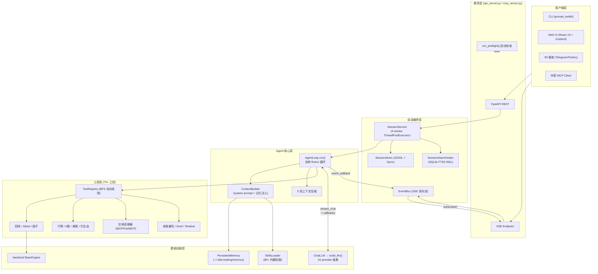
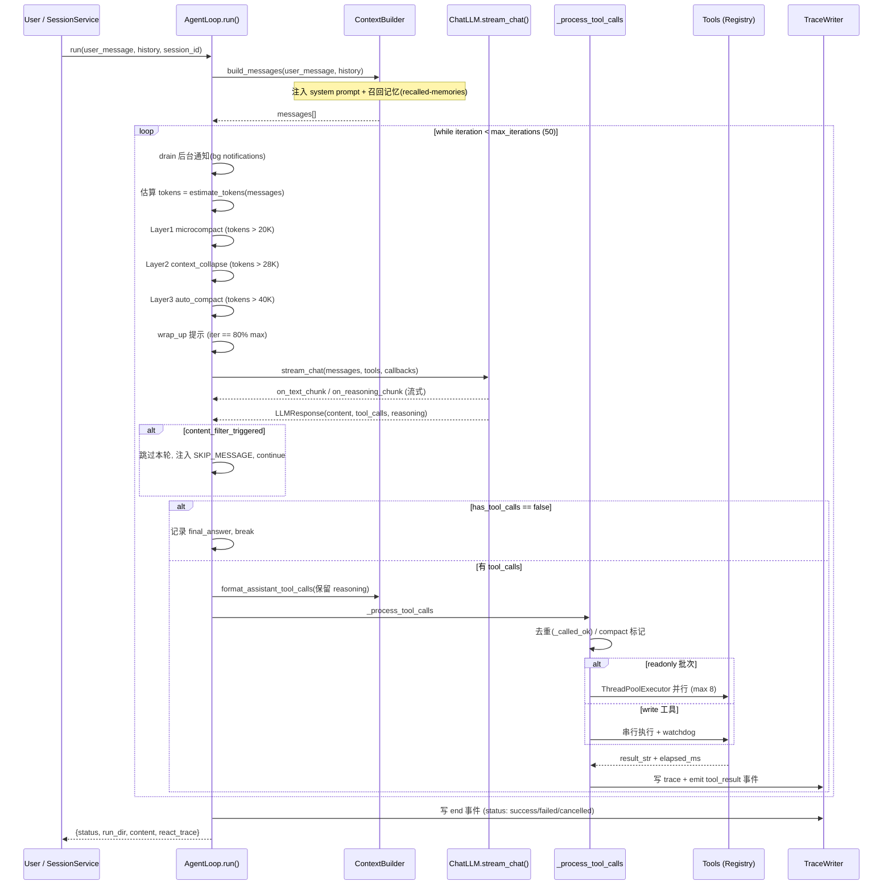
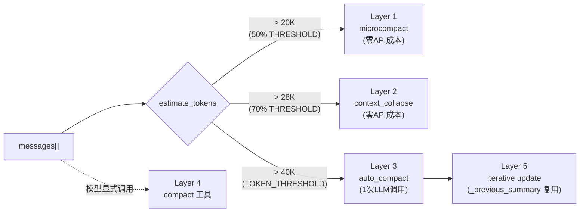
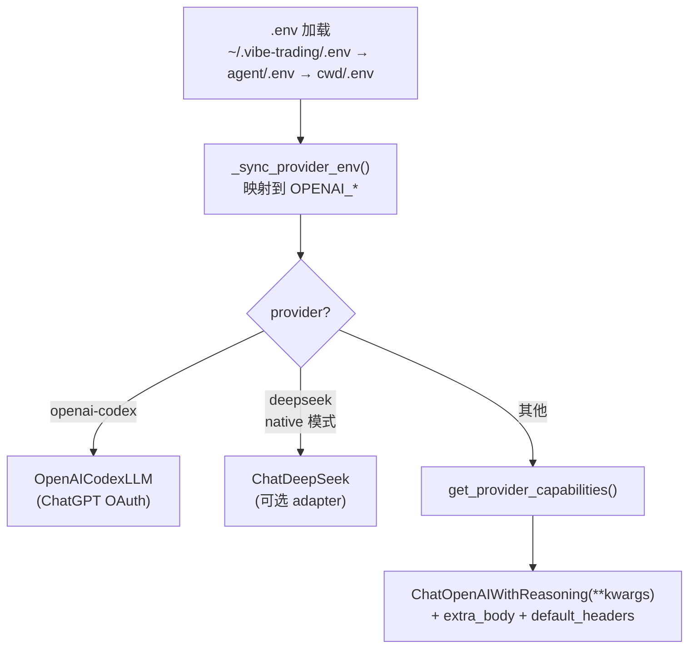
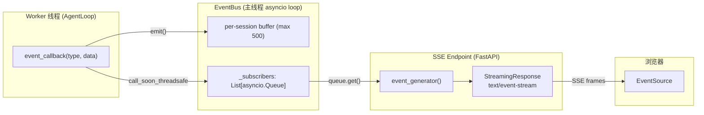

# 第一部分 · 核心技术架构

> 本文是 Vibe-Trading 深度技术文档的**【架构篇】**。读者画像：资深金融从业者 + 资深工程师。全文基于源码逐行剖析，所有 `file:line` 引用均来自当前代码树（`agent/src/...`、`agent/backtest/...`、`agent/api_server.py`），不臆断、不照抄。

---

## 1. 项目总览

### 1.1 设计理念

Vibe-Trading 的设计哲学可以用一句话概括：

> **"通过一条自然语言命令，赋能 LLM agent 全面调用金融研究、回测、衍生品定价、实盘下单的全部能力。"**

围绕这一理念，系统做了三个关键架构决策：

1. **自研 ReAct 循环而非 LangGraph**——金融任务常常是"调一个回测 → 看指标 → 改因子 → 再回测"的多轮长链路，需要在固定循环骨架之上插入精细的**上下文压缩**与**工具调度**逻辑（见 §2）。
2. **Progressive Disclosure 的技能体系**——系统 prompt 只注入一行摘要，全文按需加载，避免 75+ 工具与 79 个内置技能撑爆 token 预算（见 §6）。
3. **Fail-closed（失败即关闭）无处不在**——金融场景下"宁可不交易，不可错交易"，从 live-broker 通配符拒绝到 content-filter 断路器，安全闸门贯穿始终。

### 1.2 技术栈全景

| 层级 | 技术选型 | 用途 |
|------|---------|------|
| Agent 核心 | Python 3.11 + 自研 ReAct loop | 工具编排、5 层上下文管理 |
| LLM 接入 | LangChain ≥1.0 / langchain-openai ≥1.0 | 统一 14 provider 抽象（含别名 17 key）|
| MCP 协议 | FastMCP ≥2.14 | 远程工具（Robinhood/IBKR 实盘）|
| Web 服务 | FastAPI + Uvicorn + sse-starlette | REST + SSE 双向流 |
| 前端 | React 19 + Zustand | 实时渲染 thinking / tool / answer 流 |
| 持久化 | SQLite（FTS5、WAL 模式）| 跨会话全文检索 |
| 文件存储 | append-only JSONL + `os.fsync` | Session 消息日志 |
| 回测引擎 | numpy/pandas/scipy/duckdb + scikit-learn | 因子、归因、蒙特卡洛 |
| 数据源 | tushare/akshare/yfinance/ccxt/OKX/baostock/eastmoney... | 18 类资产数据自动 fallback |
| 配置 | Pydantic v2 | AgentConfig 强校验 |

### 1.3 整体架构图



### 1.4 目录结构

```
agent/
├── api_server.py        # FastAPI 服务：REST + SSE，~3500 行入口
├── mcp_server.py        # MCP server 入口（对外暴露 run_swarm 等）
├── backtest/            # 回测引擎（BaseEngine 模板 + 8 类市场引擎 + 优化器）
│   ├── engines/         # china_a/crypto/global_equity/futures/options_portfolio...
│   ├── loaders/         # 18 个数据源 + FALLBACK_CHAINS
│   └── optimizers/      # risk_parity / equal_weight / min_variance...
├── src/
│   ├── agent/           # loop.py(ReAct核心) context.py skills.py tools.py
│   ├── providers/       # llm.py build_llm() / chat.py stream_chat() / capabilities.py
│   ├── session/         # service.py / store.py / search.py(FTS5) / events.py(EventBus)
│   ├── memory/          # persistent.py 跨会话文件式记忆
│   ├── config/          # schema.py(AgentConfig) loader.py paths.py
│   ├── tools/           # 48 个工具文件（排除 __init__/path_utils/redaction/trade_journal_parsers 等辅助文件）+ __init__.py(BFS 自动发现)
│   └── skills/          # 79 个内置技能目录（每个含 SKILL.md）
└── cli/                 # vibe-trading 命令行
```

| 模块 | 一句话职责 |
|------|-----------|
| `agent/src/agent/loop.py` | ReAct 主循环 + 5 层压缩 + 工具批次调度 |
| `agent/src/agent/context.py` | 组装 system prompt、注入技能摘要与召回记忆 |
| `agent/src/providers/llm.py` | `build_llm()` 工厂 + 多 provider env 映射 |
| `agent/src/providers/chat.py` | `stream_chat()` 流式 + DSML tool-call fallback |
| `agent/src/session/service.py` | 会话生命周期 + 4-worker 线程池调度 |
| `agent/src/session/search.py` | SQLite FTS5 跨会话全文搜索 |
| `agent/src/memory/persistent.py` | 文件式跨会话记忆 + frozen snapshot |
| `agent/backtest/engines/base.py` | `BaseEngine.run_backtest()` 模板方法 |

---

## 2. Agent 核心：自研 ReAct 循环

### 2.1 为什么不用 LangGraph？

`pyproject.toml` 实际**已依赖 `langgraph`**（用于 checkpoint 等），但 Vibe-Trading 的 ReAct 主循环**刻意没有跑在 LangGraph 的 StateGraph 之上**，而是用约 1500 行的 `AgentLoop` 类（`agent/src/agent/loop.py`）手写。设计动机有三：

| 维度 | LangGraph StateGraph | Vibe-Trading 自研 loop |
|------|---------------------|----------------------|
| 上下文压缩 | 节点间状态固定，压缩需自定义 reducer | **5 层渐进式压缩**直接在 `messages` 列表上原地 mutate（`loop.py:199/214/1421`）|
| 工具并行 | 需 ParallelNode 封装 | 连续 readonly 自动 `ThreadPoolExecutor` 并行（`loop.py:1162`）|
| 流式取消 | 需中断信号框架 | 一个 `threading.Event` 在 stream chunk / iteration / tool batch 三级 checkpoint 轮询（`loop.py:510`）|
| Provider 兼容 | 绑定 LangChain Message | 直接操作 OpenAI dict，可塞 `reasoning_content` / Gemini `thought_signature`（`loop.py:294`）|

核心权衡：**金融任务对"上下文窗口的精细控制"和"工具调度的有副作用区分"要求极高**，LangGraph 的声明式图模型在这些细节上反而成为束缚。自研循环把 `messages: list[dict]` 作为唯一可变状态，所有压缩、批次、取消都变成对 list 的原地操作，调试与可观测性（trace）极强。

### 2.2 AgentLoop.run() 主循环逐层剖析

`run()` 位于 `agent/src/agent/loop.py:519`。下面是其结构化时序：



**入口处的 per-run 状态重置**（`loop.py:530-533`）保证一个 `AgentLoop` 实例可在同一 session 内被多次 `run()` 复用：

```python
# loop.py:530-533
self._cancel_event.clear()        # 合作式取消标志
self._called_ok = set()           # 已成功工具去重集合
self._previous_summary = ""       # Layer 5 迭代摘要的种子
```

**关键控制变量**（`loop.py:581-590`）：

```python
iteration = 0
content_filter_circuit_breaker = False       # 连续 10 次过滤即熔断
empty_model_response_iter: int | None = None # 空 response 记账
goal_continuations = 0                       # Goal 续航计数
wrap_up_at = max(1, int(self.max_iterations * 0.8))  # 80% 时催促收尾
```

**最后一轮强制文本输出**（`loop.py:681-684`）是一个精巧设计：当 `iteration == max_iterations`，把 `tool_defs` 置为 `None`，模型在"无工具可用"约束下被迫产出最终文本，避免耗尽预算后仍卡在 tool_call 死循环。

### 2.3 【核心技术亮点】5 层上下文压缩

这是 Vibe-Trading 最值得深入剖析的设计。金融回测一轮可能产生几十 KB 的 `metrics.csv`、`trades.csv` 文本，多轮下来 `messages` 列表会迅速膨胀撞上 context window。系统设计了**5 层递进式压缩**，从"零成本原地清理"到"LLM 摘要"，层层升级：



阈值常量（`loop.py:51-75`）：

```python
TOKEN_THRESHOLD       = int(os.getenv("TOKEN_THRESHOLD", "40000"))   # Layer 3 触发线
MICROCOMPACT_THRESHOLD = int(TOKEN_THRESHOLD * 0.5)                  # = 20000, Layer 1
COLLAPSE_THRESHOLD    = int(TOKEN_THRESHOLD * 0.7)                   # = 28000, Layer 2
TAIL_TOKEN_BUDGET     = 20_000                                       # Layer 3 尾部保留预算
KEEP_RECENT           = 3
COLLAPSE_PRESERVE_RECENT = 6
COLLAPSE_TEXT_MIN     = 2400
COLLAPSE_HEAD         = 900
COLLAPSE_TAIL         = 500
```

#### Layer 1 · microcompact（零成本，`loop.py:199`）

```python
def _microcompact(messages: list) -> None:
    tool_msgs = [m for m in messages if m.get("role") == "tool"]
    if len(tool_msgs) <= KEEP_RECENT:        # 保留最近 3 条 tool 结果完整
        return
    for msg in tool_msgs[:-KEEP_RECENT]:
        content = msg.get("content", "")
        if isinstance(content, str) and len(content) > 100:
            msg["content"] = "[cleared]"     # 老结果就地清空
```

**设计动机**（见 `loop.py:61-65` 注释）：阈值设在 `50%` 而非更小，是为了**短会话不误伤**。低于此阈值时模型仍可回看历史 tool 结果（metrics、文件内容、搜索命中），过早清理会丢失参照。

#### Layer 2 · context_collapse（零成本，`loop.py:214`）

```python
def _context_collapse(messages: list) -> None:
    if len(messages) <= COLLAPSE_PRESERVE_RECENT + 1:
        return
    for msg in messages[1:-COLLAPSE_PRESERVE_RECENT]:   # 跳过 system + 最近 6 条
        content = msg.get("content")
        if not isinstance(content, str) or len(content) <= COLLAPSE_TEXT_MIN:  # < 2400 不动
            continue
        if content == "[cleared]":
            continue
        head = content[:COLLAPSE_HEAD]                   # 保留前 900 字符
        tail = content[-COLLAPSE_TAIL:]                  # 保留后 500 字符
        trimmed = len(content) - COLLAPSE_HEAD - COLLAPSE_TAIL
        msg["content"] = f"{head}\n\n...[{trimmed} chars collapsed]...\n\n{tail}"
```

**纯字符串操作，零 API 调用**。对一份 50KB 的 `trades.csv`，折叠后只剩 ~1.4KB（head+tail+占位），但开头表头与结尾总结都保留——模型仍能识别"这是 trade 列表"。

#### Layer 3 · auto_compact（1 次 LLM 调用，`loop.py:1421`）

这是最复杂的一层。它做四件事：

1. **保存完整 transcript** 到 `transcript_{ts}.jsonl`（`loop.py:1447-1450`）——可追溯，不丢数据。
2. **token-budget tail 切分**：从尾部回溯累计 token，保留最近 `TAIL_TOKEN_BUDGET=20000` token 的消息不动（`loop.py:1456-1465`）。切分点还会**跳过 `tool` 角色**避免拆散 tool_call/tool_result 对（`loop.py:1468-1469`）。
3. **结构化 LLM 摘要**：用 `_STRUCTURED_SUMMARY_PROMPT`（`loop.py:364`）让 LLM 按 10 段固定结构（Goal / Constraints & Preferences / Progress / Key Decisions / Resolved Questions / Pending User Asks / Relevant Files / Remaining Work / Critical Context / Tools & Patterns）生成摘要，**强制保留所有具体数字、文件路径、参数值**。
4. **`_fix_tool_pairs` 修复**（`loop.py:237`）：压缩后可能出现孤立的 tool_call（结果被压走）或孤立的 tool_result（调用被压走），此函数双向修补——删孤儿 result、为孤儿 call 插入 stub result `[Result from earlier context — see summary above]`。

重建后的结构（`loop.py:1523-1526`）：

```python
messages.clear()
messages.append(system_msg)                                           # 1. 系统 prompt 原样保留
messages.append({"role": "user", "content": f"{compressed}\n\n<system>Continue from the summary above.</system>"})  # 2. 摘要
messages.extend(tail)                                                 # 3. 尾部 ~20K token 原文
_fix_tool_pairs(messages)                                             # 4. 修复孤儿对
```

#### Layer 4 · compact 工具（模型显式触发）

`_process_tool_calls`（`loop.py:1046-1053`）识别 `compact` 工具调用时不立即执行，而是打标记，等所有工具跑完再触发 Layer 3，并可带 `focus_topic` 参数（让摘要把 60-70% 预算聚焦于特定主题，模板 `_FOCUS_SECTION` 见 `loop.py:409`）。

#### Layer 5 · iterative update（零信息衰减）

第二次及以后的压缩不再从零摘要，而是用 `_ITERATIVE_UPDATE_PROMPT`（`loop.py:415`）**更新上一份摘要**：

```python
# loop.py:1490-1497
if self._previous_summary:
    prompt = _ITERATIVE_UPDATE_PROMPT.format(
        previous_summary=self._previous_summary,
        new_turns=conv_text,
        focus_section=focus_section,
    )
else:
    prompt = _STRUCTURED_SUMMARY_PROMPT.format(focus_section=focus_section) + conv_text
```

规则明确要求 "PRESERVE all existing information"、"Move In Progress → Done"。这把 N 次压缩的信息衰减从"指数级"降到"近乎零"，是长会话（>50 轮）能稳定运行的关键。

#### 压缩效果（量级估算）

设单轮 tool 结果平均 8KB（~2K token）：

| 场景 | 无压缩 | 仅 L1+L2 | 全 5 层 |
|------|--------|----------|---------|
| 20 轮 | ~80K token（爆窗）| ~45K | ~25K（摘要 ~3K + tail 20K + system 2K）|
| 50 轮 | 爆窗 ×2.5 | ~90K（仍爆）| ~28K（iterative update 几乎不增长）|

### 2.4 工具调度：readonly 并行 / write 串行

`_process_tool_calls`（`loop.py:1016`）→ `_batch_execute`（`loop.py:1078`）的核心逻辑：

```python
# loop.py:1100-1114  批次切分
batches: list[tuple[str, list]] = []
current_ro: list = []
for tc in tool_calls:
    tool_def = self.registry.get(tc.name)
    if tool_def and tool_def.is_readonly:   # readonly 累积
        current_ro.append(tc)
    else:                                    # write 隔离
        if current_ro:
            batches.append(("parallel", current_ro)); current_ro = []
        batches.append(("serial", [tc]))
if current_ro:
    batches.append(("parallel", current_ro))
```

执行（`loop.py:1116-1125`）：

```python
for mode, batch in batches:
    if self._cancel_event.is_set(): break    # 取消则不再起批次
    if mode == "parallel" and len(batch) > 1:
        self._execute_parallel(batch, ...)   # ThreadPoolExecutor(max 8)
    else:
        for tc in batch:
            self._execute_single(tc, ...)    # 串行
```

**设计原因**：
- **readonly 并行**：`get_market_data`、`read_file`、`session_search` 这类无副作用工具，并行可把"N 个标的数据拉取"从 N×RTT 降到 1×RTT（受限于 `max_workers=min(len, 8)`，`loop.py:1162`）。
- **write 串行**：`write_file`、`backtest`、`place_order` 必须串行——并行写同一 `run_dir` 会竞态，并行下单会破坏 mandate 审计链。
- **批次间也是串行**：即便 `[ro1, ro2, write1, ro3]`，也是 `ro1||ro2 → write1 → ro3`，保证 write 前后状态确定。

### 2.5 `_invoke_tool` 的 timeout 与 watchdog（`loop.py:1207`）

每个工具调用都被 `HeartbeatTimer`（`agent/src/agent/progress.py:123`）包裹，每 `HEARTBEAT_INTERVAL_S=3.0s` 发一次 keepalive，让 UI 永不"假死"。timeout 行为按 readonly/write 区分（`loop.py:1285-1360`）：

| 工具类型 | 超时行为 | 实现 |
|---------|---------|------|
| readonly | **杀死**：worker 线程结果丢弃，返回 `tool_timeout` 错误 | `queue.get(timeout=...)` + `timed_out.set()`（`loop.py:1337-1357`）|
| write | **只警告不杀**：watchdog 发 `timeout_warning`，继续等结果 | daemon 线程 `finished.wait(timeout)`（`loop.py:1288-1307`）|

理由：readonly 失败可重试无副作用；write（如下单）若中途杀掉，可能"订单已发但本地没记账"，造成对账黑洞，**宁等勿杀**。

### 2.6 合作式取消（`_cancel_event`）

一个 `threading.Event()`（`loop.py:505`）在**三个 checkpoint** 被轮询：

1. **每轮 iteration 起始**（`loop.py:594`）：取消则 break 主循环。
2. **每个 stream chunk**（`chat.py:283`，通过 `should_cancel` 回调）：流式过程中取消，立即停 stream。
3. **批次间**（`loop.py:1119`）：当前批次跑完，不再起新批次。

`SessionService.cancel_current`（`service.py:131`）→ `loop.cancel()` → `_cancel_event.set()`，整条链路在 <1 个 chunk 时间内响应。

### 2.7 Goal continuation（`GOAL_MAX_CONTINUATIONS=3`）

当存在 active goal 且模型给出"看似最终答案"时（`loop.py:823-890`），系统检查 `goal_needs_continuation`：若 goal 尚未完成且未达续航上限，会**注入一段 `format_goal_continuation_prompt`**，把模型答案当作中间产物，强制继续推进 goal。这是"让 agent 自主完成多步研究目标"的关键机制——既防止模型过早收尾，又用 `GOAL_MAX_CONTINUATIONS=3` 和"无新进展则停"（`loop.py:845-847`）双重防死循环。

---

## 3. 工具系统

### 3.1 BaseTool / ToolRegistry 设计（`agent/src/agent/tools.py`）

```python
class BaseTool(ABC):
    name: str = ""
    description: str = ""
    parameters: Dict[str, Any] = {}    # JSON Schema
    repeatable: bool = False           # 是否允许重复调用
    is_readonly: bool = True           # 决定并行/串行

    @classmethod
    def check_available(cls) -> bool:  # 依赖探测钩子
        return True

    @abstractmethod
    def execute(self, **kwargs: Any) -> str:  # 返回 JSON 字符串
        ...

    def to_openai_schema(self):        # 转 OpenAI function calling 格式
        return {"type": "function", "function": {
            "name": self.name, "description": self.description,
            "parameters": self.parameters or {"type": "object", "properties": {}, "required": []},
        }}
```

`ToolRegistry.execute`（`tools.py:72`）**保证永远返回合法 JSON**——工具抛异常时捕获并返回 `{"status":"error","error":...}`，避免 LLM 收到非法 JSON 后崩溃。

### 3.2 自动发现机制：BaseTool.__subclasses__() BFS

`agent/src/tools/__init__.py:33` 的 `_discover_subclasses()`：

```python
def _discover_subclasses() -> list[type[BaseTool]]:
    global _SUBCLASSES_CACHE
    if _SUBCLASSES_CACHE is not None:        # 首次后缓存
        return _SUBCLASSES_CACHE
    pkg_dir = str(Path(__file__).parent)
    for _, module_name, _ in pkgutil.iter_modules([pkg_dir]):  # 1. 导入所有模块
        if module_name.startswith("_"):
            continue
        try:
            importlib.import_module(f"src.tools.{module_name}")
        except Exception as exc:
            logger.warning("Skipped src.tools.%s: %s", module_name, exc)
    classes: list[type[BaseTool]] = []
    queue = deque(BaseTool.__subclasses__())              # 2. BFS 收集子类
    while queue:
        cls = queue.popleft()
        if cls.name:
            classes.append(cls)
        queue.extend(cls.__subclasses__())
    _SUBCLASSES_CACHE = classes
    return classes
```

**为什么不用装饰器注册？**

| 方案 | 优点 | 缺点 | Vibe-Trading 选择 |
|------|------|------|------------------|
| `@register` 装饰器 | 显式 | 每个工具文件都要 import registry，循环依赖风险 | ❌ |
| **`__subclasses__()` BFS** | 工具文件零耦合，新建文件即自动入册 | 依赖 import 副作用 | ✅ |
| 入口扫描 | 完全解耦 | 需维护清单 | ❌ |

`build_registry()`（`__init__.py:66`）逐个 `cls.check_available()` 过滤——缺 API key 的工具（如未配 `TUSHARE_TOKEN`）静默跳过，不污染 LLM 的工具列表。

### 3.3 工具全分类表（48 文件，75+ 工具类）

> 注：单文件可含多工具类（如 `goal_tool.py` 含 4 个 Goal 工具，`trading_connector_tool.py` 含 `trading_*` 系列）。

| 类别 | 代表工具 | 说明 |
|------|---------|------|
| **文件操作** | `read_file` / `write_file` / `edit_file` / `bash` | run_dir 沙箱，shell 工具默认关闭 |
| **回测** | `backtest` / `alpha_bench` / `alpha_compare` / `alpha_zoo` / `factor_analysis` | 调 BaseEngine 管线 |
| **Alpha/因子** | `alpha_zoo` / `alpha_bench` / `alpha_compare` / `factor_analysis` / `pattern` | AST 懒加载因子库 |
| **行情数据** | `get_market_data` / `market_screener` / `symbol_search` / `stock_profile` | 18 源 fallback |
| **A股数据** | `dragon_tiger`(龙虎榜) / `northbound`(北向) / `fund_flow`(资金流) / `margin_trading`(融资融券) / `lockup_expiry`(解禁) / `block_trades`(大宗交易) / `shareholder_count`(股东户数) / `sector` / `iwencai`(问财) | tushare/akshare/eastmoney |
| **美股数据** | `sec_filings`(10-K/10-Q) / `research_reports` / `stock_news` / `financial_statements` | yfinance/edgar |
| **衍生品** | `options_chain` / `options_pricing` | Black-Scholes + Monte Carlo |
| **宏观** | `fred_macro` | FRED API |
| **交易连接器** | `trading_*`(robinhood/ibkr 实盘) | MCP/FastMCP，受 mandate + kill switch 双重门控 |
| **Swarm** | `run_swarm` | 29 个多 agent 预设团队 |
| **Shadow Account** | `extract_shadow_strategy` / `run_shadow_backtest` / `render_shadow_report` / `scan_shadow_signals` | 提取用户交易策略并多市场回测 |
| **Goal** | `start_research_goal` / `get_research_goal` / `add_goal_evidence` / `update_research_goal_status` / `run_research_autopilot` | 跨轮研究目标管理 |
| **技能编写** | `save_skill` / `patch_skill` / `delete_skill` / `load_skill` | agent 自我扩展能力 |
| **记忆/搜索** | `remember` / `session_search` / `compact` | 跨会话记忆 + FTS5 检索 |
| **文档/Web** | `read_document`(PDF/DOCX/PPTX) / `read_url` / `web_search`(ddgs) | 多模态输入 |
| **MCP 远程** | `mcp_<server>_<tool>` 动态生成 | FastMCP client，stdio/sse/streamableHttp |

### 3.4 to_openai_schema() 与结果截断

每个工具的 `parameters` 是手写 JSON Schema，`to_openai_schema()`（`tools.py:42`）直接包装成 OpenAI function calling 格式喂给 `bind_tools()`。

**结果截断**（`loop.py:53, 1403`）：

```python
TOOL_RESULT_LIMIT = 10_000
truncated = result[:TOOL_RESULT_LIMIT]   # 进 messages 的版本截断到 10K 字符
```

而 trace 写盘用完整结果（经 `_redact_trace_result` → `redact_payload` 脱敏，`loop.py:1406`）——保证可追溯，又不撑爆 context。

### 3.5 repeatable 与 `_called_ok` 去重

`_process_tool_calls`（`loop.py:1057-1063`）：

```python
if tc.name in self._called_ok and not is_repeatable:
    skip_msg = json.dumps({"skipped": True, "reason": f"{tc.name} already completed successfully..."})
    messages.append(context.format_tool_result(tc.id, tc.name, skip_msg))
    continue
```

`_called_ok` 在工具成功后由 `_finalize_tool_result`（`loop.py:1398-1400`）填充：`if success: self._called_ok.add(tc.name)`。成功判定 `_is_tool_success`（`loop.py:434`）= JSON 解析后 `status != "error"`。这避免模型重复调 `start_research_goal` 之类的幂等性敏感工具。标记 `repeatable=True` 的工具（如 `get_market_data`）不受此限制。

---

## 4. LLM Provider 抽象层

### 4.1 build_llm() 工厂（`agent/src/providers/llm.py:566`）



`build_llm()` 的关键步骤（`llm.py:566-655`）：

1. **`_sync_provider_env()`**（`llm.py:466`）：调用 `_ensure_dotenv()` 加载 `.env`（搜索顺序 `~/.vibe-trading/.env` → `agent/.env` → `cwd/.env`，`llm.py:287-291`），然后根据 `LANGCHAIN_PROVIDER` 把 provider 特定 env 映射到统一的 `OPENAI_API_KEY` / `OPENAI_BASE_URL`：

```python
# llm.py:483-500  核心：provider 专有 env → OPENAI_* 统一
key_env, base_env = provider_env_names(provider, model)
api_key = os.getenv(key_env, "") or os.getenv("OPENAI_API_KEY", "")
base_url = os.getenv(base_env, "") or os.getenv("OPENAI_BASE_URL", "") or os.getenv("OPENAI_API_BASE", "")
if provider == "ollama" and base_url:
    base_url = _normalize_ollama_base_url(base_url)   # 自动补 /v1
if api_key: os.environ["OPENAI_API_KEY"] = api_key
if base_url:
    os.environ["OPENAI_API_BASE"] = base_url
    os.environ.setdefault("OPENAI_BASE_URL", base_url)
```

这让上层只需面对一个"OpenAI 兼容"接口，provider 差异在 env 层就抹平了。

2. **provider 特殊修正**：
   - MiniMax 强制 `temperature=0.01`（`llm.py:617`，因为 MiniMax 拒绝 `temperature=0`）。
   - Moonshot kimi-k2.x 强制 `temperature=1.0`（`llm.py:620`，该模型只接受 1）。
   - DashScope/Qwen 通过 `extra_body["enable_thinking"]=True` 注入思考模式（`llm.py:633-638`）——见 §4.5。
   - OpenRouter 通过 `extra_body["reasoning"]={"effort":...}` 激活推理（`llm.py:627`）。

### 4.2 ChatOpenAIWithReasoning 子类（`llm.py:30`）

这是整个 provider 层最精巧的部分。`langchain-openai 0.3.x` 在三条路径上会**丢弃非标准字段**：

| 路径 | 触发场景 | 丢弃的字段 |
|------|---------|-----------|
| `_convert_dict_to_message` | invoke / ainvoke（入站）| `reasoning_content` |
| `_convert_delta_to_message_chunk` | stream / astream（入站）| `reasoning_content` |
| `_convert_message_to_dict` | 请求序列化（出站）| `reasoning_content`、Gemini `thought_signature` |

`ChatOpenAIWithReasoning` 重写四个方法补救：

```python
# llm.py:103-112  入站捕获：把 reasoning_content 存到 additional_kwargs
def _capture(self, src, msg):
    caps = self._capabilities()
    if caps.capture_reasoning and (value := src.get("reasoning_content") or src.get("reasoning")):
        msg.additional_kwargs["reasoning_content"] = value
    if caps.gemini_thought_signatures and (signatures := self._collect_tool_call_thought_signatures(src.get("tool_calls"))):
        msg.additional_kwargs["tool_call_thought_signatures"] = signatures
```

```python
# llm.py:250-281  出站重注入：序列化时把 reasoning_content 塞回 assistant turn
def _get_request_payload(self, input_, *, stop=None, **kwargs):
    payload = super()._get_request_payload(input_, stop=stop, **kwargs)
    messages = super()._convert_input(input_).to_messages()
    caps = self._capabilities()
    for i, m in enumerate(payload["messages"]):
        if m.get("role") != "assistant": continue
        source_message = messages[i]
        if caps.normalize_assistant_content and m.get("content") is None:
            m["content"] = ""                      # kimi-k2.6 拒绝 content=None
        if caps.send_reasoning_content:
            m["reasoning_content"] = source_message.additional_kwargs.get("reasoning_content", "")
        else:
            m.pop("reasoning_content", None)
        if caps.gemini_thought_signatures:
            self._inject_tool_call_thought_signatures(m.get("tool_calls"), source_message)
```

**为什么要这么做？** Moonshot kimi-k2.6 这类 strict provider 在多轮 ReAct 中会**拒绝**缺少 `reasoning_content` 或 `content=null` 的 assistant turn（issue #39），导致工具调用后无法继续。出站重注入是唯一的解法。

`_convert_input`（`llm.py:114`）专门处理 **Gemini thought_signature 往返**：AgentLoop 把历史以 OpenAI dict 重放时，LangChain 的 `_convert_dict_to_message` 会丢掉 `extra_content.google.thought_signature`，下一轮 Gemini 就因 `missing thought_signature` 报 400。该方法在 dict→message 转换的"唯一 chokepoint"处把签名捞回 `additional_kwargs["tool_call_thought_signatures"]`，与内存路径归一。

### 4.3 ProviderCapabilities 能力矩阵（`capabilities.py`）

14 个 provider 的能力位（`capabilities.py:78-125`，`_PROVIDERS` 字典含 17 个 key，其中 `glm`=`zhipu`、`kimi`=`moonshot`、`openai_codex`=`openai-codex` 三组别名）：

| Provider | capture_reasoning | send_reasoning_content | gemini_thought_signatures | normalize_assistant_content | openrouter_reasoning_body |
|----------|:-:|:-:|:-:|:-:|:-:|
| openai | ❌ | ❌ | ❌ | ❌ | ❌ |
| openrouter | ✅ | ❌ | ❌ | ❌ | ✅ |
| deepseek | ✅ | ❌ | ❌ | ❌ | ❌ |
| gemini | ❌ | ❌ | ✅ | ❌ | ❌ |
| moonshot / kimi | ✅ | ✅ | ❌ | ✅ | ❌ |
| dashscope / qwen | ✅ | ❌ | ❌ | ✅ | ❌ |
| groq / zhipu / glm / minimax / mimo / zai / ollama | ❌ | ❌ | ❌ | ❌ | ❌ |
| openai-codex | ❌ | ❌ | ❌ | ❌ | ❌ |

`get_provider_capabilities`（`capabilities.py:143`）还支持**按模型名推断**：若 `LANGCHAIN_PROVIDER=openai` 但 `model` 以 `gemini`/`deepseek`/`glm`/`kimi` 开头，自动套对应能力（`_infer_from_model`，`capabilities.py:128`）。

### 4.4 ChatLLM.stream_chat() 流式实现（`chat.py:248`）

```python
def stream_chat(self, messages, tools=None, on_text_chunk=None,
                on_reasoning_chunk=None, timeout=None, should_cancel=None):
    llm = self._llm.bind_tools(tools) if tools else self._llm
    accumulated = None
    pending_text = ""
    possible_dsml_text = True
    for chunk in llm.stream(messages, config=config):
        if should_cancel and should_cancel():       # 合作式取消，每个 chunk 检查
            break
        if chunk.content and on_text_chunk:
            if possible_dsml_text:                  # DSML 前缀探测
                pending_text += chunk.content
                if _is_possible_dsml_tool_call_prefix(pending_text):
                    pass                            # 仍可能是 DSML，暂存
                else:
                    possible_dsml_text = False
                    on_text_chunk(pending_text); pending_text = ""
            else:
                on_text_chunk(chunk.content)
        reasoning = getattr(chunk, "additional_kwargs", {}).get("reasoning_content")
        if reasoning and not chunk.content and on_reasoning_chunk:
            on_reasoning_chunk(reasoning)           # 推理 delta 转发
        accumulated = chunk if accumulated is None else accumulated + chunk
    return self._parse_response(accumulated)
```

两个回调被 `AgentLoop.run` 注入（`loop.py:656-678`）：
- `on_text_chunk`：转发为 `text_delta` SSE 事件。
- `on_reasoning_chunk`：**节流**到 `REASONING_DELTA_MIN_INTERVAL_S=1.0s` 一次（`loop.py:660-678`），避免长推理流淹没 SSE replay buffer、挤掉 tool_call 事件——但每轮首个 chunk 立即发，保证 UI 即时切到"Reasoning…"。

### 4.5 DSML（DeepSeek 风格 XML）tool-call fallback（`chat.py:168`）

某些 OpenAI 兼容 relay（尤其 DeepSeek 经第三方代理）**不返回标准 `tool_calls`**，而是把工具调用以 DSML 文本塞进 content：

```
<||dsml||tool_calls>
  <||dsml||invoke name="get_market_data">
    <||dsml||parameter name="codes">BTC-USDT</||dsml||parameter>
  </||dsml||invoke>
</||dsml||tool_calls>
```

`_parse_dsml_tool_calls`（`chat.py:168`）用正则解析。**关键安全设计**：只有当 DSML block 之外的文本为空或仅 `/` 时才视为合法 tool call（`chat.py:184-186`），否则当作普通散文——防止模型在解释性文本里举的 DSML 例子被误执行。

### 4.6 DashScope enable_thinking 通过 extra_body 注入

DashScope（通义千问）的 `enable_thinking` 是非标准 OpenAI 参数，不能放在顶层请求体。`build_llm` 把它塞进 `extra_body`（`llm.py:633-638`），LangChain 会把 `extra_body` 与请求体深合并后发给 provider：

```python
if caps.name in {"dashscope", "qwen"} and os.getenv("VIBE_TRADING_DASHSCOPE_ENABLE_THINKING", "").strip().lower() in {"1","true","yes"}:
    extra_body["enable_thinking"] = True
```

返回的 `reasoning_content` 由 `ChatOpenAIWithReasoning._capture`（dashscope `capture_reasoning=True`）捕获。

### 4.7 content_filter 电路断路器（`content_filter.py`）

当 provider 因内容审核屏蔽响应（`finish_reason == "content_filter"`，Gemini 则是大写 `SAFETY`/`RECITATION` 等，`content_filter.py:36`），系统：

1. **跳过本轮**，注入 `CONTENT_FILTER_SKIP_MESSAGE` 让模型换条路（`loop.py:789-805`）。
2. **连续 10 次即熔断**（`MAX_CONSECUTIVE_CONTENT_FILTER_SKIPS=10`，`content_filter.py:22`），直接结束 run，避免在铁了拒绝的 provider 上空耗预算。
3. **运行结束按比例告警**：若 `content_filter_count / iterations > 5%`（`CONTENT_FILTER_WARNING_THRESHOLD=0.05`），在结果里附 `content_filter_warnings`，提示用户换 provider（`loop.py:1006`）。

---

## 5. 会话与记忆系统

### 5.1 SessionStore 文件系统布局（`session/store.py`）

```
sessions/
├── {session_id}/
│   ├── session.json          # Session 元数据（title/config/last_attempt_id）
│   ├── messages.jsonl        # append-only 消息日志（每行一条 JSON）
│   └── attempts/
│       └── {attempt_id}/
│           └── attempt.json  # 单次执行 attempt 状态
```

**append-only JSONL + `os.fsync`**（`store.py:150-153`）：

```python
with path.open("a", encoding="utf-8") as f:
    f.write(json.dumps(message.to_dict(), ensure_ascii=False) + "\n")
    f.flush()
    os.fsync(f.fileno())    # 强制落盘，防 crash 丢消息
```

`os.fsync` 比 `flush` 更彻底——`flush` 只把 Python buffer 刷到 OS，`fsync` 强制 OS 把 page cache 写到物理磁盘。金融场景下消息即审计依据，绝不能丢。

### 5.2 SessionService 异步调度（`session/service.py`）

```python
# service.py:15  专用 4-worker 线程池，避免耗尽默认 executor
_AGENT_EXECUTOR = concurrent.futures.ThreadPoolExecutor(max_workers=4, thread_name_prefix="agent")
```

`send_message`（`service.py:85`）的流程：

```mermaid
sequenceDiagram
    participant C as Client
    participant SS as SessionService
    participant STORE as SessionStore
    participant IDX as SearchIndex
    participant EXEC as _AGENT_EXECUTOR
    participant LOOP as AgentLoop

    C->>SS: send_message(session_id, content)
    SS->>STORE: append_message(Message)
    SS->>IDX: index_message(session_id, role, content)
    SS->>SS: create_attempt(Attempt)
    SS->>EXEC: asyncio.create_task(_run_attempt)
    Note over SS,EXEC: 立即返回 message_id + attempt_id
    EXEC->>LOOP: _run_with_agent → agent.run()
    LOOP-->>EXEC: result
    EXEC->>STORE: append_message(reply)
    EXEC->>IDX: index_message(assistant)
```

`_active_loops: Dict[str, AgentLoop]`（`service.py:53`）持有正在跑的 loop，`cancel_current`（`service.py:131`）通过它发取消信号。`_run_with_agent` 在 `finally` 里 `self._active_loops.pop(session_id, None)`（`service.py:275`）保证异常也清理。

### 5.3 _convert_messages_to_history() 历史裁剪（`service.py:286`）

```python
MAX_HISTORY_CHARS = 12000   # ~3000 token
# 从最新消息倒序累计，超 12K 字符即截断
for msg in reversed(history):
    msg_len = len(msg.get("content", ""))
    if total_chars + msg_len > MAX_HISTORY_CHARS:
        break
    trimmed.append(msg)
```

并把 `Run directory: /abs/path/...` 替换为 `[prev_run: {run_id}]`（`service.py:303-306`），既保留可追溯的 run_id，又避免暴露绝对路径（配合 `redaction.py` 的 `redact_internal_paths`）。

### 5.4 EventBus + SSE 双向流（`session/events.py` + `api_server.py:2305`）



**线程安全核心**（`events.py:104-112`）：worker 线程不能直接 `put_nowait` 到 `asyncio.Queue`（跨线程不安全），改用 `self._loop.call_soon_threadsafe(self._safe_put, queue, event)` 把入队操作调度到主 loop 线程执行。这是 V5 修复的关键 bug（`events.py` 顶部注释）。

**断线重连**：`subscribe` 支持 `last_event_id`（`events.py:151`），客户端断线后带 `Last-Event-ID` header 重连，`replay()` 从 buffer 找到该 id 之后的事件补发。每 30s 发一次 `heartbeat` 防 proxy 超时（`events.py:217-225`）。

SSE endpoint（`api_server.py:2305-2329`）用 `StreamingResponse` + `media_type="text/event-stream"`，并设 `X-Accel-Buffering: no` 防 Nginx 缓冲。

### 5.5 【核心】跨会话 FTS5 全文搜索（`session/search.py`）

这是除"5 层压缩"外另一大技术亮点。它给文件式 SessionStore 之上加了一层**倒排索引**，支撑 `session_search` 工具跨会话检索历史。

**数据库**：`~/.vibe-trading/sessions.db`，单例（`get_shared_index`，`search.py:349`，双重检查锁）。WAL 模式（`search.py:81-82`）允许并发读写——agent 写消息时，用户可同时搜索。

**Schema 与自动同步触发器**（`search.py:88-131`）：

```sql
CREATE TABLE messages (
    id INTEGER PRIMARY KEY AUTOINCREMENT,
    session_id TEXT, role TEXT, content TEXT, tool_name TEXT, timestamp REAL
);
CREATE VIRTUAL TABLE messages_fts USING fts5(content, content=messages, content_rowid=id);
-- 触发器：messages 表 INSERT/DELETE 时自动同步到 FTS5
CREATE TRIGGER messages_ai AFTER INSERT ON messages BEGIN
    INSERT INTO messages_fts(rowid, content) VALUES (new.id, new.content);
END;
```

"外部内容表"（`content=messages`）模式避免数据双份存储，FTS5 只存倒排索引。

**MATCH 查询 + 相关性排序 + snippet 高亮**（`search.py:226-243`）：

```sql
SELECT m.session_id, s.title, s.started_at, s.message_count,
       snippet(messages_fts, 0, '>>>', '<<<', '...', 64) AS snippet,
       rank
FROM messages_fts
JOIN messages m ON m.id = messages_fts.rowid
JOIN sessions s ON s.id = m.session_id
WHERE messages_fts MATCH ?
ORDER BY rank
LIMIT ?
```

- `rank`：FTS5 BM25 相关性（越小越相关）。
- `snippet(...64)`：截取匹配周围 64 token，用 `>>>` `<<<` 包裹命中词（前端渲染为高亮）。

**查询净化**（`search.py:192-211`）：用户输入按 `[a-zA-Z0-9_]{2,}|[\u4e00-\u9fff...]` 切 token，每个 token 双引号包裹后用 `OR` 连接——避免用户输入的 `AND`/`NOT` 被 FTS5 当操作符，同时支持 CJK 单字匹配。

**`reindex_from_store`**（`search.py:266`）：从文件 store 全量重建索引，用于损坏恢复或升级迁移。先 `DELETE` + `'rebuild'`，再遍历 `sessions/*/messages.jsonl`。

### 5.6 PersistentMemory 文件式跨会话记忆（`memory/persistent.py`）

**布局**（`persistent.py:1-9`）：

```
~/.vibe-trading/memory/
├── MEMORY.md              # 索引（< 200 行）
├── user_prefs.md          # 单条记忆 + YAML frontmatter
├── project_btc.md
└── reference_xxx.md
```

每条记忆文件格式：

```markdown
---
name: 用户风险偏好
description: 用户偏好低波动策略，max_drawdown 不超 15%
type: user
---

详细内容...（C0/C1 控制字符已剥离，超 8000 字符截断并附 marker）
```

**类型**（`persistent.py:29`）：`user`（用户偏好）/ `feedback`（反馈）/ `project`（项目）/ `reference`（参考资料）。

#### Frozen Snapshot 设计（`persistent.py:142-150`，核心技术）

```python
class PersistentMemory:
    """Design:
    - Frozen snapshot injected into system prompt at session start (preserves prompt cache).
    - Disk writes via add()/remove() update files immediately but do NOT change the snapshot.
    - Next session picks up the updated state.
    """
    def __init__(self, memory_dir=None):
        self._snapshot: str = ""
        self._load_snapshot()   # 仅在 init 时加载一次
```

**为什么这样设计？**

| 方案 | prompt cache | 实时性 | 选择 |
|------|-------------|--------|------|
| 每次 add 后重注入 | ❌ 破坏 cache prefix | ✅ | ❌ |
| **Frozen snapshot** | ✅ system prompt 整会话不变 | ⚠️ 下次会话才生效 | ✅ |
| 每轮重读磁盘 | ❌ 慢 | ✅ | ❌ |

LLM provider 的 prompt cache 是基于前缀匹配的——system prompt 一旦变化，整段 cache 失效，成本飙升。Frozen snapshot 让 system prompt 在一个 session 内绝对稳定；写入立即落盘但快照不变，**下次会话 init 时才加载新快照**。auto-recall（见下）负责会话内的实时性。

#### find_relevant 多语言分词与打分（`persistent.py:238`）

```python
def find_relevant(self, query, max_results=MAX_RESULTS):
    query_tokens = _tokenize(query)
    if not query_tokens:                       # 空查询直接返回，避免无意义打分
        return []
    scored = []
    for entry in self._scan_entries():
        meta_tokens = _tokenize(f"{entry.title} {entry.description}")
        body_tokens = _tokenize(entry.body)
        score = len(query_tokens & meta_tokens) * METADATA_WEIGHT + len(query_tokens & body_tokens)
        #                  metadata 命中 × 2.0            + body 命中 × 1.0
        if score > 0:
            scored.append((score, entry))
    scored.sort(key=lambda x: (-x[0], -x[1].modified_at))   # 分数降序，同分按新鲜度
```

分词器（`persistent.py:34-43`）覆盖 6 大非拉丁文种：

```python
_NON_LATIN_SCRIPT_RANGES = (
    "一-鿿"   # CJK Unified Ideographs   (U+4E00-U+9FFF)
    "㐀-䶿"   # CJK Extension A          (U+3400-U+4DBF)
    "฀-๿"   # Thai                     (U+0E00-U+0E7F)
    "ؠ-ي"   # Arabic letters
    "א-ת"   # Hebrew letters
    "Ѐ-ӿ"   # Cyrillic
)
_TOKEN_RE = re.compile(rf"[a-zA-Z0-9]{{3,}}|[{_NON_LATIN_SCRIPT_RANGES}]")
```

ASCII 词需 ≥3 字符（过滤 a/the 噪声），CJK/泰/阿/希/西里尔按**单字符**切（这些语言无空格分词）。metadata 权重 ×2.0 是因为标题/描述更精炼，命中价值更高。

#### auto-recall 自动注入（`context.py:236-248`）

```python
# ContextBuilder.build_messages
if self._persistent_memory:
    recalls = self._persistent_memory.find_relevant(user_message, max_results=3)
    if recalls:
        lines = [f"- **{r.title}** ({r.memory_type}): {r.body[:500]}" for r in recalls]
        recall_block = "\n".join(lines)
        enriched = f"<recalled-memories>\n{recall_block}\n</recalled-memories>\n\n{user_message}"
```

注意是注入到 **user message**，不是 system prompt——这样 system prompt（含 frozen snapshot）保持稳定不破坏 cache，而每轮的动态召回随 user message 进入上下文。

#### remember / session_search 工具

- `remember`（`tools/remember_tool.py`）：调 `PersistentMemory.add()`，注入共享实例（`__init__.py:144`：`registry.register(cls(memory=persistent_memory))`），所有工具共享同一 instance。
- `session_search`（`tools/session_search_tool.py`）：调 `SessionSearchIndex.search()`，跨会话检索历史对话。

---

## 6. Skills 渐进式加载

### 6.1 设计哲学：Progressive Disclosure

如果 79 个技能全文都塞进 system prompt，会瞬间吃掉数万 token。Vibe-Trading 借鉴认知科学中的 **progressive disclosure（渐进式披露）**原则：

- **第一层（系统 prompt）**：只注入每个技能的**一行摘要**（`skills.py:136` `get_descriptions()`）。
- **第二层（按需加载）**：模型用 `load_skill("strategy-generate")` 工具拉取**全文**（`skills.py:159` `get_content()`）。

这把"技能目录占用的 token"从 ~80K 降到 ~3K（79 行摘要），且只在真正需要时才付全文的代价。

### 6.2 SkillsLoader 双目录加载（`skills.py:113`）

```python
def _load(self):
    seen_names: set[str] = set()
    for directory in (self._user_skills_dir, self.skills_dir):  # 用户优先
        if not directory or not directory.exists():
            continue
        for path in sorted(directory.iterdir()):
            if path.is_dir() and (path / "SKILL.md").exists():
                skill = _load_skill_dir(path)
                if skill and skill.name not in seen_names:    # 同名用户技能覆盖 bundled
                    self.skills.append(skill)
                    seen_names.add(skill.name)
```

- 用户目录：`~/.vibe-trading/skills/user/`（`skills.py:90`）
- 内置目录：`agent/src/skills/`（`skills.py:108`）
- 用户技能**先加载**，同名 bundled 技能被 `seen_names` 去重跳过——这是 `patch_skill` 工具能"修改内置技能"的基础：它把改后的副本写到用户目录，下次加载即覆盖。

### 6.3 Skill 数据结构（`skills.py:15`）

```python
@dataclass
class Skill:
    name: str
    description: str = ""
    category: str = "other"      # data-source/strategy/analysis/asset-class/crypto/flow/tool/other
    body: str = ""               # SKILL.md 正文
    dir_path: Optional[Path] = None
    metadata: Dict[str, Any] = field(default_factory=dict)

    def load_support_file(self, filename):   # 按需加载技能目录下的辅助文件
        ...
```

每个技能 = 一个目录 + `SKILL.md`（YAML frontmatter + 正文）。frontmatter 字段：`name` / `description` / `category`。

### 6.4 79 个内置技能分类（实测 79 个目录）

类别顺序由 `_CATEGORY_ORDER`（`skills.py:131`）固定：

| 类别 | 代表技能 |
|------|---------|
| `data-source` | tushare / akshare / yfinance / eastmoney / ccxt / okx-market / mootdx / baostock |
| `strategy` | strategy-generate / pair-trading / ml-strategy / cross-market-strategy / event-driven / seasonal |
| `analysis` | performance-attribution / correlation-analysis / risk-analysis / quant-statistics / backtest-diagnose |
| `asset-class` | etf-analysis / fund-analysis / convertible-bond / commodity-analysis / adr-hshare |
| `crypto` | onchain-analysis / defi-yield / liquidation-heatmap / perp-funding-basis / stablecoin-flow / token-unlock-treasury / crypto-derivatives |
| `flow` | hk-connect-flow / us-etf-flow / fund-flow（资金流）|
| `tool` | doc-reader / web-reader / trade-journal / shadow-account / research-goal / report-generate |
| `other` | candlestick / ichimoku / smc / chanlun(缠论) / elliott-wave / harmonic / pine-script / vnpy-export |

### 6.5 技能编写工具：agent 自我扩展

`save_skill` / `patch_skill` / `delete_skill`（`tools/skill_writer_tool.py`）让 agent 在工作流成功后**把经验固化为新技能**，或在外部 API 变化时**修补旧技能**。`patch_skill` 的核心流程：复制 bundled 技能到用户目录 → 修改 → 下次 `SkillsLoader._load` 即覆盖。这让 agent 具备了"自我进化"能力。

---

## 7. 配置系统

### 7.1 paths.py：runtime root 与候选顺序

```python
# paths.py:7-23
_DEFAULT_FILENAMES = ("agent.json", "agent.yaml", "agent.yml")

def get_runtime_root(config_path=None):
    if config_path is not None:
        return config_path.expanduser().parent     # 显式路径的父目录
    return Path.home() / ".vibe-trading"            # 默认 ~/.vibe-trading/

def get_config_candidates(config_path=None):
    if config_path is not None:
        return [config_path.expanduser()]
    root = get_runtime_root()
    return [root / fn for fn in _DEFAULT_FILENAMES]  # 候选顺序: json → yaml → yml
```

### 7.2 loader.py：Pydantic 校验 + 深合并

`load_agent_config`（`loader.py:28`）：读文件 → `AgentConfig.model_validate` → 失败 fallback 空 `AgentConfig()`（`loader.py:47-54`），**配置错误永不阻塞启动**。

`merge_agent_config_overrides`（`loader.py:57`）：把 session 级 override 深合并到 base config。**MCP-aware server 替换**（`loader.py:262`）是亮点：

```python
def _merge_agent_config_dicts(base, override):
    non_mcp_override = {k: v for k, v in override.items() if k != "mcp_servers"}
    merged = _merge_dicts(base, non_mcp_override)
    # MCP servers 不简单深合并，而是按 server 名逐个合并 + transport 切换时重置
    override_servers = override.get("mcp_servers")
    merged_servers = dict(base.get("mcp_servers", {}))
    for server_name, server_override in override_servers.items():
        current = merged_servers.get(server_name)
        if isinstance(current, dict) and isinstance(server_override, dict):
            merged_servers[server_name] = _merge_mcp_server_dicts(current, server_override)
        else:
            merged_servers[server_name] = server_override
    merged["mcp_servers"] = merged_servers
```

`_merge_mcp_server_dicts`（`loader.py:285`）检测 override 是否**切换了 transport 家族**（如 stdio → streamableHttp），若是则用 transport 中性 payload 重置后再合并，避免"stdio 的 command 残留 + HTTP 的 url"这种非法混合。

**安全**：`sanitize_session_overrides`（`loader.py:107`）默认从 API caller 的 session override 中**剥离 `mcpServers`**（因为它含 subprocess `command/args/env`，属执行级能力，必须来自 operator 磁盘配置，不可由半信任 API 注入）。`ALLOW_SESSION_MCP_SERVERS=1` 显式开启才放行。

### 7.3 schema.py：AgentConfig + MCPServerConfig

`AgentConfig`（`schema.py:442`）：

```python
class AgentConfig(ConfigBase):
    mcp_servers: dict[str, MCPServerConfig] = Field(default_factory=dict)
    channels: ChannelsConfig = Field(default_factory=ChannelsConfig)

    @model_validator(mode="after")
    def validate_live_broker_servers(self):    # 见下
        ...
```

`ConfigBase`（`schema.py:299`）用 `alias_generator=_to_camel` + `populate_by_name=True`，同时接受 snake_case 和 camelCase（外部配置常用 camelCase 如 `mcpServers`、`enabledTools`）。

`MCPServerConfig`（`schema.py:347`）支持三种 transport：

```python
type: Literal["stdio", "sse", "streamableHttp"] | None = None
command: str = ""            # stdio 专用
args: list[str] = []
env: dict[str, str] = {}
url: str = ""                # sse/streamableHttp 专用
headers: dict[str, str] = {}
auth: MCPOAuthConfig | None = None
tool_timeout: float = 30.0
init_timeout: float | None = None
enabled_tools: list[str] = ["*"]
```

`validate_transport_config`（`schema.py:372`）做交叉校验：stdio 不能有 url/headers/auth；HTTP 必须有 url 且不能有 command；OAuth 必须 HTTPS（refresh token 不可走明文）。

### 7.4 LIVE_BROKER_SERVER_KEYS 安全检测（`schema.py:15`）

```python
LIVE_BROKER_SERVER_KEYS = frozenset({"robinhood", "ibkr"})
LIVE_BROKER_URL_HOST_SUFFIX_TO_KEY = {
    "robinhood.com": "robinhood",
    "ibkr.com": "ibkr",
}
```

`AgentConfig.validate_live_broker_servers`（`schema.py:449`）的关键安全逻辑：**live-broker server 禁止 `enabled_tools=["*"]` 通配符**。因为通配符会重新放进所有 WRITE/UNKNOWN 工具，意味着 `place_order` 之类真实下单工具会无门控暴露。

检测**同时按 config key 和 URL host**（`is_live_broker_entry`，`schema.py:128`）：哪怕把 Robinhood URL 藏在别名 key（如 `rh`）下，URL host 匹配 `robinhood.com` 仍会被识别为 live broker，无法绕过。这是"fail-closed"设计哲学的典型体现——**安全检测不能被命名诡计绕过**。

唯一例外：IBKR 官方 MCP 在 OAuth 前不知工具名，允许 `["*"]` 但**必须只请求 `mcp.read` scope**（`_allows_readonly_wildcard_probe`，`schema.py:145`），一旦含 `mcp.write` 即拒绝。

### 7.5 swarm-agent.json 单独解析

`_resolve_swarm_agent_config_path`（`loader.py:154`）解析顺序：
1. `VIBE_TRADING_SWARM_AGENT_CONFIG` env（CI/sandbox 绝对覆盖）
2. `<runtime_root>/swarm-agent.json`（swarm 专用 allowlist）
3. `<runtime_root>/{agent.json,yaml,yml}`（fallback 主配置，免重复）
4. `None`（纯本地工具）

这让 swarm 路径可用**不同的** MCP server 集，而不必复制非 MCP 字段。

---

## 8. Preflight 启动检查（`agent/src/preflight.py`）

### 8.1 run_preflight() 7 项检查

```python
# preflight.py:274-280
checks = [
    _check_llm_provider,           # LLM provider 连通性（critical）
    _check_okx,                    # OKX 公开 API
    _check_yfinance,               # yfinance 包 + 数据
    _check_tushare,                # Tushare token
    _check_akshare,                # akshare 包
    _check_ccxt,                   # ccxt 包
    _check_content_filter_threshold,  # content filter 阈值配置
]
```

### 8.2 CheckResult 数据结构（`preflight.py:20`）

```python
@dataclass(frozen=True)
class CheckResult:
    name: str
    status: str       # "ready" / "error" / "not_configured" / "skipped"
    message: str
    impact: str       # 失败影响说明
    critical: bool = False
```

### 8.3 关键策略：只有 LLM 失败阻塞启动

```python
# preflight.py:304-307
has_critical = any(r.critical and r.status != "ready" for r in results)
if has_critical:
    console.print("Critical check failed - agent cannot start without a working LLM provider.")
```

**只有 `_check_llm_provider` 标 `critical=True`**（`preflight.py:44/52/77/85/101/125`，该函数内部 6 处返回点全 critical）。OKX/yfinance/tushare 等失败只降级（"crypto backtest unavailable"），agent 仍可启动并服务其他市场。这体现了**优雅降级**原则——金融 agent 不该因为某个数据源挂了就完全不可用。

### 8.4 TCP ping base_url 的探测方法（`preflight.py:104-118`）

```python
ping_url = base_url.rstrip("/")
if ping_url.endswith("/v1"):
    ping_url = ping_url[:-3]      # 剥离 /v1，只测 TCP+SSL
requests.get(ping_url, timeout=10)
```

不 ping `/v1/chat/completions`（会触发 401/4xx 干扰判断），而是 ping base 域名，只要 TCP+SSL 握手成功即视为"可达"。简单但有效。

---

## 9. 设计模式总结

Vibe-Trading 在关键位置系统性运用了若干经典设计模式：

| 模式 | 应用位置 | 代码引用 |
|------|---------|---------|
| **Template Method** | `BaseEngine.run_backtest()` 固定管线（load → signal → precompute → execute bars → metrics → artifacts），子类只覆盖 `can_execute`/`round_size`/`calc_commission`/`apply_slippage`/`on_bar` | `backtest/engines/base.py:361` |
| **Chain of Responsibility** | `FALLBACK_CHAINS`：数据源按市场有序链，逐个尝试 `is_available()`，失败即下一个 | `backtest/loaders/registry.py:124, 136` |
| **Registry + Decorator** | `@register` 装饰器把 loader 自注册到全局 `LOADER_REGISTRY`；`_ensure_registered()` 懒导入触发 | `backtest/loaders/registry.py:56, 65` |
| **Registry（BFS 发现）** | `BaseTool.__subclasses__()` 广度优先自动发现所有工具子类 | `agent/src/tools/__init__.py:33` |
| **Strategy** | 引擎按市场选择（china_a/crypto/global_equity...）；优化器按配置选择（risk_parity/equal_weight/min_variance） | `backtest/engines/`, `backtest/optimizers/` |
| **Factory** | `build_llm()` 根据 provider 产出不同 LLM 实例；`build_registry()` 工厂装配工具 | `providers/llm.py:566`, `tools/__init__.py:66` |
| **Observer / Pub-Sub** | `EventBus` + SSE：AgentLoop `event_callback` → EventBus → SSE endpoint → 浏览器 | `session/events.py`, `loop.py:1531` |
| **Cooperative Cancellation** | `_cancel_event` 三级 checkpoint 轮询 | `loop.py:505, 594, 1119` |
| **Circuit Breaker** | content_filter 连续 10 次即熔断 | `loop.py:792`, `content_filter.py:22` |
| **Frozen Snapshot** | PersistentMemory 快照注入 system prompt 保 cache | `memory/persistent.py:142` |
| **Progressive Disclosure** | Skills 一行摘要注入 prompt，全文按需加载 | `agent/skills.py:136, 159` |

**Fail-closed（失败即关闭）随处可见**——这是金融系统的灵魂：

| 场景 | Fail-closed 行为 |
|------|-----------------|
| Live broker 通配符 allowlist | `["*"]` 直接拒绝（`schema.py:468`）|
| Write 工具超时 | 不杀，等完成（`loop.py:1285`）|
| 工具执行异常 | 返回 `status:error` JSON，不让 LLM 崩（`tools.py:79`）|
| Content filter 连续触发 | 熔断结束 run（`loop.py:792`）|
| Session override 含 MCP server | 剥离（`loader.py:107`）|
| OAuth MCP 非 HTTPS | 拒绝（`schema.py:407`）|
| 工具结果写 trace 前 | `redact_payload` 脱敏（`loop.py:1406`）|
| `_redact_provider_error` | 错误信息中 KEY/TOKEN/SECRET 替换 `[redacted]`（`chat.py:119`）|

---

## 附录：核心常量速查

| 常量 | 值 | 位置 | 含义 |
|------|----|------|------|
| `TOKEN_THRESHOLD` | 40000 | `loop.py:51` | Layer 3 触发线 |
| `MICROCOMPACT_THRESHOLD` | 20000 | `loop.py:65` | Layer 1 触发线（50%）|
| `COLLAPSE_THRESHOLD` | 28000 | `loop.py:68` | Layer 2 触发线（70%）|
| `TAIL_TOKEN_BUDGET` | 20000 | `loop.py:75` | Layer 3 尾部保留预算 |
| `TOOL_RESULT_LIMIT` | 10000 | `loop.py:53` | 进 messages 的结果截断 |
| `KEEP_RECENT` | 3 | `loop.py:52` | microcompact 保留的最近 tool 结果数 |
| `TOOL_TIMEOUT_SECONDS` | 1800 | `loop.py:57` | 工具默认超时（30 分钟）|
| `GOAL_MAX_CONTINUATIONS` | 3 | `loop.py:58` | Goal 续航上限 |
| `MAX_CONSECUTIVE_CONTENT_FILTER_SKIPS` | 10 | `content_filter.py:22` | 熔断阈值 |
| `MAX_INDEX_LINES` | 200 | `persistent.py:25` | MEMORY.md 索引上限 |
| `MAX_ENTRY_CHARS` | 8000 | `persistent.py:26` | 单条记忆正文上限 |
| `MAX_RESULTS` | 5 | `persistent.py:27` | `find_relevant` 默认召回数（auto-recall 调用时传 3）|
| `METADATA_WEIGHT` | 2.0 | `persistent.py:28` | 记忆打分 metadata 权重 |
| `MAX_HISTORY_CHARS` | 12000 | `service.py:319` | 历史裁剪字符预算 |
| `VALID_SOURCES` | 18+auto | `registry.py:33` | 数据源全集 |

---

> **下一篇**将进入【交易与执行篇】，剖析 live-broker mandate/kill-switch 双重门控、Robinhood/IBKR OAuth 授权流、Shadow Account 行为提取算法等实盘交易核心技术。
