# 第二部分 · 金融业务领域知识

> 读者画像：资深金融从业者 + 资深工程师。本文把项目涉及的每个金融业务概念拆成「业务定义 → 学术/实务背景 → 数学公式 → 项目实现（含 `file:line`）→ 实战注意点」。所有金融术语保留英文原词（Alpha、IC、Sharpe、Mandate、Greeks 等）。
>
> 本部分由四个专题分片合并而成：①量化因子与算子 ②回测引擎与实盘风控 ③数据源与技术分析 ④Swarm 多智能体协作。

---

## 目录

- [1. 量化因子体系](#1-量化因子体系)
- [2. 回测引擎与实盘风控](#2-回测引擎与实盘风控)
- [3. 数据源体系与技术分析流派](#3-数据源体系与技术分析流派)
- [4. Swarm 多智能体协作](#4-swarm-多智能体协作)

---


## 1. 量化因子体系

> 本节源自 `02a-factors.md`。


### 1.1 业务定义

量化因子（factor）本质是一个从市场横截面（cross-section）或时间序列（time-series）到标量打分的映射。Vibe-Trading 采用 **wide DataFrame 约定**：`index = trading_date`（DatetimeIndex），`columns = instrument_code`，单元格存放因子值（`agent/src/factors/base.py:1-13`）。任意因子的 `compute()` 必须返回与 `close` 同形状的 DataFrame，NaN 在 warmup/缺数期保留。

**横截面因子（Cross-sectional factor）** 描述"同一时刻不同标的之间的相对排序"。其经济含义是：因子值越高的标的，下一期期望收益越高（或越低）。数学表达为每个时点上的横截面回归：

$$
r_{i,t+1} = \alpha_t + \beta_t \, f_{i,t} + \varepsilon_{i,t}, \quad \forall i \in \text{Universe at } t
$$

其中 $f_{i,t}$ 是标的 $i$ 在 $t$ 时刻的因子值，$r_{i,t+1}$ 是其下一期收益。$\beta_t$ 即当日的 **IC（Information Coefficient）**。Vibe-Trading 的因子评价（§1.6）即基于此框架：每天对全市场横截面做一次相关，得到一条 IC 时间序列。

**时序因子（Time-series factor）** 描述"同一标的不同时点上的趋势"，常见于 CTA、择时、波动率聚集信号，其判别力来自单标的历史。动量 $\text{MOM}_{i,t} = \ln P_{i,t} - \ln P_{i,t-k}$ 本身是时序量，但被横截面化（rank/zscore）后才进入选股。

### 1.2 经济直觉差异

| 维度 | 横截面因子 | 时序因子 |
|------|-----------|---------|
| 信号来源 | 同日标的间相对位置 | 单标的历史轨迹 |
| 交易含义 | 多高 / 空低（market-neutral） | 择时、趋势跟踪 |
| 典型代表 | Alpha101、SMB/HML、ILLIQ | 均线穿越、MACD、波动率体制 |
| 评价方式 | 横截面 IC、分层回测 | Sharpe、最大回撤 |

> **实务注意**：Vibe-Trading 内 zoo 的 alpha 几乎全部以横截面形式落地（`rank()` / `_cross_sectional_zscore()` 包裹），即便底层是时序算子（`ts_mean`、`delta`）。一个 alpha 是否"横截面有效"，最终由 §1.6 的 IC 与分层回测裁决。

---

### 1.3 因子分类详解

Vibe-Trading 的 registry 把每个 alpha 标注 1–2 个 theme 标签（`agent/src/factors/registry.py:48-60`），共 11 类。下表给出每类的业务含义、典型公式与对应 zoo 路径。

| 类别 | 业务含义 | 典型公式 | 经济直觉 | zoo 路径示例 |
|------|---------|---------|---------|------------|
| **动量 momentum** | 趋势延续 | $\text{ret}_{t-k\to t}=\frac{P_t-P_{t-k}}{P_{t-k}}$ | 行为偏差、信息扩散慢 | `zoo/academic/carhart_mom.py`、`zoo/alpha101/alpha_001.py` |
| **反转 reversal** | 短期过度反应修复 | $-\text{ret}_{t-1\to t}$（短期反转） | 流动性冲击、超买超卖 | `zoo/qlib158/`（`reversal` 标签）、`zoo/gtja191/alpha_001.py` |
| **波动率 volatility** | 低波动异象 / 期权复制 | $\sigma_t=\text{ts\_std}(r, n)$ | 低波异常、风险补偿 | `zoo/academic/rmw.py`（用 $-\sigma_{60d}$ 代理 quality） |
| **成交量 volume** | 量价关系 | $\text{corr}(\text{open}, \text{vol}, 10)$ | 供求压力、聪明钱 | `zoo/alpha101/alpha_006.py`（alpha101 中 `volume` 标签达 40 个） |
| **质量 quality** | 盈利稳健、低杠杆 | ROE、应计异常 | 经营质量溢价 | `zoo/academic/smb.py`、`rmw.py`（OHLCV 代理） |
| **价值 value** | 低估修复 | $\text{book/market}$、$\text{earnings/price}$ | 价值溢价 | `zoo/academic/hml.py`（用 $-252d$ 收益代理） |
| **流动性 liquidity** | 流动性溢价 | $\text{ILLIQ}=\overline{|r_t|/\text{dollar\_vol}_t}$ | 非流动标的需补偿 | `zoo/academic/illiq.py`（Amihud 2002） |
| **微观结构 microstructure** | 盘口/订单簿失衡 | 成交集中度、上下影线 | 知情交易者足迹 | `zoo/qlib158/`（`volume+microstructure` 标签） |
| **情绪 sentiment** | 舆情、关注度 | 新闻情感、搜索量 | 羊群效应 | academic 暂无纯情绪因子（OHLCV 限制） |
| **成长 growth** | 营收/利润增速 | $\Delta \text{EPS}$ | 增长定价 | 同上，基本面因子待扩展 |
| **杠杆 leverage** | 财务杠杆、做空兴趣 | $\text{debt/equity}$ | 风险敞口 | 同上 |

> **实务注意**：academic zoo 中 SMB/HML/CMA/RMW/MOM 均明确标注 `[PRICE PROXY]`（见 `zoo/academic/smb.py:7-9`），因为原始定义依赖账面市值、资产增速等基本面数据，而 OHLCV panel 只有量价。这些代理因子只在量价能近似 fundamental ranking 的前提下有效——若用于严格归因须外接 fundamental feed。

---

### 1.4 Alpha Zoo 三大体系

Vibe-Trading 的 zoo 目录（`agent/src/factors/zoo/`）是各 alpha 的"单一事实源"。每个 alpha 是一个 `.py` 文件，源码即文档：文件头注释（中文名/说明/用途）+ `__alpha_meta__` dict literal + `compute()` 函数。Registry 通过 **AST 静态扫描**提取元数据（`registry.py:105-141`，`load_alpha_meta_from_py`），导入时才执行 `compute()`，实现"声明期零副作用、计算期懒加载"。

#### 1.4.1 Alpha101（Kakushadze 2015）

**起源与设计哲学**：Zura Kakushadze 2015 年论文 *"101 Formulaic Alphas"*（arXiv:1601.00991），将 WorldQuant 量化研究员的 101 个 alpha 以**纯公式形式**公开，所有 alpha 仅依赖 6 个量价输入（open/high/low/close/volume/vwap）+ 固定算子集，刻意设计为**完全可复现**——同一份 OHLCV 数据、同一套算子，任何人都能算出相同结果。这一可复现哲学正是 Vibe-Trading `base.py` 算子库的范本。

**剖析 Alpha#1**（`zoo/alpha101/alpha_001.py:38-64`）：

$$
\text{Alpha\#1} = \text{rank}\bigl(\text{ts\_argmax}(\text{SignedPower}((\text{returns}<0)\,?\,\text{stddev}(\text{returns},20):\text{close},\;2.),\;5)\bigr) - 0.5
$$

- **直觉**：对"亏损日"取 20 日波动率、对"盈利日"取收盘价，平方放大极端值，再看过去 5 天里哪一天的极端值最靠后（`ts_argmax` 越大说明异动越近期）。
- **实现要点**（`alpha_001.py:54-64`）：用 `cond` 矩阵做三元选择 `ts_std(returns,20)*cond + close*(1-cond)`，规避了 numpy/pandas 不支持向量化三元的问题；`signed_power` 保号平方；`rank()-0.5` 把百分位映射到 $[-0.5, 0.5]$ 中心化。

**剖析 Alpha#6**（`zoo/alpha101/alpha_006.py:54-62`）：

$$
\text{Alpha\#6} = -1 \times \text{correlation}(\text{open},\,\text{volume},\,10)
$$

- **直觉**：开盘价与成交量 10 日负相关——放量高开往往后续回落（开盘反转），取负号做多该信号。
- **实现**：直接 `-1.0 * ts_corr(open_, volume, 10)`，`ts_corr` 内部 `min_periods=10` 保证 warmup 期返回 NaN 而非零（`base.py:133-149`）。

#### 1.4.2 GTJA191（国泰君安 191）

**中文语境研报体系**：国泰君安证券 2014 年研报《短周期量化择时与择股》，针对 **A 股（equity_cn）** 设计的 191 个 alpha，与 Alpha101 互补。设计上更强调**量价秩相关**与日内形态，参数窗口普遍更短（6/10/20 日）。

**与 Alpha101 的差异**：

| 维度 | Alpha101 | GTJA191 |
|------|---------|---------|
| 目标市场 | US equity（`universe=['equity_us']`）| A 股（`universe=['equity_cn']`）|
| 窗口 | 中长（5/10/20/60 日混合）| 偏短（多 6/10 日）|
| 核心算子 | `SignedPower`、`ts_argmax` 复杂嵌套 | `CORR(RANK(...), RANK(...))` 量价秩相关为主 |
| 风格 | 多条件分支、非线性 | 线性秩组合更常见 |

**示例 GTJA#1**（`zoo/gtja191/alpha_001.py:48-54`）：

$$
\text{GTJA\#1} = -1 \times \text{CORR}\bigl(\text{RANK}(\Delta \ln V_t,\,1),\;\text{RANK}\bigl(\tfrac{C_t-O_t}{O_t}\bigr),\;6\bigr)
$$

直觉是量价背离：放量（$\Delta \ln V>0$）但日内收益排名靠后，预示短期反转。实现中 `np.log(v.where(v>0))` 显式屏蔽零成交量的对数陷阱。

#### 1.4.3 Qlib158（微软）

**ml-friendly 特征工程导向**：微软 Qlib 框架的 `Alpha158`/handler.py 衍生出的 158 个特征（本仓 155 个），设计哲学与上述两者截然不同——**不是给人看的信号公式，而是给 GBDT/LSTM 吃的数值特征**。因此每个因子窗口固定（5/10/20/30/60 日五档），按 `beta/cntd/cntn/cntp/...` 前缀成体系铺开（见 `ls zoo/qlib158/`：`beta5..beta60`、`cntd5..cntd60`），形成规则化特征矩阵。

**示例 BETA20**（`zoo/qlib158/beta20.py:26-29`）：

$$
\text{BETA20} = \frac{\text{close}_t - \text{close}_{t-20}}{20 \cdot \text{close}_t}
$$

实现极简：`safe_div(delta(c, 20), c) / 20.0`。注意 qlib158 单因子作为独立 alpha 几乎不显著（IC 接近 0），其价值在于喂给下游 ML 模型做组合挖掘，而非单因子选股。

#### 1.4.4 Academic（学术经典因子）

`zoo/academic/` 10 个因子均为顶刊论文的"教科书实现"，是因子研究的基准锚点：

- **ILLIQ**（Amihud 2002，`illiq.py`，theme=`liquidity`）：$\text{ILLIQ}=\overline{|r_t|/(\text{close}_t\cdot\text{volume}_t)}^{21d}$，21 日均单位成交额价格冲击，捕获流动性溢价。
- **Fama-French 五因子**（1993+2015）：SMB（`smb.py`，逆市值代理，theme=`quality`）、HML（`hml.py`，$-252d$ 收益代理价值，theme=`value`）、CMA（`cma.py`，$-\Delta_{60}\ln\text{vol}$ 代理保守投资，theme=`quality`）、RMW（`rmw.py`，$-\sigma_{60d}$ 代理稳健盈利，theme=`quality`）。注意：SMB/CMA/RMW 原属 size/investment/profitability 维度，但本仓因 OHLCV 限制只能用量价代理，registry 按其代理量的经济含义归入 `quality`/`value`。
- **MKT 市场因子**（Sharpe 1964 CAPM，`mkt_rf.py`，theme=`momentum`，`[PRICE PROXY]`）：21 日去均值收益代理市场因子 $R_M - R_f$，是 CAPM/单因子模型的基准。
- **52-week high**（George & Hwang 2004，`high52w.py`，theme=`momentum`）：$\text{close}_t/\text{ts\_max}(\text{close},252)$，距 52 周高点越近越倾向上涨——这是比传统动量更强的预测变量。
- **Carhart MOM**（`carhart_mom.py`，theme=`momentum`）：$12m\text{-}1m$ 收益（剔除最近一月防反转污染），即 UMD。
- **短期反转 STREV**（Jegadeesh 1990，`strev.py`，theme=`reversal`）：$-21d$ 收益，1 月反转异象，与中期动量（MOM）方向相反。
- **收益偏度 RETSKEW**（Harvey-Siddique 2000，`retskew.py`，theme=`volatility`）：$-60d$ 偏度代理，负偏资产需补偿（coskewness 定价）。

---

### 1.5 横截面算子库

`agent/src/factors/base.py` 定义了全部算子。核心契约（`base.py:1-13`）：

> **NaN 纪律**：所有算子传播 NaN，禁止 `fillna(0)`；常量窗口的 `ts_corr/ts_cov` 返回 NaN 而非零。
> **前视禁令**：`delta(df, d)` 强制 $d\ge1$；刻意不提供 `Ref(df, -n)` 形式。

下表逐个给出公式、直觉与加速实现。

| 算子 | 公式 | 直觉 | 实现 file:line | 加速 |
|------|------|------|---------------|------|
| `rank` | 横截面百分位 $\text{pct\_rank}(f_{i,t})$ | 标准化到 $[0,1]$，消除量纲 | `base.py:60-65` | pandas `rank(axis=1)` |
| `scale` (L1) | $f \cdot a / \sum_i |f_i|$ | 每行绝对值和归一为 $a$，零和行→NaN | `base.py:68-76` | 向量化 |
| `ts_rank` | 窗口内末值百分位 | 时序归一化，与 `rank` 可复合 | `base.py:79-130` | `sliding_window_view` ~45x |
| `ts_corr` | 滚动 Pearson 相关 | 量价/量量联动 | `base.py:133-149` | pandas `.rolling().corr()` |
| `ts_cov` | 滚动样本协方差 | 联合波动、Beta | `base.py:152-162` | pandas `.rolling().cov()` |
| `ts_mean` | 滚动均值 | 均线、平滑 | `base.py:165-169` | pandas `.rolling().mean()` |
| `ts_std` | 滚动样本标准差 (ddof=1) | 波动率 | `base.py:172-176` | pandas `.rolling().std()` |
| `ts_max`/`ts_min` | 滚动极值 | 高低点、突破 | `base.py:179-190` | pandas `.rolling()` |
| `ts_argmax`/`ts_argmin` | 极值在窗口内的 0-based 索引 | 信号"新鲜度" | `base.py:207-238` | bottleneck ~350x |
| `delta` | $f_t - f_{t-d},\; d\ge1$ | 一阶差分（动量/反转）| `base.py:241-248` | `df - df.shift(d)` |
| `decay_linear` | $\frac{\sum_{k=0}^{n-1}(n-k)x_{t-k}}{\sum(n-k)}$ | 线性衰减加权均线，近端权重高 | `base.py:251-282` | `einsum` ~40x |
| `signed_power` | $\text{sign}(x)\lvert x\rvert^p$ | 保号幂，放大极端 | `base.py:285-289` | numpy |
| `safe_div` | $a/(b+\varepsilon\,\text{sign}(b))$ | 除零→NaN 而非 inf/0 | `base.py:292-304` | 向量化 |
| `vwap` | 见下 | 成交量加权基准价 | `base.py:307-338` | 向量化 |

**`vwap` 的市场差异化实现**（`base.py:307-338`）是本项目最精细的算子。中港美三地数据口径不同：

- **CN A 股**（`equity_cn`）：$\text{vwap} = \frac{\text{amount}\times 1000}{\text{volume}\times 100 + 1}$。因 Tushare `daily.amount` 单位为**千元**、`daily.vol` 单位为**手（100 股）**；分子 ×1000 转 CNY、分母 ×100 转股数，`+1` 保证停牌日分母为正。源码注释记录了 2026-05-17 对 `000001.SZ` 的实测：`amount/(vol*100)≈0.0093`，对应收盘 9.27，反向验证 1000× 缩放。
- **US/HK/期货**：无 amount 时退化为典型价 $(O+H+L+C)/4$。
- **crypto**：优先用 panel 自带 `vwap`。

**加速倍数实测**（`base.py` 注释 + `_backend.py`）：
- `ts_rank` 用 `numpy.lib.stride_tricks.sliding_window_view`（`_backend.py:33`）做无拷贝滑窗，~45x 于 `rolling().apply()`；且刻意不用 `bottleneck.move_rank`，因为后者算的是 Spearman rank correlation 而非百分位 rank（`base.py:85-87`、`_backend.py:9-11`）。
- `ts_argmax/ts_argmin` 用 `bottleneck.move_argmax/min`，~350x 加速；但 `bn` 返回的是"距窗口末端的距离"，需 `(n-1)-raw` 转换为 0-based 起始索引（`base.py:210-211`）。
- `decay_linear` 用 `np.einsum("ijk,k->ij")` 一次性完成所有窗口的加权求和（`base.py:278`），~40x 加速。
- bottleneck 可通过环境变量 `VIBE_TRADING_DISABLE_BOTTLENECK=1` 强制关闭，回退到纯 pandas 路径（`_backend.py:18`），结果完全一致。

> **实务注意：前视偏差（lookahead bias）是量化回测的头号杀手**。本项目通过三道闸门防御：(1) `delta` 算子硬性 $d\ge1$（`base.py:246`），刻意不实现 `Ref(df,-n)`；(2) IC 评估用的 forward return 由 `close.pct_change().shift(-1)` 生成（`alpha_bench_tool.py:482-483`）并按因子时间戳对齐；(3) OOS 切分在 split 日"train 含、test 不含"边界（`bench_runner_strict.py:473-474`），杜绝跨桶泄漏。

---

### 1.6 因子评价

因子值算出来只是第一步，"这个因子有没有用"才是研究的核心问题。Vibe-Trading 的评价体系分三层：IC（线性预测力）、分层回测（组合可实现性）、随机对照+OOS（统计显著性）。全部纯数学实现于 `agent/src/factors/factor_analysis_core.py` 与 `bench_runner_strict.py`。

#### 1.6.1 IC（Information Coefficient）

IC 是因子值与未来收益的相关系数。项目实现（`factor_analysis_core.py:8-47`，`compute_ic_series`）用 **Spearman 秩相关**（Pearson on ranks）而非 Pearson，因为秩相关对极端值稳健、且与 rank-based 的多空组合一致：

$$
\text{IC}_t = \rho_{\text{Spearman}}\bigl(\{f_{i,t}\},\;\{r_{i,t+1}\}\bigr), \quad i \in \text{Universe}_t
$$

Pearson 与 Spearman 的公式对比：

$$
\rho_{\text{Pearson}} = \frac{\text{Cov}(f,r)}{\sigma_f \sigma_r}, \qquad \rho_{\text{Spearman}} = \rho_{\text{Pearson}}(\text{rank}(f),\,\text{rank}(r))
$$

**经验阈值**：行业惯例 $|\overline{\text{IC}}| > 0.03$ 即视为有效因子，$>0.05$ 算优秀。本项目 `bench_runner.categorise()`（基础版，见 `bench_runner_strict.py:13-17` 引述）以 raw IC mean 0.02、IC 正比 0.55、t-stat 2.0 为 gate。

**IC_IR（信息比率稳定性）**：衡量 IC 序列的稳定程度，比单期 IC 更重要：

$$
\text{IC\_IR} = \frac{\overline{\text{IC}}}{\sigma(\text{IC})}
$$

IC_IR > 0.5 是优质因子。本项目 `bench_runner_strict.py:484-485` 直接计算 `ir = ic_mean / ic_std`。

**实现细节**（`factor_analysis_core.py:30-43`）：
- 只在"因子与收益同时非空"的单元格上算秩（`pair_mask`，line 32），镜像"逐日 `f.dropna()∩r.dropna()`"的循环逻辑；
- 每日有效标的数 `< 5` 直接丢弃（`_MIN_VALID_PER_DATE=5`，line 5/43），避免小样本噪声；
- 向量化用 `factor_ranks.corrwith(return_ranks, axis=1)`（line 41），比逐日循环快一个数量级。

#### 1.6.2 分层回测（Layered Backtest）

IC 只反映线性关系，分层回测验证"因子能否转化为可交易组合"。实现于 `compute_group_equity`（`factor_analysis_core.py:50-98`）：

1. 每日按因子值排序，`pd.qcut` 分成 N 组（默认 5 或 10），`method="first"` 处理并列；
2. 每组等权持有，计算组内当日收益均值；
3. 多空收益 = 顶层组 − 底层组，累积复利得到净值曲线（`equity_df = (1+ret_df).cumprod()`，line 97）。

分层净值曲线的标准评估（mermaid 展示典型形态）：

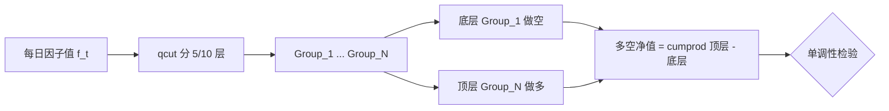

理想因子：净值曲线**严格单调**（Group_1 < Group_2 < ... < Group_N），多空组合夏普 > 1。实务中若顶层与底层曲线交叉，则因子失效或存在非线性。

> 实现注意（line 82-85）：当因子并列值过多导致 `qcut` 分层不足 N 组时，自动回退到等宽 `pd.cut`，避免抛异常中断全市场回测。

#### 1.6.3 IR（Information Ratio，组合层）

IC_IR 是因子层稳定性，**IR 是组合层超额收益的稳定性**，定义（项目 `bench_runner_strict.py` 语义）：

$$
\text{IR} = \frac{\overline{r_p - r_b}}{\sigma_{\text{tracking}}(r_p - r_b)} = \frac{\text{超额收益均值}}{\text{跟踪误差}}
$$

其中 $r_p$ 为组合收益、$r_b$ 为基准。IR > 0.5 视为优秀主动管理。在因子语境下，多空组合的 IR ≈ IC_IR × $\sqrt{N_{\text{bets}}}$，因此高频 + 多标的能放大单因子 IR。

#### 1.6.4 随机对照 + OOS：抵御数据窥探

这是本项目最严谨的设计（`bench_runner_strict.py`），直接回应 Harvey-Liu-Zhu (2016) *"...and the Cross-Section of Expected Returns"* 提出的**多重检验 / 数据窥探（data snooping）**问题：当你试了 455 个 alpha（`bench_runner_strict.py:89`，即 alpha101+gtja191+qlib158+academic 四 zoo 全量），按 t>2 的常规标准必然有大量假阳性——HLZ 指出修正多重检验后，发表因子的 |t| 阈值应提至 **~3.5** 而非 2.0。

项目用两条 rail 解决：

**Rail 1：同宇宙随机对照（random control）**。`compute_random_ic_series`（`bench_runner_strict.py:141-174`）对每个 alpha，在每日横截面上**置换（shuffle）因子值到不同标的**（`_shuffle_within_rows`，line 99-138），破坏"因子→标的"映射但保留横截面分布，构造一个"无信息但统计包络相同"的零假设基线。重复 5 个 seed（line 162）取均值，得到 `random_ic`。真正的因子 alpha 应定义为：

$$
\alpha_t = \text{IC}_t^{\text{signal}} - \text{IC}_t^{\text{random}}, \qquad t\text{-stat} = \frac{\overline{\alpha_t}}{\sigma(\alpha_t)/\sqrt{n}}
$$

仅当 `alpha_t > 阈值` 才算"击败了随机"（`alpha_series_paired`，line 177-184；`t_stat`，line 187-195）。

**Rail 2：OOS 时间切分**。传 `oos_split="YYYY-MM-DD"` 后（line 427-432），将 IC 序列按时间切成 train/test，分别算 t-stat。`categorise_strict`（line 242-293）给出四级判定：

| 类别 | 判定条件 | 含义 |
|------|---------|------|
| `confirmed_alive` | 全样本 $t\ge\text{thr}$ 且 test 期 $t\ge\text{thr}$（同号）| 真存活，可上线 |
| `train_only` | 全样本通过但 test 落入噪声带 | 过拟合，OOS 失效 |
| `reversed_strict` | test 期 $t\le-\text{thr}$（符号翻转）| 训练期 alpha 是假象，最强失效信号 |
| `noise` | $t\in[-\text{thr},\text{thr}]$ | 与随机无异 |

阈值默认 `alpha_t_threshold=2.0`（向后兼容）；当跑完整 455-alpha zoo 时应传 `3.5` 以实现 HLZ 多重检验修正（`StrictThresholds` docstring，line 83-94）。

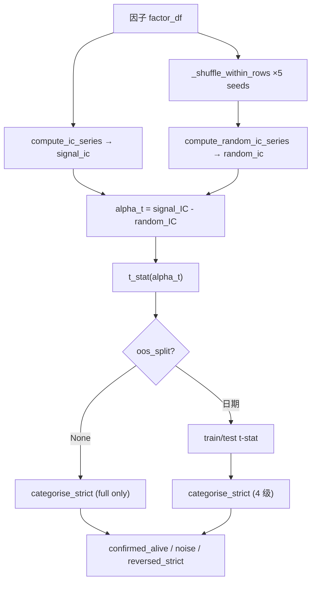

> **实务注意**：bili_stock A 股 9 个月审计（`bench_runner_strict.py:21-24` 引述）发现——12 个单因子全部在某个参数下通过 raw IC 检验，但**仅 1 个**经受住平行随机对照。这正是 raw IC gate 制造假阳性的主因，也是 strict runner 将 `random_control` 设为**强制显式传参**（line 353-360，省略即 `TypeError`）的原因。

---

### 1.7 小结

| 关注点 | 项目落点 | 关键 file:line |
|--------|---------|---------------|
| 因子数学契约 | wide DataFrame、NaN 传播、禁 inf | `base.py:1-13` |
| 算子加速 | bottleneck 350x、sliding_window 45x、einsum 40x | `base.py:210-282`、`_backend.py` |
| 元数据治理 | AST 静态扫描、pydantic `extra="forbid"` | `registry.py:67-141` |
| 前视防御 | `delta d≥1`、forward return shift、OOS 边界 | `base.py:246`、`alpha_bench_tool.py:482`、`bench_runner_strict.py:473` |
| 评价三层 | IC(IR) → 分层回测 → 随机对照+OOS | `factor_analysis_core.py`、`bench_runner_strict.py` |

掌握这套"算子 → 因子 zoo → 评价"闭环后，下一节将进入**组合构建与回测引擎**（§2）：如何把 `confirmed_alive` 的因子转化为有约束优化下的权重与净值曲线。


---


## 2. 回测引擎与实盘风控

> 本节源自 `02b-backtest-live.md`。


### 2.1 业务定义

回测（backtest）是用历史 OHLCV 数据驱动一套策略，模拟其在过去会如何交易、产生何种权益曲线，从而在不承担真实资金风险的前提下评估策略的统计期望。它是量化研究的"假阴线"——所有 alpha 在上线前都必须先在历史里被证伪或证实。

### 2.2 信号→权重→收益链路

Vibe-Trading 的回测内核是一条明确的因果链：

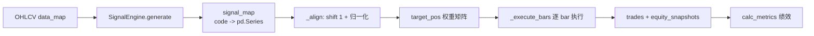

每个标的产出一个信号 `Series`（连续值，clip 到 $[-1, 1]$），再被聚合成目标权重矩阵，最后在逐 bar 循环里被市场规则（手续费、涨跌停、手数）"挤压"成实际持仓。

### 2.3 bar-by-bar 事件驱动 vs 向量化

工程上存在两种实现：**向量化回测**把整段权益曲线用矩阵运算一次性算出，速度极快但无法表达"T+1 不能卖""涨跌停不能成交"这类条件分支；**事件驱动（bar-by-bar）**逐根 K 线推进，每根 bar 都重新决策、撮合、记账，速度慢一个数量级，但能精确建模市场摩擦。Vibe-Trading 选择后者——金融真实性优先于速度，市场规则是收益曲线的一阶影响因素，不可被向量化"磨平"。

核心循环在 `BaseEngine._execute_bars`（`agent/backtest/engines/base.py:504-559`）：每个 `ts` 先跑 `on_bar` 钩子（资金费/爆仓/swap），再按目标权重 `_rebalance` 每个标的，最后记录 `EquitySnapshot`。末尾强平所有残留仓位（`end_of_backtest` reason）。

### 2.4 signal shift(1)：防前视（look-ahead bias）

这是回测最致命的陷阱：若用 $t$ 时刻收盘价生成的信号，又在 $t$ 时刻收盘价成交，等于"偷看未来"。`_align` 函数（`agent/backtest/engines/base.py:78-137`）在 L126-127 做了关键处理：

```python
raw = signal_map[c].reindex(own_dates).fillna(0.0).clip(-1.0, 1.0)
shifted = raw.shift(1).fillna(0.0)
pos[c] = shifted.reindex(dates).ffill(limit=ffill_limit).fillna(0.0)
```

`shift(1)` 把信号整体后移一根 bar，物理含义是"用 $t$ 日收盘计算的信号，在 $t+1$ 日开盘成交"——next-bar-open 语义。执行时 `_rebalance` 取的是 `bar["open"]`（`base.py:622, 633`），与 shift 语义自洽。`clip(-1, 1)` 防止 LLM 生成越界信号，`ffill(limit)` 防止用前值掩盖长期停牌（单市场 limit=5，跨市场 limit=10 以容纳春节等长假）。

> **实务注意**：shift 必须在**每个标的自己的交易日历**上做，再 reindex 到统一日历。若直接在统一日历上 shift，跨市场（A 股遇美股交易日）会错位一根。

---

### 2.5 绩效指标数学

#### 2.5.1 核心指标

所有指标在 `calc_metrics`（`agent/backtest/metrics.py:151-234`）一次算出。设权益序列 $E_t$、收益 $r_t = E_t/E_{t-1} - 1$、$n$ 为 bar 数、$\text{bpy}$ 为年化因子。

| 指标 | 公式 | 代码行 |
|------|------|--------|
| 总收益 | $R_{\text{tot}} = E_n/E_0 - 1$ | `metrics.py:187` |
| 年化收益 | $R_{\text{ann}} = (1+R_{\text{tot}})^{\text{bpy}/n} - 1$ | `metrics.py:188` |
| 最大回撤 | $\text{MDD} = \min_t (E_t - \max_{s\le t} E_s)/\max_{s\le t} E_s$ | `metrics.py:193-195` |
| Sharpe | $\frac{\bar r}{\sigma_r}\sqrt{\text{bpy}}$ | `metrics.py:190` |
| Calmar | $R_{\text{ann}} / |\text{MDD}|$ | `metrics.py:197` |
| Sortino | $\frac{\bar r}{\sigma_{r^-}}\sqrt{\text{bpy}}$，$\sigma_{r^-}$ 为下行收益标准差 | `metrics.py:200-202` |
| 胜率 | $\#\{t:\text{pnl}_t>0\}/\#\text{trades}$ | `metrics.py:71` |
| 盈亏比 | $\overline{\text{win}}/\overline{|\text{loss}|}$ | `metrics.py:74-75` |
| Profit Factor | $\sum\text{win}/\sum|\text{loss}|$ | `metrics.py:77-79` |

#### 2.5.2 Benchmark 超额与 Information Ratio

当传入 `bench_ret`（`metrics.py:206-215`）：超额收益 $\text{excess} = R_{\text{tot}} - R_{\text{bench}}$；主动收益 $a_t = r_t - r_{\text{bench},t}$，则

$$\text{IR} = \frac{\bar a}{\sigma_a}\sqrt{\text{bpy}}$$

IR 衡量的是"每单位跟踪误差的超额"，是相对收益策略的核心 KPI。

#### 2.5.3 年化因子 bars_per_year

$$
\text{Sharpe} = \frac{\bar r}{\sigma_r}\sqrt{\text{bpy}}
$$

年化因子是 Sharpe/Sortino/IR 的"乘子"，算错会让波动率系统性偏估。`calc_bars_per_year`（`metrics.py:34-46`）按 `interval × source` 二维查表：

| 市场 | source | 交易日/年 | 1D bars | 5m bars |
|------|--------|----------|---------|---------|
| A 股 | tushare/akshare/mootdx | 252 | 252 | 12,096 |
| 美股 | yfinance | 252 | 252 | 19,656 |
| 加密 | okx/ccxt | 365 | 365 | 105,120 |
| 港股 | futu | 252 | 252 | 12,096 |

加密 $365\times24$、外汇 $365\times24$（连续市场）。跨市场组合时 `bars_per_year=None`（`runner.py:525-528`），退化为**日历日年化**：$\text{bpy} = n / (\text{days}/365.25)$（`metrics.py:177-181`），避免用单市场因子误估混合曲线。

> **实务注意**：分母 $\sigma$ 用样本标准差（`pandas .std()` 默认 ddof=1），Sharpe 不减无风险利率（`risk_free` 默认 0），与多数研究惯例一致；若对接考核，需显式减 $r_f$。

---

### 2.6 市场规则差异表 + 引擎

不同市场的"摩擦结构"完全不同，强行用一套撮合逻辑会高估收益。Vibe-Trading 用 `BaseEngine` 抽象 + 子类覆写四个钩子（`can_execute`/`round_size`/`calc_commission`/`apply_slippage`）+ 可选 `on_bar` 来隔离差异。

#### 2.6.1 市场规则总表

| 维度 | A 股 | 美股 | 港股 | 加密(永续) | 外汇 | 期货 | 期权 |
|------|------|------|------|-----------|------|------|------|
| 交收 | T+1 | T+0 | T+0 | T+0 | T+0 | T+0 | T+0 |
| 涨跌停 | ±10/20/30% | 无 | 无 | 无 | 无 | 涨跌停板 | 无 |
| 做空 | 禁止 | 允许 | 允许 | 允许 | 允许 | 允许 | 允许 |
| 最小手 | 100 股 | 0.01 股 | 100 股 | 6 位小数 | 1000 单位 | 整手 | 整张 |
| 手续费 | 万2.5+印花税 | 0 | 万1.5+印花税 | Maker/Taker | 点差(半价差) | 乘数相关 | 权利金×费率 |
| 杠杆 | 1× | 1× | 1× | 可配 | 100× | 保证金 | — |

#### 2.6.2 各引擎要点

**ChinaAEngine**（`agent/backtest/engines/china_a.py`）：`can_execute`（L40-73）三道闸——禁做空（L52-53）、T+1（L56-62，比较 `bar_date == entry_date`）、涨跌停（L64-71，涨停不能买/跌停不能卖）；`_price_limit`（L137-155）按代码前缀判板：300/688（创业板/科创板）→±20%、北交所 8 开头（6 位）→±30%、主板→±10%（ST 标的规整为 ±5%，但仅凭代码无法可靠识别，需上游标记）；`round_size`（L75-77）向下取整到 100 股；`calc_commission`（L79-93）= max(万2.5, ¥5) + 过户费万0.1 双边 + 印花税万5 卖方。

**GlobalEquityEngine**（`agent/backtest/engines/global_equity.py`）：US/HK 双模，由 `market` 参数切换。US 零佣金、0.01 股碎股（L53-57）；HK 万1.5 佣金 + 双边印花税 + SFC/FRC 征费 + CCASS 结算费（L65-71）。

**CryptoEngine**（`agent/backtest/engines/crypto.py`）：7×24 不限方向（L43-45），分数仓位到 6 位（L47-49），Maker/Taker 分档（L51-58，开仓 taker/平仓 maker）；`on_bar`（L64-77）跑两件事——资金费（每 8 小时结算）扣 `capital`、维护保证金率触发强平时 `_close_position` reason=`liquidation`。

**ForexEngine**（`agent/backtest/engines/forex.py`）：无显式佣金（点差即成本），`apply_slippage_for_symbol`（L98-122）应用"半价差 + slippage_pips"的不利方向滑点；24 种货币对各有 pip 价差表（L25-36，主要对 1.0-1.5 pip，异国对 USD/TRY 达 15 pip）；`on_bar`（L124-132）每日收盘记 swap（隔夜利息），周三 swap ×3（覆盖周末）。

**FuturesBaseEngine**（`agent/backtest/engines/futures_base.py`）：在 `BaseEngine` 上叠加合约乘数——PnL = $\text{dir}\cdot\text{size}\cdot\text{cm}\cdot(P_{\text{exit}}-P_{\text{entry}})$（L39-44），保证金 = $\text{size}\cdot P\cdot\text{cm}/\text{lev}$（L46-50），下单量 = $\text{notional}/(P\cdot\text{cm})$（L52-56）。子类（China/Global futures）实现 `get_contract_multiplier`。

**OptionsPortfolio**（`agent/backtest/engines/options_portfolio.py`）：用 Black-Scholes 合成理论价（`bs_price` L30-60），欧式 + 美式（早行权启发式 L320-348：intrinsic > continuation×1.02 则行权）；IV 微笑（`iv_smile_adjustment` L135-155）：$\text{IV}(K) = \text{IV}_{\text{atm}} + \text{skew}\cdot\ln(K/S) + \text{curv}\cdot\ln(K/S)^2$；逐日 mark-to-market + Greeks 聚合（delta/gamma/theta/vega）。

**CompositeEngine**（`agent/backtest/engines/composite.py`）：跨市场共享一个资金池，按 `_detect_market` 给每个 symbol 路由到子引擎做"规则书"，所有 state（capital/positions/trades）留在 Composite 自己手里（L60-90）。T+1 因为要查共享持仓表，被拦截在 Composite 层而非子引擎（L94-114）。

---

### 2.7 投资组合优化器

信号给的是方向，优化器（`agent/backtest/optimizers/`）决定"配多少"。统一接口 `(ret, pos, dates) -> pos`，在 `_align` 里 `_load_optimizer` 动态加载（`base.py:140-158`）。

所有优化器继承 `BaseOptimizer`（`optimizers/base.py`），共享滚动协方差窗口（lookback 默认 60 bar）、NaN 校验、保留信号符号只改权重的逻辑（L74-76）。权重在 `_calc_weights` 内归一到 $\sum w=1$。

#### 2.7.1 四种优化器

**mean_variance**（`mean_variance.py`，Markowitz）：最大化 Sharpe 比，等价于在 long-only simplex 上求

$$
\max_w \ \frac{w^\top\mu - r_f}{\sqrt{w^\top\Sigma w}}, \quad w\ge 0,\ \sum w = 1
$$

L39-43 定义 `neg_sharpe`，SLSQP 求解（L45-52，bounds $[0,1]$，等式约束 $\sum w=1$）。失败回退等权。

**risk_parity**（`risk_parity.py`，Spinu 2013）：让各资产**边际风险贡献**相等。$w_i \propto 1/\sigma_i$ 作种子（L28-29），然后 5 轮 Newton 风格精炼（L31-39）：$\text{mrc} = \Sigma w / \sigma_p$，$\text{rc}_i = w_i\cdot\text{mrc}_i$，目标 $\text{rc}_i = \sigma_p/n$，迭代 $w_i \leftarrow w_i\cdot(\text{target}/\text{rc}_i)$。

**max_diversification**（`max_diversification.py`，Choueifaty-Coignard）：最大化分散化比

$$
\text{DR} = \frac{w^\top\sigma}{\sqrt{w^\top\Sigma w}}
$$

$\sigma$ 为各资产波动率向量。L31-35 `neg_dr`，SLSQP 求解。

**equal_volatility**（`equal_volatility.py`，逆波动）：最朴素，$w_i \propto 1/\sigma_i$，不做协方差建模（L34-37）。低波资产配高权，让每个资产"贡献等量波动"。

> **实务注意**：Markowitz 对协方差估计极敏感（样本 $\Sigma$ 病态时权重极端），生产多用 risk_parity/逆波动；SLSQP 不收敛时全部回退等权（`_equal_weight`），这是设计上的 fail-safe 而非 bug。

---

### 2.8 信任层与可复现

回测结果要能被审计、被复现，必须冻结"配置 + 策略代码 + 产物"的密码学指纹。

#### 2.8.1 Run Card（`agent/backtest/run_card.py`）

`write_run_card`（L25-90）每次回测末尾写 `run_card.json` + `run_card.md`，核心是 `reproducibility` 块：

- `config_hash`：优先对 `config.json` 文件做 `_file_hash`（SHA-256，分块读取，L108-113），否则对 dict 做 `_json_hash`（排序 key + 紧凑序列化后 SHA-256，L97-105）。
- `strategy_hash`：对 `code/signal_engine.py` 同样 `_file_hash`（L55-58）。
- `artifacts`：列出所有产物文件（config、signal_engine、artifacts/）的 path + size + sha256（`_list_artifacts` L142-162）。

复现验证就是重算这些 hash 与存档比对，任一不一致即"回测被篡改过"。

#### 2.8.2 AST 扫描防 LLM 注入（`agent/backtest/runner.py`）

策略代码由 LLM 生成，存在被注入恶意 `import os; os.system(...)` 的风险。`_validate_signal_engine_source`（L243-270）在 `_load_module_from_file`（L145-160，在 `importlib` 执行**前**调用）对源码做 AST 白名单审查：

- 顶层只允许：docstring、`import`/`from import`、函数/类定义、字面量常量赋值（`_is_safe_constant_assignment` L177-183）。
- 拒绝：顶层可执行语句（`raise ValueError(...)` 类调用）、函数装饰器（L203）、非字面量默认参数（L205-207）、不安全注解（L208-216）、类体内可执行语句（`_validate_class_body` L219-240）、自引用循环 import（L253-257）。

注意 import 本身**不**被拦截——真正危险的是 import-time 副作用执行；扫描器保证 `exec_module` 时只有定义被执行，方法体内的恶意代码要到实例化调用 `generate()` 才跑（这是为什么还需 `safe_run_dir` 把 run 目录限定在白名单根下，`runner.py:409-414`）。

---

### 2.9 实盘 Mandate 授权

#### 2.9.1 bounded autonomy + immutable consent

实盘交易必须遵循"有界自治"：agent 能在用户预设的边界内自由决策，但**不能自己改边界**。Mandate 就是这份边界契约，用 `@dataclass(frozen=True)` 实现编译期不可变（`agent/src/live/mandate/model.py`）。

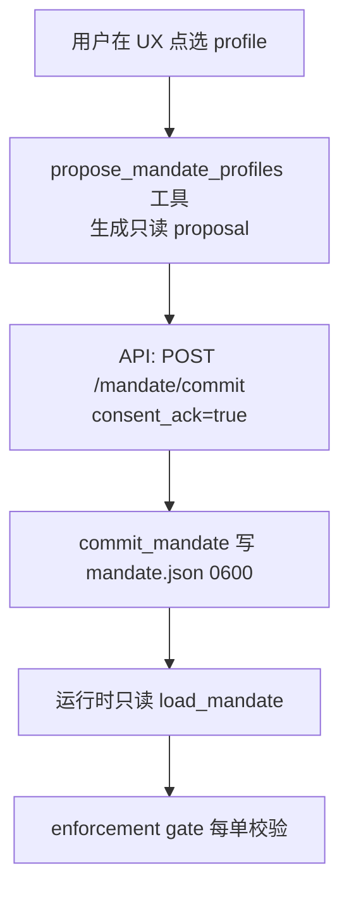

#### 2.9.2 Mandate 数据模型

`HardCaps`（`model.py:36-64`，层 a 量化上限）：

| 字段 | 含义 |
|------|------|
| `account_funding_usd` | 圈存账户余额（broker 侧真上限，本地镜像做防御性数学） |
| `max_order_notional_usd` | 单笔订单名义额上限 |
| `max_total_exposure_usd` | 所有持仓总市值上限 |
| `max_leverage` | 总杠杆倍数，1.0 = 纯现金 |
| `allowed_instruments` | 可交易工具类型白名单，空=全拒 |
| `max_trades_per_day` | UTC 日下单计数上限 |

`UniverseConstraint`（`model.py:66-87`，层 b 选股宇宙）：`asset_classes`（资产大类桶，非个股白名单——保留 agent 发现能力）、`min_market_cap_usd`、`min_avg_daily_volume_usd`（流动性地板）、`exclude_symbols`（个股硬黑名单，优先级最高）。

#### 2.9.3 单一写路径 + 默认 30 天

`commit_mandate`（`agent/src/live/mandate/commit.py:312-452`）是**全系统唯一**能激活实盘权限的函数。关键不变量：

- **不是工具、不在 agent 工具注册表里**（commit.py 模块 docstring L1-25）：agent loop 拿不到这个引用，即使模型被劫持也无法 self-authorize。这是"命门不变量"——结构性保证，不是 prompt 层保证。
- 必须传入 `consent_ack=True`（L367-368），而该布尔只能由 surface（API endpoint）在用户真实点击时设置，模型永远产不出。
- commit 时**重新校验** profile 是否仍 fit 用户当初看到的 ceiling 快照（`_profile_fits_ceilings` L275-309，经 `_normalize_limits` 别名归一防 H9 旁路）。
- proposal 一次性（`_invalidate_proposal` L437），防止重放。
- `ConsentMeta.expires_at` = `created_at + lifetime_days`，`DEFAULT_MANDATE_LIFETIME_DAYS = 30`（`commit.py:45`，L381）——活 mandate 不能永生，到期 gate 自动 fail-closed。

`flatten_on_halt`（`model.py:138`，commit.py L387-391）默认 False（cancel-only，安全默认），需用户显式 opt-in 才在 kill switch 触发时平仓。

---

### 2.10 fail-closed 安全栈（逐层剖析）

实盘订单在到达 broker 前，要穿过一条顺序固定的"洋葱"校验栈。任何一层解析失败都 DENY，绝不 wave-through。

#### 2.10.1 门控顺序

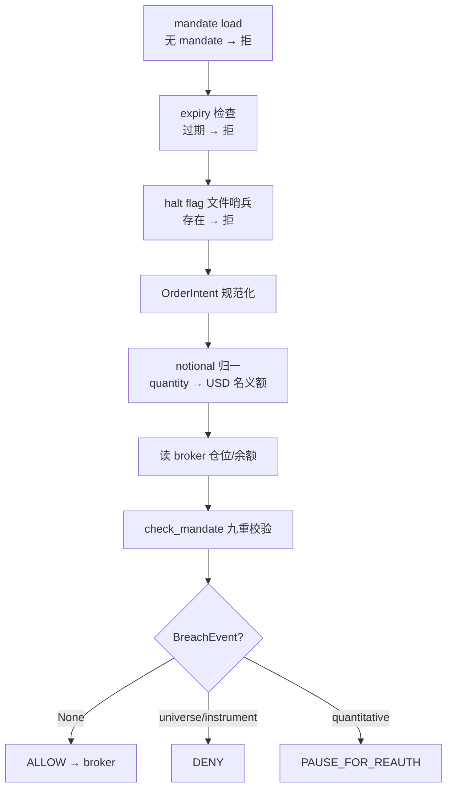

- **mandate load + expiry**：无 mandate 或 `expires_at` 已过 → 拒。
- **halt 文件哨兵**：`halt_flag_set`（`halt.py:135-163`）纯文件系统检查，**不查 LLM 状态、不读进程内 flag**——即使 agent loop 卡死、模型循环、SSE 总线挂了都生效。
- **OrderIntent**（`enforcement.py:100-124`）：broker 无关的归一化订单，symbol 大写、side ∈ {buy,sell}、`notional_usd` + `quantity` + `instrument_type` + `asset_class` 显式携带（多市场连接器用 `asset_class` 区分 US/HK/CN 股票）。
- **notional 规范化（防 H3/H4 旁路）**：`_resolve_order_notional`（`enforcement.py:199-228`）若 `notional_usd` 缺失/非正/NaN → 返回 None → 上游 fail-closed DENY。gate 在 `check_mandate` 前用 live quote 把 quantity 换算成 USD 名义额，盖在 `notional_usd` 上，否则恶意 agent 可只传 quantity 绕过名义额上限。
- **读仓位**：`_positions_market_value`（`enforcement.py:277-301`）严格解析，任一仓位不可解析 → None → DENY。

#### 2.10.2 check_mandate 决策顺序（`enforcement.py:379-538`）

九个 check 固定顺序，首个失败即定 verdict（顺序即模块 docstring 的 exclude-list → instrument → asset-class → single-order notional → total exposure → leverage → daily count → funding → universe floors）：

1. **exclude_symbols**（L426-432，universe/DENY）：个股黑名单，优先级最高。
2. **allowed_instruments**（L434-441，instrument/DENY）：工具类型白名单，空=全拒。
3. **asset_classes**（L447-454，universe/DENY）：资产大类桶；OPTION 无桶，纯由 instrument 把关。
4. **max_order_notional_usd**（L457-470，quantitative/PAUSE）：单笔名义额。
5. **max_total_exposure_usd**（L474-489，quantitative/PAUSE）：post-trade 总敞口 = current + signed(notional)，sell 用负号减敞口。
6. **max_leverage**（L492-505，quantitative/PAUSE）：$|\text{post\_exposure}|/\text{funding}$；funding ≤ 0 → attempted=inf → DENY。
7. **max_trades_per_day**（L508-515，quantitative/PAUSE）：UTC 日计数 +1 超限。
8. **account_funding_usd**（L519-525，quantitative/PAUSE）：防御性纵深，只对 buy 拦截（sell 不会超资金）。
9. **universe floors**（L530-536，universe/DENY）：market_cap / ADV 地板，缺数据 fail-closed。

#### 2.10.3 BreachEvent 路由（`enforcement.py:126-166`）

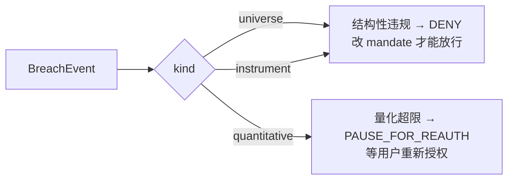

结构性违规（黑名单、工具/资产类不允许）只能 DENY——agent 永远不能编辑 mandate，所以无任何旁路。量化超限 PAUSE，等用户在 consent UX 重新授权。

#### 2.10.4 halt kill switch（`halt.py`）

- **全局 vs 单 broker**：`<runtime_root>/live/HALT` 全局，`<runtime_root>/live/<broker>/HALT` 单 broker（L46-69）。全局总赢（L155）。
- **文件即指令**：sentinel 内容是 JSON 归属元数据，**文件存在性**才是 halt 本身；malformed JSON 仍算 tripped（fail-closed，L184-191）。用户/看门狗可直接 `touch` 文件绕过 `trip_halt`。
- **flatten_on_halt**：runner 观察到 trip 后经 `on_halt_action`（L251-280）调注册的 `flatten_and_cancel`——撤 resting order + 按 mandate 平仓。注意 `trip_halt` 是纯哨兵写入、无副作用，action 是 runner 独立驱动的第二阶段（L194-209 设计说明）。

---

### 2.11 对账与异常（Reconcile）

交易不幂等：崩溃后"重发"用封堵丢失工作漏洞的方式，开了一个更糟的漏洞（双倍交易真钱）。`reconcile`（`agent/src/live/runtime/reconcile.py:271-362`）的职责是**分类并暴露**歧义，绝不自动重发。

#### 2.11.1 注入式 READ-only

`reconcile` 接收三个注入的 READ callable（`read_positions`/`read_balance`/`read_open_orders`），**永远不持有 broker 写工具**——结构上保证它无法重发订单。它把 broker 真相 diff `<broker>/runtime_state.json` 里的崩溃前持久态。

#### 2.11.2 DeltaKind 分类（`reconcile.py:74-98`）

| DeltaKind | 含义 | 处置 |
|-----------|------|------|
| `matched` | broker 真相 == 记录态 | 无动作 |
| `unknown_fill` | broker 有仓位/成交，我方无记录 | **forces halt**（真钱无审计痕迹移动） |
| `orphan_order` | 我方记录了挂单，broker 无 | 不重发，surface 调查（已撤/拒/成交清出） |
| `mid_order_ambiguous` | 我方"已提交未确认"订单崩溃 | **forces halt**（no-retry 规则） |

`unknown_fill` / `mid_order_ambiguous` 属 `_HALTING_KINDS`（L103），任一存在则 `requires_halt=True`（L176-183），runner 必须 halt + surface，绝不静默重试。歧义从不自动重发——`_call_tool` 故意不重试 mutating 调用、`LiveOrderGuardTool.repeatable=False`。

#### 2.11.3 持久化策略

clean reconcile（无 halting delta）才原子写新 state（temp + `os.replace`，L550-588）；不安全则**保留**原 ambiguity 记录不动（runner 需要原始记录 surface 给人）。冷启动无 prior state 时 broker 真相直接成 baseline、零 delta（未记录过的仓位不算 unknown_fill）。corrupt 文件重命名 aside 而非当冷启动，防半截写入被误读（L531-543）。

---

### 2.12 Shadow Account（影子账户）

#### 2.12.1 业务定义

Shadow Account 是**从用户真实交易日志里反向提取"可复现策略"**的子系统。它回答：用户（一个主观交易者）实际在用什么规则赚钱？这套规则能不能被结构化、回测、然后归因？

三者关系：

| | broker | mandate | 审计 | 价格源 |
|---|---|---|---|---|
| 实盘 | 有 | 有 | audit.jsonl | live quote |
| 回测 | 无 | 无 | run_card | 历史 OHLCV |
| Shadow | **无** | **无** | **无** | 历史 OHLCV |

Shadow 是纯研究端——无 broker、无 mandate、无审计，只读历史数据做归因。

#### 2.12.2 提取管线（`agent/src/shadow_account/extractor.py`）


- **FIFO 配对**（`extractor.py:93`）：先买先卖配对成 roundtrip。
- **过滤盈利**（L98）：只从赚钱的交易里提炼规则（亏钱的归因到 overtrading/noise）。
- **特征工程**（`_compute_features` L298-327）：journal 衍生特征（holding_days、pnl_pct、entry_hour、entry_weekday、market）永远可算；price 特征（`entry_rsi14`、`prior_5d_return`）按 `buy_dt` as-of 读取历史 OHLCV（`_attach_price_features` L270-295，因果性保证：只读 $\le$ buy_dt 的 bar），价格数据不可得则 NaN 降级。
- **KMeans 聚类**（`_auto_cluster` L416-456）：z-score 标准化后用 silhouette 在 k∈[2,5] 选最优，回退 k=2；NaN 用中位数填补（仅影响分组，不影响规则边界）。
- **规则提取**（`_cluster_to_rule` L459-521）：每簇取 holding_days/entry_hour 的 p10-p90 分位作 entry/exit 条件，dominant market 标签。样本不足（<`min_support`=3）退化为单簇启发式（`_heuristic_single_rule` L524-544）。文档提及的决策树 max_depth=3 是 v2 预留路径，当前用分位数边界（更轻量、小样本可解释）。
- **路径提取**：`entry_condition` dict（市场、时段、RSI/收益区间）→ codegen 模板 → signal_engine.py。

最少 5 个盈利 roundtrip 才能提取（`MIN_PROFITABLE_ROUNDTRIPS=5`，L36），否则 ValueError。

#### 2.12.3 归因分解（`models.py:84-96`，`backtester.py:393-474`）

把"用户实际 PnL"与"shadow 策略 PnL"的差值，分解为五个有业务含义的来源（signed，正=shadow 本可多赚）：

| 分解项 | 公式 | 业务含义 |
|--------|------|---------|
| `noise_trades_pnl` | $-\sum \text{pnl on rule-violating trades}$ | 用户违反自己规则的交易（shadow 会回避） |
| `early_exit_pnl` | $+\sum_{\text{win, hold<lo}} \text{pnl}\cdot\frac{\text{lo}-\text{hold}}{\text{lo}}$ | 盈利单过早平仓的少赚 |
| `late_exit_pnl` | $+\sum_{\text{loss, hold>hi}} |\text{pnl}|\cdot\frac{\text{hold}-\text{hi}}{\text{hi}}$ | 亏损单死扛过头多亏 |
| `overtrading_pnl` | $-\sum \text{pnl on excess trades}$ | 超出预期交易频次（1 单/2×中位持仓天）的额外交易 |
| `missed_signals_pnl` | $\text{shadow} - \text{real} - (\text{noise+early+late+over})$ | 残差，以上都无法解释的部分 |

`overtrading` 按预期预算 $=\text{span}/(2\times\text{median\_hold})$ 算超额笔数，对 cheapest（|pnl| 最小）的超额单惩罚（L486-512）。top-5 |impact| 的反事实交易记入 `counterfactual_trades` 供报告 Section 6 展示。

> **实务注意**：归因是"事后解释"而非"因果证明"。noise/missed 的符号约定（负 pnl 取反为正）容易让人误读为"shadow 一定赚"，实际它度量的是"若遵守规则可避免的损失"，需配合 coverage/support 解释置信度。

---

*本文档基于 Vibe-Trading 源码撰写，所有 file:line 引用均经源码核对。回测引擎聚焦金融真实性（bar-by-bar + 市场规则隔离），实盘风控聚焦 fail-closed 结构性保证（mandate 不可变 + 单一写路径 + 文件哨兵 kill switch + 注入式 READ-only 对账），Shadow Account 聚焦从主观交易中蒸馏可量化策略。三者共同构成"先模拟、再验证、后实盘"的安全闭环。*


---


## 3. 数据源体系与技术分析流派

> 本节源自 `02c-data-ta.md`。


A 股市场存在大量由交易所/监管强制披露的结构化资金面与筹码面数据。它们既是 A 股 alpha 的重要来源，也是与成熟市场最大的信息结构差异。本项目将每一类封装为只读 Tool，统一经 Eastmoney datacenter 公共 endpoint 取数（无认证、按源 IP 限速），返回 JSON envelope。

### 3.1 龙虎榜 `get_dragon_tiger`

| 维度 | 内容 |
| --- | --- |
| **业务定义** | 沪深交易所每日披露的"异常交易个股"榜单，列明上榜原因（涨跌幅 ±7%、换手率 >20%、日振幅 >15% 等）、买卖前五席位明细、净买入额。 |
| **披露制度/起源** | 交易所信息披露制度，自 2005 年股权分置改革后逐步完善，意在抑制短线操纵、提升市场透明度。每个交易日 18:00 后披露当日数据。 |
| **用法** | ① 识别游资接力（同一席位反复出现在不同标的）；② 机构席位净买入 = 长线信号；③ 知名游资席位（如东方财富拉萨）联动可作情绪指标。 |
| **项目实现** | `DragonTigerTool`，name=`get_dragon_tiger`，读 Eastmoney `RPT_DAILYBILLBOARD_DETAILS`（上榜明细）+ `RPT_BILLBOARD_TRADEDETAIL`（席位明细）。`code` 可选：不传返回全市场上榜列表（上限 200 条），传 code 额外返回该股 top-30 买卖席位。 |

### 3.2 北向资金 `get_northbound_flow`

| 维度 | 内容 |
| --- | --- |
| **业务定义** | 沪深港通（Stock Connect）下，香港及国际资金借道买入内地 A 股的净流入额，分沪股通（沪港通北向）+ 深股通（深港通北向）。单位：万元 CNY。 |
| **披露制度/起源** | 2014 年沪港通、2016 年深港通先后开通。北向被称为"聪明钱（smart money）"，是 A 股日内的全球情绪风向标。 |
| **用法** | ① 北向连续多日大额净流入 → 风险偏好上行；② 个股层面北向持股变动（需用 `get_fund_flow`，本工具为全市场总量）；③ 沪深分化反映大盘 vs 成长风格切换。 |
| **项目实现** | `get_northbound_flow(lookback_days=10)`，返回 realtime（最新实时净流入）+ history（最近 N 个交易日，clamp 到 `[1, _MAX_LOOKBACK_DAYS]`）。**注意**：本工具是全市场总量，非单股流入；单股资金流用 `get_fund_flow`。 |

### 3.3 融资融券 `get_margin_trading`

| 维度 | 内容 |
| --- | --- |
| **业务定义** | 融资（借钱买股，多头杠杆）+ 融券（借股卖出，空头杠杆）余额。核心字段：融资余额、融资买入额、融券余额、两融（RZRQ）合计余额。 |
| **披露制度/起源** | 2010 年 3 月 A 股正式开闸两融。两融标的池由交易所定期调整（目前约 2000 只）。余额逐日披露。 |
| **用法** | ① 融资余额持续上行 = 散户/杠杆多头情绪升温，趋势末段常见；② 融券余额激增 = 看空对冲，常出现在大股东减持前；③ 两融余额/流通市值比 >10% 视为高杠杆警戒线。 |
| **项目实现** | `get_margin_trading(code, days=30)`，每日一行（最新在前），覆盖 SH/SZ 标的。 |

### 3.4 大宗交易 `get_block_trades`

| 维度 | 内容 |
| --- | --- |
| **业务定义** | 单笔成交达到规定最低限额（A 股通常 ≥50 万股或 ≥300 万元）的场外协议大宗成交，记录成交价、量、额、相对收盘价折溢价、买卖双方营业部席位。 |
| **披露制度/起源** | 大宗交易系统独立于集中竞价，T+1 披露。机构大额调仓、股东减持、过桥交易常经此通道。 |
| **用法** | ① 折价成交（如 -8%）常见于股东减持出货，是中期空头信号；② 溢价大宗 = 看多机构抢筹；③ 同一席位对倒（买方=卖方）疑似过桥，无方向意义。 |
| **项目实现** | `get_block_trades(code, days=30)`，返回每笔明细含 premium/discount、买卖营业部。 |

### 3.5 限售解禁 `get_lockup_expiry`

| 维度 | 内容 |
| --- | --- |
| **业务定义** | 首发原股东、定向增发、股权激励等处于锁定期的限售股，锁定期满后转为可流通，产生减持压力。 |
| **披露制度/起源** | 《上市公司股权分置改革》及再融资规则确定的限售期（首发的控股股东通常锁定 36 个月，战略投资者 12 个月等）。解禁日为预定、可提前获知。 |
| **用法** | ① 大额近期解禁（解禁市值 > 流通市值 20%）= 减持冲击风险，常提前 1-2 月压制股价；② 解禁靴子落地后反而可能利空出尽反弹；③ 定增解禁（成本低）比首发解禁（成本极低）减持意愿更强。 |
| **项目实现** | `get_lockup_expiry(code)` 返回个股完整历史解禁计划；省略 code 传 `horizon_days=30` 返回全市场未来 N 日解禁日历（clamp `[1,365]`）。`repeatable=True` 允许批量查询。 |

### 3.6 股东户数 `get_shareholder_count`

| 维度 | 内容 |
| --- | --- |
| **业务定义** | 季报披露的"股东户数"，配合环比变化与户均持股/持股市值，反映筹码集中度。 |
| **披露制度/起源** | 强制在定期报告（季报/半年报/年报）中披露。中国结算（CSDC）持有实时数据，但公开口径仅定期报告快照。 |
| **用法** | ① 户数环比下降（筹码集中）+ 户均市值上升 = 主力吸筹，看多；② 户数激增（筹码分散）= 主力派发，看空；③ 配合十大流通股东变动交叉验证。 |
| **项目实现** | `get_shareholder_count(code, max_periods)`，每行一个报告期，含户数、环比绝对/百分比变化、户均股数/市值。覆盖 SH/SZ/BJ。 |

> **实务注意**：以上 6 个工具全部经 Eastmoney 公共 datacenter 取数，按源 IP 限速。批量回测前务必加节流，否则会触发 IP 封禁。北向与龙虎榜是日内实时数据，其余为 T+1 披露。

---

### 3.7 美股 / 全球数据

#### 3.7.1 SEC filings `get_sec_filings`

| 表格 | 含义 | 用法 |
| --- | --- | --- |
| **10-K** | 年报，经审计的完整财务 | 一次性看清全年经营、风险因素（Item 1A）、管理层讨论（MD&A） |
| **10-Q** | 季报，未经审计 | 季度跟踪盈利质量、应收/存货异常 |
| **8-K** | 重大事项即时披露（Material Event） | 并购、CFO 变动、业绩预告修正，最快的事件来源 |
| **13F** | 机构持仓季度披露（≥1 亿美元管理人） | 追踪 Berkshire/桥水等聪明钱持仓变动，45 天滞后 |

- **项目实现**：`get_sec_filings(ticker, form?, metric?, limit?)`。ticker → CIK（经 SEC company-tickers 表），返回 accession number、filing/report date、primary-document URL。`metric` 传入 XBRL `us-gaap` 概念（如 `Revenues`、`NetIncomeLoss`、`Assets`）时，额外返回该概念的报告期时间序列。仅覆盖 US 市场。

#### 3.7.2 FRED 宏观 `get_macro_series`

| series_id | 指标 | 经济含义 |
| --- | --- | --- |
| `FEDFUNDS` | 联邦基金利率 | 美联储政策利率，加息周期压估值 |
| `DGS10` | 10 年期国债收益率 | 无风险利率锚，与成长股估值反向 |
| `CPIAUCSL` | CPI | 通胀，决定 Fed 路径 |
| `GDPC1` | 实际 GDP | 衰退/扩张判定 |
| `UNRATE` | 失业率 | 就业-通胀（菲利普斯曲线）联动 |

- **项目实现**：`get_macro_series(series_id, start_date?, end_date?, limit?)`，需 `FRED_API_KEY`（免费申请）。`check_available()` 在无 key 时返回 False，工具被静默排除出 registry。

#### 3.7.3 iWenCai 语义搜索 `iwencai_search`

| 维度 | 内容 |
| --- | --- |
| **业务定义** | 同花顺 iWenCai（问财）提供的自然语言选股引擎，中文短语即可解析为多条件筛选，返回匹配的 A 股标的 + 解析出的指标列。 |
| **用法** | 例：`"市盈率低于15且净利润增长的银行股"` → 直接得到符合条件标的。远快于手工拼 SQL/因子表达式。 |
| **项目实现** | `iwencai_search(query, limit=20)`，需 `VIBE_TRADING_IWENCAI_KEY`。`repeatable=True`。返回结构化结果列表。中文 query 解析效果最佳。 |

---

### 3.8 数据源 fallback chain 工程

#### 3.8.1 18 个 loader 总览

| # | loader | 市场 | 认证 | 风险等级 | 备注 |
|---|--------|------|------|----------|------|
| 1 | tushare | A股/期货/基金/宏观 | token | 中 | 积分制，专业 A 股 |
| 2 | akshare | 全市场 | 无 | 中（IP 限速） | 开源聚合层 |
| 3 | baostock | A股 | 无 | 低 | 免费，gRPC |
| 4 | tencent | A股 | 无 | 中 | 实时行情 |
| 5 | mootdx | A股 | 无 | 中 | 通达信协议 |
| 6 | eastmoney | A股/港股/宏观 | 无 | 中（IP 限速） | 公共 datacenter |
| 7 | sina | A股/美股/港股 | 无 | 中 | 老牌免费源 |
| 8 | yfinance | 美股/全球/加密 | 无 | 低 | Yahoo 官方 |
| 9 | yahoo | 同 yfinance | 无 | 低 | 别名通道 |
| 10 | stooq | 美股/全球 | 无 | 低 | 历史数据强 |
| 11 | futu | 港股 | token | 中 | OpenAPI |
| 12 | ccxt | 加密 | key（可选） | 低 | 100+ 交易所聚合 |
| 13 | okx | 加密 | key（可选） | 低 | 单交易所直连 |
| 14 | finnhub | 美股 | key | 低 | REST API |
| 15 | alphavantage | 美股 | key | 低 | REST，限速严 |
| 16 | tiingo | 美股 | key | 低 | 高质量历史 |
| 17 | fmp | 美股 | key | 低 | Financial Modeling Prep |
| 18 | local | 全市场 | 配置文件 | — | 永不降级网络源 |

#### 3.8.2 按市场排列的 fallback chain

`FALLBACK_CHAINS` 的排序原则：**先 IP-ban 风险（轻量公共 endpoint 优先），后数据质量**。无认证公共源（eastmoney/sina/stooq/yahoo）靠前，key-gated REST（finnhub/alphavantage/tiingo/fmp）靠后，`local` 永远兜底。

| 市场 | fallback chain（左→右） |
|------|------------------------|
| a_share | tencent → mootdx → eastmoney → baostock → akshare → tushare → local |
| us_equity | yahoo → stooq → sina → eastmoney → yfinance → tiingo → fmp → finnhub → alphavantage → akshare → local |
| hk_equity | eastmoney → yahoo → futu → yfinance → akshare → local |
| crypto | okx → ccxt → yfinance → local |
| futures | tushare → akshare → local |
| fund | tushare → akshare → local |
| macro | akshare → tushare → local |
| forex | akshare → yfinance → local |

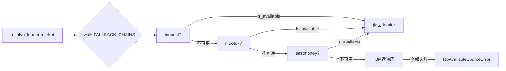

#### 3.8.3 `local` 永不降级网络源

`_NO_NETWORK_FALLBACK_SOURCES = frozenset({"local"})`：当用户显式请求 `local`（读取 `~/.vibe-trading/data-bridge/config.yaml` 配置的本地文件），若不可用，**绝不允许**静默降级到 Yahoo/Tencent 等网络源。设计意图：`local` 的 `markets` 集合覆盖全市场仅为让 auto-resolver 能"够到"它，而非让一次失败的网络请求伪装成 local 数据。这是一个配置问题，必须抛错让用户看见。

#### 3.8.4 `DataLoaderProtocol` 接口

```python
@runtime_checkable
class DataLoaderProtocol(Protocol):
    name: str              # 源名（如 "tushare"）
    markets: set[str]      # 支持的市场集合
    requires_auth: bool    # 是否需要 token/key

    def is_available(self) -> bool: ...   # token 存在 + 网络可达
    def fetch(self, codes, start_date, end_date, *,
              interval="1D", fields=None) -> dict[str, pd.DataFrame]: ...
```

`@register` 装饰器在模块首次 import 时把类写入全局 `LOADER_REGISTRY`。`_ensure_registered()` 懒加载全部 18 个 loader 模块（缺失依赖如 akshare 未装则静默跳过），保证 `resolve_loader` 调用方永远看到非空 registry，与 import 顺序无关。

#### 3.8.5 三层数据健壮性工程

| 层 | 函数 | 作用 |
|----|------|------|
| **结构校验** | `validate_ohlc(frame, strategy="drop"\|"warn"\|"raise")` | 丢弃/告警/拒绝违反 OHLC 不变量的脏 bar：`high<low`、`high<open`、`open<=0` 等。loader 边界的统一 sanity pass。 |
| **重试预算** | `retry_with_budget(fn, transient, deadline, label, max_retries=3, backoff=(0.5,1.5,4.0))` + `check_budget` | 墙钟 deadline + 退避调度，仅对声明的 transient 异常重试。`sleep(min(backoff[i], remaining))` 防止短预算花完整退避；终态失败包成 `TimeoutError`，原异常作 `__cause__`。 |
| **Parquet 缓存** | `cached_loader_fetch(...)` | opt-in（`VIBE_TRADING_DATA_CACHE=1`）。content-addressed key（source+symbol+timeframe+date+fields 的 sha256），写 `~/.vibe-trading/cache/loaders/<source>/<key>.parquet`（duckdb 写）。**关键**：`loader_cache_range_is_final` 仅缓存 `end_date < today` 的范围，避免把正在形成的当日 bar 钉死在缓存里。 |

> **实务注意**：Tushare 等 loader 在 `__init__` 时即调用 SDK 检查凭证，可能直接抛错。`resolve_loader` 把构造异常等同于 `is_available()=False`，保证 fallback chain 不中断（Issue #50）。

---

### 3.9 技术分析流派（项目 skills 全收录）

七大流派全部位于 `agent/src/skills/<name>/`，各自有独立 `SKILL.md`。信号统一约定：`1`=做多，`-1`=做空，`0`=观望。

#### 3.9.1 缠论 chanlun

| 维度 | 内容 |
| --- | --- |
| **起源** | 缠中说禅（2006–2008 博客系列），一套纯基于价格结构的中国本土技术分析体系。 |
| **核心理论** | 市场是完全由价格几何结构决定的自相似系统，无需外部信息。 |
| **关键链路** | 原始K线 → 去包含处理 → 分型（FX）识别 → 笔（BI）检测 → 中枢（ZS）构建 → 买卖点判定 |
| **核心概念** | **分型**：顶分型（中间K最高）/底分型；**笔**：相邻顶底分型间走势，最小单元；**中枢**：≥3 笔的价格重叠区域，趋势核心；**背驰**：力度衰减。 |
| **买卖点** | 一买/一卖（趋势末背驰反转）、二买/二卖（回调不破底/顶确认）、三买/三卖（中枢上/下移后不回前中枢）。 |
| **项目位置** | `skills/chanlun/`，基于 [czsc](https://github.com/waditu/czsc) 库（v0.9.68+），内置 43 个信号函数（`cxt_first_buy_V221126` 等），支持 3/5/7/9/11 笔形态分类。 |

#### 3.9.2 艾略特波浪 elliott-wave

| 维度 | 内容 |
| --- | --- |
| **起源** | R.N. Elliott（1930s），后人 Prechter 推广。 |
| **核心理论** | 市场以分形波浪结构运动：**5 浪推动**（顺趋势 1-2-3-4-5）+ **3 浪调整**（逆趋势 A-B-C）。 |
| **三条铁律** | ① 浪 2 不回破浪 1 起点；② 浪 3 不能是最短推动浪；③ 浪 4 不进浪 1 价格区间。 |
| **斐波那契比例** | 浪 2 回撤浪 1 的 0.5–0.618；浪 3 = 浪 1 × 1.618；浪 4 回撤浪 3 的 0.382；浪 5 ≈ 浪 1。 |
| **信号** | 5 浪推动完成 → 卖（趋势顶）；ABC 调整完成 → 买。浪 3 进行中 → 顺势不反转。 |
| **项目位置** | `skills/elliott-wave/`，**纯自研 pandas 实现**，Zigzag 检测转折点 + 斐波那契比例校验，`swing_window=10`、`fib_tolerance=0.15`。采用"宁缺毋滥单一解释"策略。 |

#### 3.9.3 一目均衡 ichimoku

| 维度 | 内容 |
| --- | --- |
| **起源** | 日本细田悟一（Goichi Hosoda，1930s 开发，1968 公开），"一目"=一眼看穿。 |
| **核心理论** | 五线 + 云层构成的完整趋势评估体系，自带支撑阻力与时间维度。 |
| **五线** | **转换线 Tenkan-sen** (9H+9L)/2；**基准线 Kijun-sen** (26H+26L)/2；**先行带 A** (Tenkan+Kijun)/2 前移 26；**先行带 B** (52H+52L)/2 前移 26（A/B 之间为云层）；**滞后线 Chikou** 收盘后移 26。 |
| **信号** | TK 交叉触发，三重过滤：强买=多头 TK 交叉+价在云上+多头云（A>B）；强卖反之。warm-up 需 78 根（52+26）。 |
| **项目位置** | `skills/ichimoku/`，纯 pandas 实现。 |

#### 3.9.4 SMC（Smart Money Concepts）

| 维度 | 内容 |
| --- | --- |
| **起源** | ICT（Inner Circle Trader，Michael Huddleston），追踪"聪明钱"（机构资金）行为的现代机构交易流派。 |
| **核心理论** | 机构资金在流动性匮乏区制造价格行为，散户止损是机构流动性来源。 |
| **关键概念** | **BOS**（Break of Structure，趋势延续）；**ChoCH**（Change of Character，趋势反转）；**FVG**（Fair Value Gap，价格回补目标）；**Order Blocks**（订单块，机构订单密集区）；**Liquidity**（流动性掠夺/sweep，止损狩猎区）。 |
| **信号** | 方向由 ChoCH 给出，BOS 确认，FVG 过滤：多头 ChoCH/BOS + 多头 FVG → 做多。 |
| **项目位置** | `skills/smc/`，基于 `smartmoneyconcepts` 库，`swing_length=10`、`close_break=True`。 |

#### 3.9.5 谐波 harmonic

| 维度 | 内容 |
| --- | --- |
| **起源** | H.M. Gartley（1935《Profits in the Stock Market》），后人 Carney/ Pesavento 系统化为斐波那契几何学派。 |
| **核心理论** | 用精确的斐波那契比例关系识别 XABCD 五点价格结构，在 PRZ（潜在反转区）捕捉高胜率反转。 |
| **四类形态** | Gartley（B=0.618XA, D=0.786XA）；Bat（B=0.382–0.5XA, D=0.886XA）；Butterfly（B=0.786XA, D=1.27XA）；Crab（B=0.382–0.618XA, D=1.618XA）。 |
| **信号** | 看涨形态（D 在底部）→ 买；看跌形态（D 在顶部）→ 卖。 |
| **项目位置** | `skills/harmonic/`，可选 `vibe-trading-ai[harmonic]`（pyharmonics），未装则 fallback 到内置检测器，`is_stock=False`。 |

#### 3.9.6 蜡烛图 candlestick

| 维度 | 内容 |
| --- | --- |
| **起源** | 日本本间宗久（18 世纪米市），Steve Nison 引入西方。 |
| **核心理论** | 单根/多根 K 线的实体与影线组合反映多空力量瞬时平衡。 |
| **15 种形态** | 单 K（5）：锤子线/倒锤/射击之星/十字星/纺锤顶；双 K（5）：看涨/看跌吞没、看涨/看跌孕线、刺透线/乌云盖顶；三 K（4）：启明星/黄昏星/三白兵/三黑鸦。 |
| **信号** | 看涨形态 +1，看跌 -1，总分 >0 做多，<0 做空。 |
| **项目位置** | `skills/candlestick/`，纯 pandas 向量化实现 15 形态 + 1 趋势确认，`body_pct=0.1`、`shadow_ratio=2.0`。 |

#### 3.9.7 期权策略 options-strategy

| 维度 | 内容 |
| --- | --- |
| **起源** | Black-Scholes（1973）定价模型 + 期权组合工程学。 |
| **核心理论** | 从标的价格出发，BS 模型合成理论期权价，模拟多腿组合 PnL/Greeks/到期行权。 |
| **支持策略** | Covered Call（备兑）、Protective Put（保护性看跌）、Straddle（同价对敲）、Strangle（异价对敲）、Iron Condor（铁鹰）、Butterfly（蝶式）、Calendar Spread（日历价差）。 |
| **Greeks** | **Delta**（标的变化 1 → 期权价变化，对冲比率）；**Gamma**（Delta 变化率，衡量对冲稳定性）；**Theta**（每日时间衰减，卖方收益源）；**Vega**（波动率 1% → 期权价变化，波动率交易核心）；**Rho**（利率敏感度）。 |
| **项目位置** | `skills/options-strategy/`，BS 合成数据模式（`iv_source="historical"` 用 30 日滚动历史波动率替代 IV），多腿组合回测，输出 `equity/metrics/trades/greeks.csv`。配套 `options_pricing` 工具单次定价。 |

> **实务注意**：① BS 假设恒定波动率，但真实市场有波动率微笑/偏斜，深虚值定价偏差大；② Theta 衰减非线性，最后 30 天加速，但 Gamma 风险也激增；③ 本引擎仅支持欧式期权，深实值美式期权有提前行权价值时会低估。

---

### 3.10 跨市场交易规则速查表

#### 3.10.1 全市场主表

| 维度 | A 股 | 港股 | 美股 | 加密 | 外汇 | 期货 | 期权 |
|------|------|------|------|------|------|------|------|
| **交易时间** | 9:30–11:30 / 13:00–15:00（T+1） | 9:30–12:00 / 13:00–16:00（T+0） | 9:30–16:00 ET（T+0） | 7×24 | 24/5（悉尼→纽约轮转） | 各交易所分时段，夜盘常见 | 跟随标的，到期日特殊 |
| **最小变动价位** | 0.01 元 | 0.001–0.05（按价位档） | $0.01（> $1）/ $0.0001 | 视交易所 | pip 0.0001（JPY 0.01） | 合约规定 tick | $0.01 / $0.05 |
| **结算** | T+1（资金 T+0） | T+2 | T+1 | 即时 | T+2 | 每日盯市 mark-to-market | T+1（美）/ T+0 |
| **保证金** | 现金账户为主；两融维持担保比 ≥130% | 无强制最低，券商自定 | Reg T 50% 日内/隔夜 | 永续合约 1×–125× | 1%–5%（杠杆 20–100×） | 商品 5%–15% | 买方付权利金，卖方需保证金 |
| **做空规则** | 融券标的池内，禁裸卖空 | 可借券卖空，需报告 | 规则 SHO，禁裸卖空（除做市商） | 永续/合约开空自由 | 做空=卖出报价货币 | 卖开仓，天然双向 | 买入认沽 |
| **涨跌幅** | ±10%（ST ±5%、创业/科创 ±20%） | 无 | 无（仅熔断 circuit breaker） | 无 | 无 | 各品种规定 | 无 |
| **税务要点** | 印花税卖出 0.05%；红利税差别化；个人免资本利得税 | 印花税买卖各 0.13% | 资本利得税（长持 <15%/短持 最高 37%） | 各国差异大 | 免税/低税区居多 | 商品期货平仓盈亏计税 | 美国复杂（Section 1256 60/40） |

#### 3.10.2 结算与税务要点补充

| 市场 | T+N | 关键税务 |
|------|-----|----------|
| A 股 | T+1 | 个人转让免资本利得税；股息红利按持股期限差别化（≤1 月 20%，1 月–1 年 10%，>1 年 0%） |
| 港股 | T+2 | 港股通红利税 20%（个人），印花税 0.13% 双边 |
| 美股 | T+1（2024 年起由 T+2 缩短） | 非居民填 W-8BEN 免/低预扣，资本利得对非居民通常免税 |
| 加密 | 即时 | 多数司法辖区视作财产，每笔交易触发资本利得 |

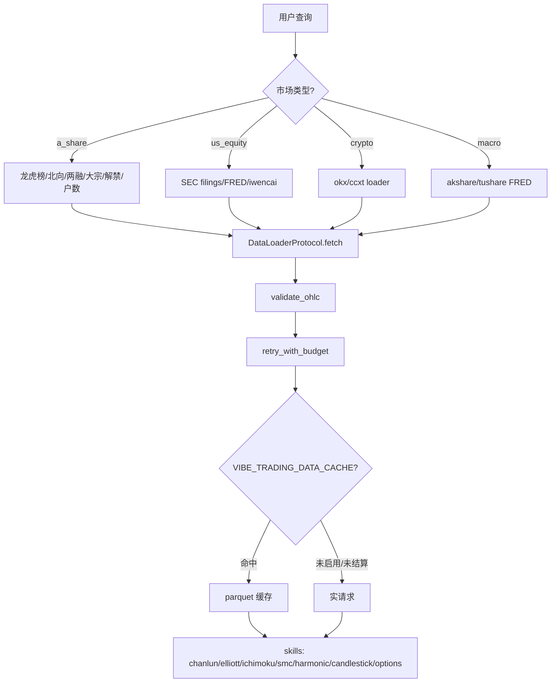


---


## 4. Swarm 多智能体协作

> 本节源自 `02d-swarm.md`。


### 4.1 业务定义

**Swarm**：把一个复杂金融研究/决策任务拆成若干**有边界、有工具、有人设**的子 agent，按 DAG 依赖编排，层内并行、层间串行，最终聚合为一个可执行结论的系统。

### 4.2 单 agent 的三大结构性缺陷

金融研究与单边对话天然冲突。一个单体 agent 同时扮演「看多研究员 + 看空研究员 + 风控 + PM」时，会出现：

| 缺陷 | 单 agent 表现 | 多 agent 解法 |
| --- | --- | --- |
| **视角单一（confirmation bias）** | LLM 倾向顺着 prompt 的语气走，看多 prompt 出看多结论，无人挑战 | 设独立 `bear_advocate` 与 `bull_advocate`，prompt 强制反向立场（见 `investment_committee.yaml:9,56`） |
| **风险制衡缺失** | 同一上下文里既当裁判又当运动员，仓位建议无人否决 | 独立 `risk_officer` / `desk_risk_manager`，对上游结论打分（`investment_committee.yaml:106`） |
| **专家分工不深** | 一个 prompt 塞满技术面 + 基本面 + 资金面 + 衍生品，注意力被稀释 | 每个 agent 只配自己领域的 `skills` 白名单（如 `crypto_trading_desk.yaml:42,83,119`） |

### 4.3 多 agent vs 单 agent 取舍

多 agent 不是免费午餐。下表给出真实的工程取舍，**只有当任务满足「多元视角 + 可分解 + 结论需制衡」时才值得上 swarm**：

| 维度 | 单 agent | Swarm（多 agent） |
| --- | --- | --- |
| Token 成本 | 1× | ≈ N×（N 个 worker 各自跑 ReAct 循环，token 累加在 `SwarmRun.total_input_tokens`） |
| 延迟 | 单链路 | 取决于**关键路径深度**，层内并行可摊薄（`runtime.py:256` 拓扑分层） |
| 结论质量 | 易一边倒 | 多空辩论 + 风控否决，结论更稳健 |
| 失败半径 | 全失败 | 单 worker 失败只阻塞其下游（`task_store.py:113` `resolve_dependencies`） |
| 适用场景 | 单点问答、写一段代码 | 投委会、交易台、事件驱动尽调 |

> **实务注意**：一个 4-agent 的投委会跑下来常消耗单 agent 的 4–6 倍 token，且 wall-clock 至少是关键路径深度 × 单 agent 时间。**别对「查一个 ticker 现价」这种任务上 swarm**——那是杀鸡用牛刀。Swarm 的价值在「决策可信度」，不在「速度」。

---

### 4.4 投资委员会 DAG 案例（详析）

#### 4.4.1 业务背景

买方基金的**投资委员会（Investment Committee, IC）**是经典的决策结构：看多研究员建多仓逻辑 → 看空研究员挑刺 → CRO 独立风控复核 → PM 拍板。这套流程天然是 DAG，且**多空必须并行**（否则后跑的一方会偷看前一方结论，失去独立性）。

#### 4.4.2 链路

`investment_committee.yaml` 定义了 4 个 agent × 4 个 task 的辩论链路：

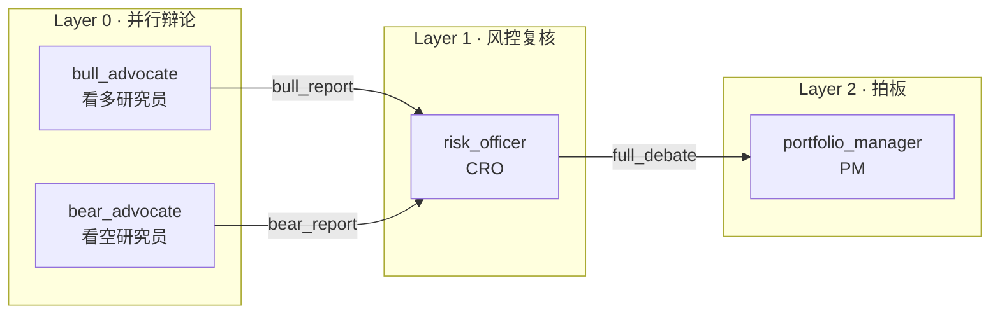

| Task ID | Agent | depends_on | input_from | 层级 |
| --- | --- | --- | --- | --- |
| `task-bull` | `bull_advocate` | `[]` | `{}` | L0 |
| `task-bear` | `bear_advocate` | `[]` | `{}` | L0 |
| `task-risk` | `risk_officer` | `[task-bull, task-bear]` | `{bull_report: task-bull, bear_report: task-bear}` | L1 |
| `task-decision` | `portfolio_manager` | `[task-risk]` | `{full_debate: task-risk}` | L2 |

（依赖声明见 `investment_committee.yaml:209-229`。）

#### 4.4.3 角色职责与上游注入

| Agent | 立场 | 核心产出 | 关键 skill |
| --- | --- | --- | --- |
| `bull_advocate`（`L9`） | 强制看多，每个论点要数据支撑 | 多头 thesis、催化剂日历、看多目标价区间 | `technical-basic` / `fundamental-filter` / `sentiment-analysis` |
| `bear_advocate`（`L56`） | 强制独立挑刺，「不要被群众裹挟」 | 看空风险点、估值泡沫、VaR/CVaR、看空目标价 | `technical-basic` / `fundamental-filter` / `risk-analysis` / `volatility` |
| `risk_officer`（`L106`） | **既不偏向多也不偏向空**，只做风控 | 多空论点可靠性打分（1–5）、盲点风险、仓位上限、止损/对冲 | `risk-analysis` / `volatility` / `correlation-analysis` |
| `portfolio_manager`（`L158`） | 拍板，**不做三方投票的平均** | 方向、分批建仓计划、最终目标价/止损、信心度 0–100% | `strategy-generate` / `asset-allocation` |

#### 4.4.4 上游 input 如何注入下游 prompt

这是 swarm 协作的**关键机制**——下游 agent 的 system_prompt 里写一个占位变量 `{upstream_context}`，运行时由 `build_worker_prompt` 替换（`worker.py:199-212`）：

```python
# worker.py:200-207
if upstream_summaries:
    sections = []
    for key, summary in upstream_summaries.items():
        sections.append(f"### {key}\n{summary}")
    upstream_block = "## Upstream Context (from previous agents)\n\n" + "\n\n".join(sections)
# worker.py:211
agent_spec.system_prompt.replace("{upstream_context}", upstream_block)
```

`upstream_summaries` 的来源是 task 的 `input_from` 映射，在 `runtime.py:570-573` 从已完成的上游 `task_summaries` 里按 key 取出：

```python
# runtime.py:570-573
upstream: dict[str, str] = {}
for context_key, source_task_id in task.input_from.items():
    if source_task_id in task_summaries:
        upstream[context_key] = task_summaries[source_task_id]
```

于是 `risk_officer` 的 prompt 里 `{upstream_context}` 被替换成 `### bull_report\n<看多总结>\n\n### bear_report\n<看空总结>`，CRO 就能在同一上下文里对照多空。

> **实务注意**：注入的是上游 agent 的 **summary**（即其 `report.md` 或最后一段正文，见 `worker.py:745` `_best_summary` + `:909` `_resolve_summary`），**不是完整的 tool 调用记录**。这意味着上游若在 tool 调用里捞到关键数据但没写进 summary，下游就看不到——所以 worker prompt 强制要求 Phase 3 必须 `write_file report.md`（`worker.py:276-281`）。

#### 4.4.5 依赖门控（safety-critical）

`risk_officer` 依赖 `[task-bull, task-bear]`。如果某个上游 failed，**绝不能让 CRO 在缺一边的情况下硬跑**——那等于让风控只看多空一面就签字。`runtime.py:518-547` 的依赖门控逻辑专门处理这个：

```python
# runtime.py:518-547（节选）
blocked_upstreams = []
for dep_id in task.depends_on:
    dep_task = task_store.load_task(dep_id)
    if dep_task.status != TaskStatus.completed:
        blocked_upstreams.append((dep_id, dep_task.status.value))
if blocked_upstreams:
    task_store.update_status(tid, TaskStatus.blocked, ...)
    self._emit_event(..., "task_blocked", ...)
    continue   # 不派发，跳过
```

被 block 的 task 不会出现在 `layer_results` 里，run 级别最终标记为 `failed`（`runtime.py:349-351`）——**沉默成功是比失败更危险的金融 bug**。

---

### 4.5 交易台组织：crypto_trading_desk

#### 4.5.1 业务背景

研究团队（research）产出「观点」，交易台（trading desk）产出「可执行单子」。区别在于：交易台必须落到**仓位、杠杆、执行时机、风控闸门**，而不是停在「看多/看空」。

#### 4.5.2 crypto_trading_desk 拓扑

`crypto_trading_desk.yaml` 是执行向的 3+1 结构：

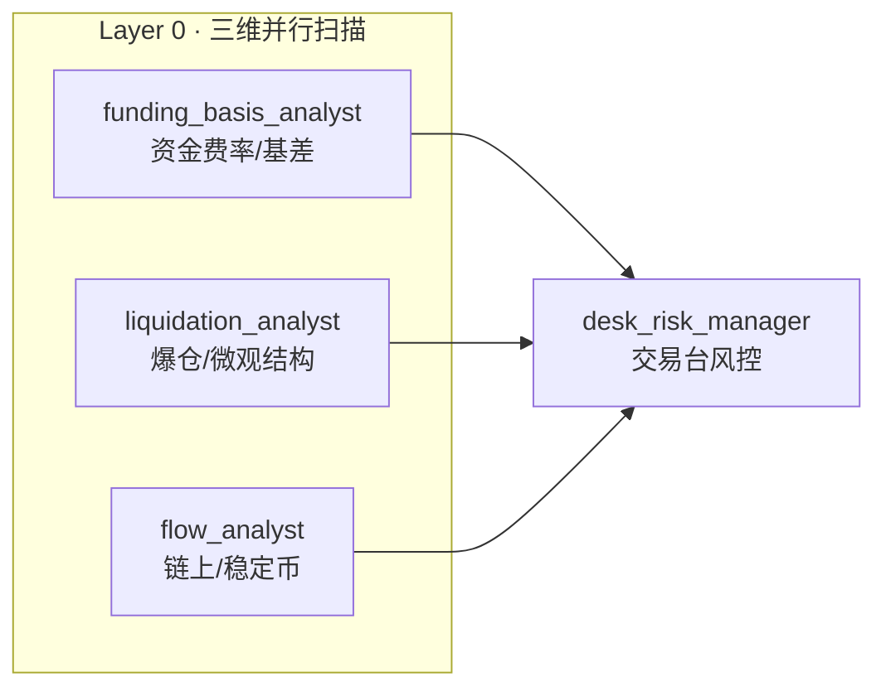

（依赖见 `crypto_trading_desk.yaml:173-196`，三个分析师 `depends_on: []`，`desk_risk_manager` 依赖三者。）

#### 4.5.3 分工与权重

| Agent | 关注什么 | 输出什么 |
| --- | --- | --- |
| `funding_basis_analyst`（`L6`） | 永续资金费率（OKX/Binance/Bybit 8h）、季度期货基差、contango/backwardation | 费率 regime 分类、carry 机会年化、OI×费率矩阵信号 |
| `liquidation_analyst`（`L47`） | 多空爆仓簇（带 $ 量级）、级联风险、盘口深度 ±1/2/5% | 爆仓磁铁方向、$1M 单子滑点能否 <0.1%、推荐订单类型 |
| `flow_analyst`（`L88`） | 稳定币增减、交易所净流入、巨鲸钱包、MVRV/SOPR、ETF 流 | 链上累积/派发判断、资本轮动方向 |
| `desk_risk_manager`（`L124`） | **三维信号加权**：链上 40% > 资金费率 35% > 爆仓 25%（`L139`） | 方向、仓位 %、最大杠杆、TP1/2/3、硬止损、5 个风控闸门（费率/爆仓临近/稳定币流出/BTC-NASDAQ 相关/最大回撤） |

#### 4.5.4 研究 desk vs 交易 desk 的本质差异

| 维度 | research team（如 `crypto_research_lab`） | trading desk（如 `crypto_trading_desk`） |
| --- | --- | --- |
| 终态产物 | 投资观点（thesis） | **可执行交易单**（方向+仓位+止损+风控闸门） |
| 风控角色 | 可选的编辑/合成 | **必须有** `risk_manager` 做 gate（`L154-159`） |
| 权重 | 无显式权重 | 显式信号权重（`L139`） |
| 失败代价 | 观点错了亏声誉 | 单子错了亏本金，**必须可被阻断** |

> **实务注意**：交易台预设里的 `desk_risk_manager` 给出的是**建议**，不是真实下单指令。Vibe-Trading 的 swarm 层不下单——下单要走 `backtest/` 或对接实盘 broker 的另一条路径。把 swarm 输出当交易信号直接打单，等于把 LLM 的置信度当成真实风控，极其危险。

---

### 4.6 预设团队总览（29 个）

`agent/src/swarm/presets/` 下共 **29 个 yaml**（非 30；以下按 desk 类型分组）。每个文件就是一个开箱即用的 DAG 团队。

#### 4.6.1 研究 / Research

| 预设 | 用途 |
| --- | --- |
| `equity_research_team` | 宏观→行业→个股三层研究，编辑合成完整报告 |
| `fundamental_research_team` | 财务/估值/质量三维并行，合成买方深度报告 |
| `technical_analysis_panel` | 经典 TA + Ichimoku + 谐波 + 艾略特 + SMC 并行，信号聚合打分 |
| `commodity_research_team` | 供需深度并行，周期策略师合成大宗商品 thesis |
| `credit_research_team` | 信用质量+利率环境+行业信用三维，合成债券策略 |
| `crypto_research_lab` | 链上+DeFi+情绪三维，Alpha 合成器收敛建议 |
| `sector_rotation_team` | 经济周期+景气度+资金流并行，构建并回测行业轮动策略 |
| `sentiment_intelligence_team` | 新闻/社交/资金流并行，情绪合成器输出复合分数 |
| `social_alpha_team` | Twitter/Telegram/Reddit 并行，提取可交易社交情绪因子 |

#### 4.6.2 交易 / Trading Desk

| 预设 | 用途 |
| --- | --- |
| `crypto_trading_desk` | 加密执行台（详见 §4.5） |
| `statistical_arbitrage_desk` | 配对扫描+微观结构并行，套利策略师构建策略+风控复核 |
| `quant_strategy_desk` | 选股+因子并行→策略回测→风险审计 |
| `derivatives_strategy_desk` | 波动率分析→策略设计→Greeks 风险，串行期权台 |
| `pairs_research_lab` | 相关性扫描+协整并行，配对策略师设计+微观结构复核 |
| `ml_quant_lab` | 特征工程+模型设计并行，回测工程师做严格样本外验证 |

#### 4.6.3 风控 / Portfolio Review

| 预设 | 用途 |
| --- | --- |
| `risk_committee` | 回撤/尾部风险/市场 regime 并行，风控主管签字 |
| `portfolio_review_board` | 业绩归因+风险复核+执行质量并行，CIO 合成再平衡决策 |
| `investment_committee` | 多空辩论→风控复核→PM 拍板（详见 §4.4） |
| `factor_research_committee` | 因子挖掘+验证并行→组合构建→回测复核 |

#### 4.6.4 事件驱动 / 宏观 / 另类

| 预设 | 用途 |
| --- | --- |
| `event_driven_task_force` | 事件扫描→深度影响分析→策略构建，串行尽调链 |
| `earnings_research_desk` | 基本面+盈利修正+期权/事件+盈利策略师，财报季深研 |
| `geopolitical_war_room` | 地缘+能源冲击+供应链并行，首席策略师出应急配置手册 |
| `macro_strategy_forum` | 全球+国内+政策并行，首席策略师出跨资产配置指引 |
| `macro_rates_fx_desk` | 利率+外汇+商品/通胀并行，宏观 PM 出跨资产配置 |
| `global_allocation_committee` | A股+加密+港美股并行，配置师出跨市场加权配置 |
| `global_equities_desk` | A股+港美股+加密分析师+全球策略师，多市场选股 |
| `etf_allocation_desk` | ETF 筛选+宏观配置+风险预算并行，组合优化器构建+回测 |
| `fund_selection_panel` | 多维筛选→Brinson 归因→FOF 权重优化，串行基金评审 |
| `convertible_bond_team` | 债底+股性+嵌入期权价值并行，合成可转债策略 |

---

### 4.7 DAG 调度机制

#### 4.7.1 拓扑分层：层内并行、层间串行

`task_store.py:203` `topological_layers` 用 Kahn 算法把 DAG 切成层，**同一层的 task 无相互依赖、可并行**：

```python
# task_store.py:216-247（Kahn 算法核心）
in_degree = {t.id: len(t.depends_on) for t in tasks}
queue = deque(tid for tid, deg in in_degree.items() if deg == 0)
while queue:
    layer = list(queue); queue.clear()
    layers.append(layer)
    for tid in layer:
        for downstream in dependents[tid]:
            in_degree[downstream] -= 1
            if in_degree[downstream] == 0:
                queue.append(downstream)
```

`runtime.py:502` 用 `ThreadPoolExecutor(max_workers=4)` 跑同一层——**全局并发上限 4**（`SwarmRuntime.__init__` 默认，`runtime.py:63`）。层与层之间是 `for layer_idx, layer_task_ids in enumerate(layers)` 的串行循环（`runtime.py:261`），上一层全完成（或失败）后才进下一层。

> **实务注意**：max_workers=4 是「同层并发上限」，不是「总 agent 数」。一个 4 层 × 每层 3 agent 的 DAG 仍然只是每层最多 3 路并行。如果你的 layer 有 8 个并行 task，只有 4 个能同时跑，其余排队。加密市场行情 API 多有 rate limit，4 路并行已经接近安全上限，别盲目调大。

#### 4.7.2 取消机制（per-run threading.Event）

每个 run 启动时创建一个独立的 `threading.Event`（`runtime.py:132-134`），存入 `_cancel_events` 字典。`cancel_run(run_id)` 调用 `cancel_event.set()`（`runtime.py:161`）。

取消检查点在**层边界**（`runtime.py:263`），不是逐 token 中断——正在跑的 worker 会自然跑完，但下一层不再派发：

```python
# runtime.py:263-267
if cancel_event.is_set():
    self._cancel_remaining_tasks(task_store, layer_task_ids, run.tasks)
    all_succeeded = False
    break
```

`_cancel_remaining_tasks`（`runtime.py:729`）把所有非 completed/failed 的 task 标记为 `cancelled`。最终 run 状态：取消信号置位 → `RunStatus.cancelled`，否则看 `all_succeeded`（`runtime.py:367-369`）。

#### 4.7.3 SSE 事件流（events.jsonl）

所有事件经 `_emit_event`（`runtime.py:164`）做两件事：(1) `store.append_event` 追加到 `.swarm/runs/{id}/events.jsonl`（append-only，支持 offset 读取，`store.py:242`）；(2) 若注册了 `live_callback` 则实时回调（SSE 推送的基础）。

关键事件类型（`models.py:125` `SwarmEvent`）：

| 事件 | 触发点 | 含义 |
| --- | --- | --- |
| `run_started` | `runtime.py:238` | run 进入 running |
| `layer_started` | `runtime.py:269` | 某层开始，data 带 task 列表 |
| `task_started` | `runtime.py:564` | 单 worker 开跑 |
| `task_completed` | `runtime.py:308` | worker 正常完成 |
| `task_failed` | `runtime.py:331` | worker failed/timeout/incomplete |
| `task_blocked` | `runtime.py:538` | 上游未完成，下游被跳过（**safety-critical**） |
| `task_retry` | `runtime.py:674` | 重试前（最多 `max_retries` 次，默认 2） |
| `task_heartbeat` | `worker.py:676` | tool 调用中持续发心跳，防 stale-run reaper 误杀 |
| `run_heartbeat` | `runtime.py:429` | grounding 预取阶段心跳 |
| `run_completed` | `runtime.py:385` | run 终态（completed/failed/cancelled） |

> **实务注意**：heartbeat 机制不是装饰——`store.py` 的 stale-run reaper 靠 `events.jsonl` 最后一条的时间戳判断 run 是否「卡死」（`store.py:356`）。多 symbol grounding 预取可能 30s+，没有心跳就会被误判为僵尸 run 被 reap 掉。所以 `SWARM_HEARTBEAT_INTERVAL_S`（默认 3s）别调太大。

#### 4.7.4 WorkerStatus：incomplete vs failed

这是 swarm 输出契约里**最容易踩坑**的区分。`models.py:43` 定义了 5 种终态：

| Status | 含义 | 是否重试 | 下游影响 |
| --- | --- | --- | --- |
| `completed` | 正常产出 report | 否 | 下游可消费 summary |
| `failed` | 抛异常/工具错误 | **是**（`runtime.py:672` 按 `max_retries` 重试） | 触发依赖门控，下游 blocked |
| `timeout` | 超 `timeout_seconds` | 否 | 同 failed |
| `token_limit` | 触发 token 上限 | 否 | 同 failed |
| `incomplete` | **没异常，但产出不合格** | 否 | 同 failed（runtime 统一走 else 分支 `runtime.py:321`） |

`incomplete` 是最微妙的：worker 跑完了，没崩，但产出不达标。判定逻辑在 `worker.py:872` `_classify_deliverable`：

```python
# worker.py:886-905（节选）
if not text: return "empty deliverable"
if any(m in low for m in _UNPARSED_TOOL_MARKERS): return "unparsed tool-call markup ..."
if any(m in low for m in _FABRICATION_MARKERS): return "explicitly fabricated / mock data"
if low.startswith(_PLAN_PREFIXES) and len(text) < 600: return "plan-only stub ..."
if is_data_agent and not report_written and data_tool_calls == 0:
    return "data agent produced no tool calls and no report.md"
```

四种典型 incomplete 场景：(1) 只输出计划没执行；(2) 直接把 tool 返回的 JSON 当结论；(3) 明说「这是模拟数据」；(4) **data agent 一个工具都没调**就写了报告（最危险，等于纯靠训练记忆编数）。

> **实务注意**：`incomplete` 绝不能折叠成 `completed`（`models.py:49` 注释明确强调 P01/P03）。一个没调任何数据工具就写满价格的「研报」，比 crash 更具破坏性——它会流到下游 PM 那里被当成真实结论。把它标 failed、阻断下游，是 swarm 的安全底线。

---

### 4.8 Grounding 防幻觉

#### 4.8.1 业务问题

LLM 的训练数据有 cutoff。问它「NVDA 现价多少」，它会自信地报一个**几个月前的训练数据价格**，且毫无愧疚。在金融场景里，用昨天的价格做今天的多空判断，等于闭眼开车。

`grounding.py:1-9` 的设计哲学一句话：**结构性修复，而非靠 prompt 恳求**——在 worker 开跑前把真实近期 OHLCV 喂进 prompt，并明确告诉它「这些是本次 run 唯一可信的价格」。

#### 4.8.2 三步机制

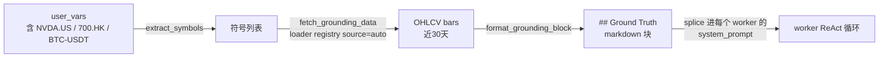

**Step 1 — 符号提取**（`grounding.py:118` `extract_symbols_from_user_vars`）：扫描 `user_vars` 所有 value，匹配四种后缀形态：

| 模式 | 正则（`grounding.py:75-80`） | 示例 |
| --- | --- | --- |
| 美股 | `\b[A-Z]{1,5}\.US\b` | `NVDA.US` |
| 港股 | `\b\d{3,5}\.HK\b` | `700.HK` |
| A股 | `\b\d{6}\.(?:SZ|SH|BJ)\b` | `600519.SH` |
| 加密 | `\b[A-Z]{2,6}-USDT\b` | `BTC-USDT` |

裸 ticker（如 `NVDA` 无后缀）在护栏下**提升**为 `NVDA.US`（`grounding.py:86,118-141`）：要求 2–5 个大写字母、命中一份金融 stopword 黑名单（`ETF/CEO/GDP/USD/BTC` 等不提升，`grounding.py:91-115`）、且显式后缀符号优先（防止 `BTC-USDT` 被误拆出 `BTC.US`）。

**Step 2 — 预取 OHLCV**（`runtime.py:406` `_prefetch_grounding_data` → `grounding.py:160` `fetch_grounding_data`）：对每个符号调 `backtest.loaders.registry.resolve_loader` + `_detect_market` 路由到对应 loader，拉取近 `DEFAULT_WINDOW_DAYS=30` 天（`grounding.py:64`）的日线。**单符号失败不影响整体**（`grounding.py:207` per-symbol try/except），最多 `DEFAULT_MAX_SYMBOLS=8` 个符号（`grounding.py:65`，可由 `SWARM_GROUNDING_MAX_SYMBOLS` 覆盖）。

**Step 3 — 渲染注入**（`grounding.py:231` `format_grounding_block`）：生成带强约束指令的 markdown 块，在 `worker.py:219-223` 拼接到 system_prompt：

```
## Ground Truth — Recent Market Data
**These are the authoritative current prices for this run.** Do NOT cite
prices ... from your training data — markets have moved.
### NVDA.US  (window 2026-06-03 → 2026-07-03)
| Date | Close | Volume |
| --- | ---: | ---: |
| 2026-06-30 | 123.45 | 12,345,678 |
...
**Latest close:** 125.67  **Window range:** 118.00 – 126.50
```

#### 4.8.3 配套的硬约束

光喂数据不够，worker prompt 还有一条**无条件**的 Data Citation Discipline（`worker.py:243-264`）：任何具体数字必须可追溯到 (a) 本次 tool 调用、(b) Ground Truth 块、(c) 上游已溯源的 summary——否则要么调数据工具，要么删掉数字并标注「未核实」。这条规则对**没有数据工具的合成 agent 同样生效**，防止 PM 编造上游没给的数字。

> **实务注意**：grounding 是 **run 启动时的一次性快照**（`grounding.py:43` 明确承认），不随 run 进行中刷新。一个跑 20 分钟的投委会，worker 看到的仍是开跑时的价格——这对日级决策可接受，对分钟级高频交易**绝对不够**，那种场景 worker 必须自己再调 `get_market_data` 取最新价。

---

### 4.9 小结

Swarm 的价值不在「多」，而在「**分工 + 制衡 + 可溯源**」：

1. **分工**：DAG 把复杂决策切成有边界的专家角色，每个 agent 只看自己的 skill 白名单；
2. **制衡**：多空辩论 + 独立风控 + 依赖门控，上游失败宁可阻断下游也不让风控空转；
3. **可溯源**：grounding 喂真实价格 + Data Citation 硬规则 + `incomplete` 状态拦截无证据产出，三道防线压住 LLM 的编造本能。

至此，业务篇覆盖了因子（§1）→ 回测与实盘风控（§2）→ 数据源与技术分析（§3）→ Swarm 多智能体（§4）四大领域。单 worker 内部的 ReAct 循环与 tool 编排属于工程运行时，见架构篇。


---

