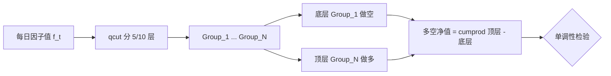
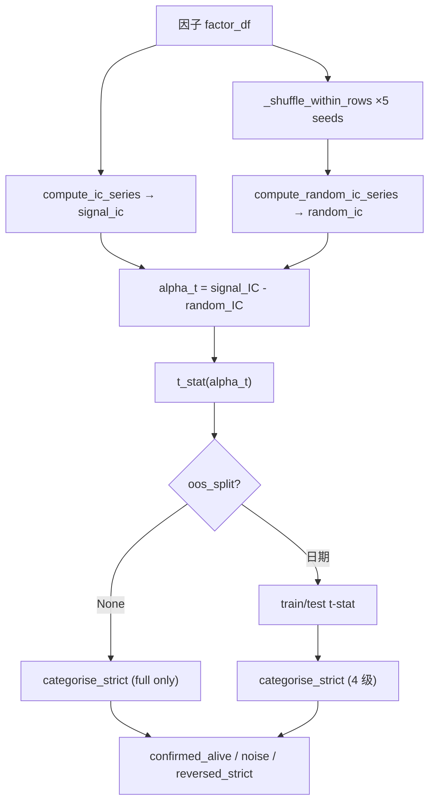

# 第二部分 · 分片 A：量化因子 + 算子 + 评价

> 本文是 Vibe-Trading 深度技术文档的**【因子篇】**。读者画像：资深金融从业者 + 资深工程师。全文基于源码逐行剖析，所有 `file:line` 引用均来自当前代码树（`agent/src/factors/...`），不臆断。项目内置 4 个 zoo、共 **460 个 alpha**（alpha101=102、gtja191=192、qlib158=155、academic=11）。

---

## 1. 横截面因子 vs 时序因子

### 1.1 业务定义

量化因子（factor）本质是一个从市场横截面（cross-section）或时间序列（time-series）到标量打分的映射。Vibe-Trading 采用 **wide DataFrame 约定**：`index = trading_date`（DatetimeIndex），`columns = instrument_code`，单元格存放因子值（`agent/src/factors/base.py:1-13`）。任意因子的 `compute()` 必须返回与 `close` 同形状的 DataFrame，NaN 在 warmup/缺数期保留。

**横截面因子（Cross-sectional factor）** 描述"同一时刻不同标的之间的相对排序"。其经济含义是：因子值越高的标的，下一期期望收益越高（或越低）。数学表达为每个时点上的横截面回归：

$$
r_{i,t+1} = \alpha_t + \beta_t \, f_{i,t} + \varepsilon_{i,t}, \quad \forall i \in \text{Universe at } t
$$

其中 $f_{i,t}$ 是标的 $i$ 在 $t$ 时刻的因子值，$r_{i,t+1}$ 是其下一期收益。$\beta_t$ 即当日的 **IC（Information Coefficient）**。Vibe-Trading 的因子评价（§5）即基于此框架：每天对全市场横截面做一次相关，得到一条 IC 时间序列。

**时序因子（Time-series factor）** 描述"同一标的不同时点上的趋势"，常见于 CTA、择时、波动率聚集信号，其判别力来自单标的历史。动量 $\text{MOM}_{i,t} = \ln P_{i,t} - \ln P_{i,t-k}$ 本身是时序量，但被横截面化（rank/zscore）后才进入选股。

### 1.2 经济直觉差异

| 维度 | 横截面因子 | 时序因子 |
|------|-----------|---------|
| 信号来源 | 同日标的间相对位置 | 单标的历史轨迹 |
| 交易含义 | 多高 / 空低（market-neutral） | 择时、趋势跟踪 |
| 典型代表 | Alpha101、SMB/HML、ILLIQ | 均线穿越、MACD、波动率体制 |
| 评价方式 | 横截面 IC、分层回测 | Sharpe、最大回撤 |

> **实务注意**：Vibe-Trading 内 zoo 的 alpha 几乎全部以横截面形式落地（`rank()` / `_cross_sectional_zscore()` 包裹），即便底层是时序算子（`ts_mean`、`delta`）。一个 alpha 是否"横截面有效"，最终由 §5 的 IC 与分层回测裁决。

---

## 2. 因子分类详解

Vibe-Trading 的 registry 把每个 alpha 标注 1–2 个 theme 标签（`agent/src/factors/registry.py:48-60`），共 11 类。下表给出每类的业务含义、典型公式与对应 zoo 路径。

| 类别 | 业务含义 | 典型公式 | 经济直觉 | zoo 路径示例 |
|------|---------|---------|---------|------------|
| **动量 momentum** | 趋势延续 | $\text{ret}_{t-k\to t}=\frac{P_t-P_{t-k}}{P_{t-k}}$ | 行为偏差、信息扩散慢 | `zoo/academic/carhart_mom.py`、`zoo/alpha101/alpha_001.py` |
| **反转 reversal** | 短期过度反应修复 | $-\text{ret}_{t-1\to t}$（短期反转） | 流动性冲击、超买超卖 | `zoo/qlib158/`（`reversal` 标签）、`zoo/gtja191/alpha_001.py` |
| **波动率 volatility** | 低波动异象 / 期权复制 | $\sigma_t=\text{ts\_std}(r, n)$ | 低波异常、风险补偿 | `zoo/academic/rmw.py`（用 $-\sigma_{60d}$ 代理 quality） |
| **成交量 volume** | 量价关系 | $\text{corr}(\text{open}, \text{vol}, 10)$ | 供求压力、聪明钱 | `zoo/alpha101/alpha_006.py`（alpha101 中 `volume` 标签达 40 个） |
| **质量 quality** | 盈利稳健、低杠杆 | ROE、应计异常 | 经营质量溢价 | `zoo/academic/smb.py`、`rmw.py`（OHLCV 代理） |
| **价值 value** | 低估修复 | $\text{book/market}$、$\text{earnings/price}$ | 价值溢价 | `zoo/academic/hml.py`（用 $-252d$ 收益代理） |
| **流动性 liquidity** | 流动性溢价 | $\text{ILLIQ}=\overline{|r_t|/\text{dollar\_vol}_t}$ | 非流动标的需补偿 | `zoo/academic/illiq.py`（Amihud 2002） |
| **微观结构 microstructure** | 盘口/订单簿失衡 | 成交集中度、上下影线 | 知情交易者足迹 | `zoo/qlib158/`（`volume+microstructure` 标签） |
| **情绪 sentiment** | 舆情、关注度 | 新闻情感、搜索量 | 羊群效应 | academic 暂无纯情绪因子（OHLCV 限制） |
| **成长 growth** | 营收/利润增速 | $\Delta \text{EPS}$ | 增长定价 | 同上，基本面因子待扩展 |
| **杠杆 leverage** | 财务杠杆、做空兴趣 | $\text{debt/equity}$ | 风险敞口 | 同上 |

> **实务注意**：academic zoo 中 SMB/HML/CMA/RMW/MOM 均明确标注 `[PRICE PROXY]`（见 `zoo/academic/smb.py:7-9`），因为原始定义依赖账面市值、资产增速等基本面数据，而 OHLCV panel 只有量价。这些代理因子只在量价能近似 fundamental ranking 的前提下有效——若用于严格归因须外接 fundamental feed。

---

## 3. Alpha Zoo 三大体系

Vibe-Trading 的 zoo 目录（`agent/src/factors/zoo/`）是各 alpha 的"单一事实源"。每个 alpha 是一个 `.py` 文件，源码即文档：文件头注释（中文名/说明/用途）+ `__alpha_meta__` dict literal + `compute()` 函数。Registry 通过 **AST 静态扫描**提取元数据（`registry.py:105-141`，`load_alpha_meta_from_py`），导入时才执行 `compute()`，实现"声明期零副作用、计算期懒加载"。

### 3.1 Alpha101（Kakushadze 2015）

**起源与设计哲学**：Zura Kakushadze 2015 年论文 *"101 Formulaic Alphas"*（arXiv:1601.00991），将 WorldQuant 量化研究员的 101 个 alpha 以**纯公式形式**公开，所有 alpha 仅依赖 6 个量价输入（open/high/low/close/volume/vwap）+ 固定算子集，刻意设计为**完全可复现**——同一份 OHLCV 数据、同一套算子，任何人都能算出相同结果。这一可复现哲学正是 Vibe-Trading `base.py` 算子库的范本。

**剖析 Alpha#1**（`zoo/alpha101/alpha_001.py:38-64`）：

$$
\text{Alpha\#1} = \text{rank}\bigl(\text{ts\_argmax}(\text{SignedPower}((\text{returns}<0)\,?\,\text{stddev}(\text{returns},20):\text{close},\;2.),\;5)\bigr) - 0.5
$$

- **直觉**：对"亏损日"取 20 日波动率、对"盈利日"取收盘价，平方放大极端值，再看过去 5 天里哪一天的极端值最靠后（`ts_argmax` 越大说明异动越近期）。
- **实现要点**（`alpha_001.py:54-64`）：用 `cond` 矩阵做三元选择 `ts_std(returns,20)*cond + close*(1-cond)`，规避了 numpy/pandas 不支持向量化三元的问题；`signed_power` 保号平方；`rank()-0.5` 把百分位映射到 $[-0.5, 0.5]$ 中心化。

**剖析 Alpha#6**（`zoo/alpha101/alpha_006.py:54-62`）：

$$
\text{Alpha\#6} = -1 \times \text{correlation}(\text{open},\,\text{volume},\,10)
$$

- **直觉**：开盘价与成交量 10 日负相关——放量高开往往后续回落（开盘反转），取负号做多该信号。
- **实现**：直接 `-1.0 * ts_corr(open_, volume, 10)`，`ts_corr` 内部 `min_periods=10` 保证 warmup 期返回 NaN 而非零（`base.py:133-149`）。

### 3.2 GTJA191（国泰君安 191）

**中文语境研报体系**：国泰君安证券 2014 年研报《短周期量化择时与择股》，针对 **A 股（equity_cn）** 设计的 191 个 alpha，与 Alpha101 互补。设计上更强调**量价秩相关**与日内形态，参数窗口普遍更短（6/10/20 日）。

**与 Alpha101 的差异**：

| 维度 | Alpha101 | GTJA191 |
|------|---------|---------|
| 目标市场 | US equity（`universe=['equity_us']`）| A 股（`universe=['equity_cn']`）|
| 窗口 | 中长（5/10/20/60 日混合）| 偏短（多 6/10 日）|
| 核心算子 | `SignedPower`、`ts_argmax` 复杂嵌套 | `CORR(RANK(...), RANK(...))` 量价秩相关为主 |
| 风格 | 多条件分支、非线性 | 线性秩组合更常见 |

**示例 GTJA#1**（`zoo/gtja191/alpha_001.py:48-54`）：

$$
\text{GTJA\#1} = -1 \times \text{CORR}\bigl(\text{RANK}(\Delta \ln V_t,\,1),\;\text{RANK}\bigl(\tfrac{C_t-O_t}{O_t}\bigr),\;6\bigr)
$$

直觉是量价背离：放量（$\Delta \ln V>0$）但日内收益排名靠后，预示短期反转。实现中 `np.log(v.where(v>0))` 显式屏蔽零成交量的对数陷阱。

### 3.3 Qlib158（微软）

**ml-friendly 特征工程导向**：微软 Qlib 框架的 `Alpha158`/handler.py 衍生出的 158 个特征（本仓 155 个），设计哲学与上述两者截然不同——**不是给人看的信号公式，而是给 GBDT/LSTM 吃的数值特征**。因此每个因子窗口固定（5/10/20/30/60 日五档），按 `beta/cntd/cntn/cntp/...` 前缀成体系铺开（见 `ls zoo/qlib158/`：`beta5..beta60`、`cntd5..cntd60`），形成规则化特征矩阵。

**示例 BETA20**（`zoo/qlib158/beta20.py:26-29`）：

$$
\text{BETA20} = \frac{\text{close}_t - \text{close}_{t-20}}{20 \cdot \text{close}_t}
$$

实现极简：`safe_div(delta(c, 20), c) / 20.0`。注意 qlib158 单因子作为独立 alpha 几乎不显著（IC 接近 0），其价值在于喂给下游 ML 模型做组合挖掘，而非单因子选股。

### 3.4 Academic（学术经典因子）

`zoo/academic/` 11 个因子均为顶刊论文的"教科书实现"，是因子研究的基准锚点：

- **ILLIQ**（Amihud 2002，`illiq.py`）：$\text{ILLIQ}=\overline{|r_t|/(\text{close}_t\cdot\text{volume}_t)}^{21d}$，21 日均单位成交额价格冲击，捕获流动性溢价。
- **Fama-French 五因子**（1993+2015）：SMB（`smb.py`，逆市值代理）、HML（`hml.py`，$-252d$ 收益代理价值）、CMA（`cma.py`，$-\Delta_{60}\ln\text{vol}$ 代理保守投资）、RMW（`rmw.py`，$-\sigma_{60d}$ 代理稳健盈利）。
- **52-week high**（George & Hwang 2004，`high52w.py`）：$\text{close}_t/\text{ts\_max}(\text{close},252)$，距 52 周高点越近越倾向上涨——这是比传统动量更强的预测变量。
- **Carhart MOM**（`carhart_mom.py`）：$12m\text{-}1m$ 收益（剔除最近一月防反转污染），即 UMD。

---

## 4. 横截面算子库

`agent/src/factors/base.py` 定义了全部算子。核心契约（`base.py:1-13`）：

> **NaN 纪律**：所有算子传播 NaN，禁止 `fillna(0)`；常量窗口的 `ts_corr/ts_cov` 返回 NaN 而非零。
> **前视禁令**：`delta(df, d)` 强制 $d\ge1$；刻意不提供 `Ref(df, -n)` 形式。

下表逐个给出公式、直觉与加速实现。

| 算子 | 公式 | 直觉 | 实现 file:line | 加速 |
|------|------|------|---------------|------|
| `rank` | 横截面百分位 $\text{pct\_rank}(f_{i,t})$ | 标准化到 $[0,1]$，消除量纲 | `base.py:60-65` | pandas `rank(axis=1)` |
| `scale` (L1) | $f \cdot a / \sum_i |f_i|$ | 每行绝对值和归一为 $a$，零和行→NaN | `base.py:68-76` | 向量化 |
| `ts_rank` | 窗口内末值百分位 | 时序归一化，与 `rank` 可复合 | `base.py:79-130` | `sliding_window_view` ~45x |
| `ts_corr` | 滚动 Pearson 相关 | 量价/量量联动 | `base.py:133-149` | pandas `.rolling().corr()` |
| `ts_cov` | 滚动样本协方差 | 联合波动、Beta | `base.py:152-162` | pandas `.rolling().cov()` |
| `ts_mean` | 滚动均值 | 均线、平滑 | `base.py:165-169` | pandas `.rolling().mean()` |
| `ts_std` | 滚动样本标准差 (ddof=1) | 波动率 | `base.py:172-176` | pandas `.rolling().std()` |
| `ts_max`/`ts_min` | 滚动极值 | 高低点、突破 | `base.py:179-190` | pandas `.rolling()` |
| `ts_argmax`/`ts_argmin` | 极值在窗口内的 0-based 索引 | 信号"新鲜度" | `base.py:207-238` | bottleneck ~350x |
| `delta` | $f_t - f_{t-d},\; d\ge1$ | 一阶差分（动量/反转）| `base.py:241-248` | `df - df.shift(d)` |
| `decay_linear` | $\frac{\sum_{k=0}^{n-1}(n-k)x_{t-k}}{\sum(n-k)}$ | 线性衰减加权均线，近端权重高 | `base.py:251-282` | `einsum` ~40x |
| `signed_power` | $\text{sign}(x)\lvert x\rvert^p$ | 保号幂，放大极端 | `base.py:285-289` | numpy |
| `safe_div` | $a/(b+\varepsilon\,\text{sign}(b))$ | 除零→NaN 而非 inf/0 | `base.py:292-304` | 向量化 |
| `vwap` | 见下 | 成交量加权基准价 | `base.py:307-338` | 向量化 |

**`vwap` 的市场差异化实现**（`base.py:307-338`）是本项目最精细的算子。中港美三地数据口径不同：

- **CN A 股**（`equity_cn`）：$\text{vwap} = \frac{\text{amount}\times 1000}{\text{volume}\times 100 + 1}$。因 Tushare `daily.amount` 单位为**千元**、`daily.vol` 单位为**手（100 股）**；分子 ×1000 转 CNY、分母 ×100 转股数，`+1` 保证停牌日分母为正。源码注释记录了 2026-05-17 对 `000001.SZ` 的实测：`amount/(vol*100)≈0.0093`，对应收盘 9.27，反向验证 1000× 缩放。
- **US/HK/期货**：无 amount 时退化为典型价 $(O+H+L+C)/4$。
- **crypto**：优先用 panel 自带 `vwap`。

**加速倍数实测**（`base.py` 注释 + `_backend.py`）：
- `ts_rank` 用 `numpy.lib.stride_tricks.sliding_window_view`（`_backend.py:33`）做无拷贝滑窗，~45x 于 `rolling().apply()`；且刻意不用 `bottleneck.move_rank`，因为后者算的是 Spearman rank correlation 而非百分位 rank（`base.py:85-87`、`_backend.py:9-11`）。
- `ts_argmax/ts_argmin` 用 `bottleneck.move_argmax/min`，~350x 加速；但 `bn` 返回的是"距窗口末端的距离"，需 `(n-1)-raw` 转换为 0-based 起始索引（`base.py:210-211`）。
- `decay_linear` 用 `np.einsum("ijk,k->ij")` 一次性完成所有窗口的加权求和（`base.py:278`），~40x 加速。
- bottleneck 可通过环境变量 `VIBE_TRADING_DISABLE_BOTTLENECK=1` 强制关闭，回退到纯 pandas 路径（`_backend.py:18`），结果完全一致。

> **实务注意：前视偏差（lookahead bias）是量化回测的头号杀手**。本项目通过三道闸门防御：(1) `delta` 算子硬性 $d\ge1$（`base.py:246`），刻意不实现 `Ref(df,-n)`；(2) IC 评估用的 forward return 由 `close.pct_change().shift(-1)` 生成（`alpha_bench_tool.py:482-483`）并按因子时间戳对齐；(3) OOS 切分在 split 日"train 含、test 不含"边界（`bench_runner_strict.py:473-474`），杜绝跨桶泄漏。

---

## 5. 因子评价

因子值算出来只是第一步，"这个因子有没有用"才是研究的核心问题。Vibe-Trading 的评价体系分三层：IC（线性预测力）、分层回测（组合可实现性）、随机对照+OOS（统计显著性）。全部纯数学实现于 `agent/src/factors/factor_analysis_core.py` 与 `bench_runner_strict.py`。

### 5.1 IC（Information Coefficient）

IC 是因子值与未来收益的相关系数。项目实现（`factor_analysis_core.py:8-47`，`compute_ic_series`）用 **Spearman 秩相关**（Pearson on ranks）而非 Pearson，因为秩相关对极端值稳健、且与 rank-based 的多空组合一致：

$$
\text{IC}_t = \rho_{\text{Spearman}}\bigl(\{f_{i,t}\},\;\{r_{i,t+1}\}\bigr), \quad i \in \text{Universe}_t
$$

Pearson 与 Spearman 的公式对比：

$$
\rho_{\text{Pearson}} = \frac{\text{Cov}(f,r)}{\sigma_f \sigma_r}, \qquad \rho_{\text{Spearman}} = \rho_{\text{Pearson}}(\text{rank}(f),\,\text{rank}(r))
$$

**经验阈值**：行业惯例 $|\overline{\text{IC}}| > 0.03$ 即视为有效因子，$>0.05$ 算优秀。本项目 `bench_runner.categorise()`（基础版，见 `bench_runner_strict.py:13-17` 引述）以 raw IC mean 0.02、IC 正比 0.55、t-stat 2.0 为 gate。

**IC_IR（信息比率稳定性）**：衡量 IC 序列的稳定程度，比单期 IC 更重要：

$$
\text{IC\_IR} = \frac{\overline{\text{IC}}}{\sigma(\text{IC})}
$$

IC_IR > 0.5 是优质因子。本项目 `bench_runner_strict.py:484-485` 直接计算 `ir = ic_mean / ic_std`。

**实现细节**（`factor_analysis_core.py:30-43`）：
- 只在"因子与收益同时非空"的单元格上算秩（`pair_mask`，line 32），镜像"逐日 `f.dropna()∩r.dropna()`"的循环逻辑；
- 每日有效标的数 `< 5` 直接丢弃（`_MIN_VALID_PER_DATE=5`，line 5/43），避免小样本噪声；
- 向量化用 `factor_ranks.corrwith(return_ranks, axis=1)`（line 41），比逐日循环快一个数量级。

### 5.2 分层回测（Layered Backtest）

IC 只反映线性关系，分层回测验证"因子能否转化为可交易组合"。实现于 `compute_group_equity`（`factor_analysis_core.py:50-98`）：

1. 每日按因子值排序，`pd.qcut` 分成 N 组（默认 5 或 10），`method="first"` 处理并列；
2. 每组等权持有，计算组内当日收益均值；
3. 多空收益 = 顶层组 − 底层组，累积复利得到净值曲线（`equity_df = (1+ret_df).cumprod()`，line 97）。

分层净值曲线的标准评估（mermaid 展示典型形态）：

理想因子：净值曲线**严格单调**（Group_1 < Group_2 < ... < Group_N），多空组合夏普 > 1。实务中若顶层与底层曲线交叉，则因子失效或存在非线性。

> 实现注意（line 82-85）：当因子并列值过多导致 `qcut` 分层不足 N 组时，自动回退到等宽 `pd.cut`，避免抛异常中断全市场回测。

### 5.3 IR（Information Ratio，组合层）

IC_IR 是因子层稳定性，**IR 是组合层超额收益的稳定性**，定义（项目 `bench_runner_strict.py` 语义）：

$$
\text{IR} = \frac{\overline{r_p - r_b}}{\sigma_{\text{tracking}}(r_p - r_b)} = \frac{\text{超额收益均值}}{\text{跟踪误差}}
$$

其中 $r_p$ 为组合收益、$r_b$ 为基准。IR > 0.5 视为优秀主动管理。在因子语境下，多空组合的 IR ≈ IC_IR × $\sqrt{N_{\text{bets}}}$，因此高频 + 多标的能放大单因子 IR。

### 5.4 随机对照 + OOS：抵御数据窥探

这是本项目最严谨的设计（`bench_runner_strict.py`），直接回应 Harvey-Liu-Zhu (2016) *"...and the Cross-Section of Expected Returns"* 提出的**多重检验 / 数据窥探（data snooping）**问题：当你试了 460 个 alpha，按 t>2 的常规标准必然有大量假阳性——HLZ 指出修正多重检验后，发表因子的 |t| 阈值应提至 **~3.5** 而非 2.0。

项目用两条 rail 解决：

**Rail 1：同宇宙随机对照（random control）**。`compute_random_ic_series`（`bench_runner_strict.py:141-174`）对每个 alpha，在每日横截面上**置换（shuffle）因子值到不同标的**（`_shuffle_within_rows`，line 99-138），破坏"因子→标的"映射但保留横截面分布，构造一个"无信息但统计包络相同"的零假设基线。重复 5 个 seed（line 162）取均值，得到 `random_ic`。真正的因子 alpha 应定义为：

$$
\alpha_t = \text{IC}_t^{\text{signal}} - \text{IC}_t^{\text{random}}, \qquad t\text{-stat} = \frac{\overline{\alpha_t}}{\sigma(\alpha_t)/\sqrt{n}}
$$

仅当 `alpha_t > 阈值` 才算"击败了随机"（`alpha_series_paired`，line 177-184；`t_stat`，line 187-195）。

**Rail 2：OOS 时间切分**。传 `oos_split="YYYY-MM-DD"` 后（line 427-432），将 IC 序列按时间切成 train/test，分别算 t-stat。`categorise_strict`（line 242-293）给出四级判定：

| 类别 | 判定条件 | 含义 |
|------|---------|------|
| `confirmed_alive` | 全样本 $t\ge\text{thr}$ 且 test 期 $t\ge\text{thr}$（同号）| 真存活，可上线 |
| `train_only` | 全样本通过但 test 落入噪声带 | 过拟合，OOS 失效 |
| `reversed_strict` | test 期 $t\le-\text{thr}$（符号翻转）| 训练期 alpha 是假象，最强失效信号 |
| `noise` | $t\in[-\text{thr},\text{thr}]$ | 与随机无异 |

阈值默认 `alpha_t_threshold=2.0`（向后兼容）；当跑完整 460-alpha zoo 时应传 `3.5` 以实现 HLZ 多重检验修正（`StrictThresholds` docstring，line 83-94）。

> **实务注意**：bili_stock A 股 9 个月审计（`bench_runner_strict.py:21-24` 引述）发现——12 个单因子全部在某个参数下通过 raw IC 检验，但**仅 1 个**经受住平行随机对照。这正是 raw IC gate 制造假阳性的主因，也是 strict runner 将 `random_control` 设为**强制显式传参**（line 353-360，省略即 `TypeError`）的原因。

---

## 小结

| 关注点 | 项目落点 | 关键 file:line |
|--------|---------|---------------|
| 因子数学契约 | wide DataFrame、NaN 传播、禁 inf | `base.py:1-13` |
| 算子加速 | bottleneck 350x、sliding_window 45x、einsum 40x | `base.py:210-282`、`_backend.py` |
| 元数据治理 | AST 静态扫描、pydantic `extra="forbid"` | `registry.py:67-141` |
| 前视防御 | `delta d≥1`、forward return shift、OOS 边界 | `base.py:246`、`alpha_bench_tool.py:482`、`bench_runner_strict.py:473` |
| 评价三层 | IC(IR) → 分层回测 → 随机对照+OOS | `factor_analysis_core.py`、`bench_runner_strict.py` |

掌握这套"算子 → 因子 zoo → 评价"闭环后，下一分片（02b）将进入**组合构建与回测引擎**：如何把 `confirmed_alive` 的因子转化为有约束优化下的权重与净值曲线。
