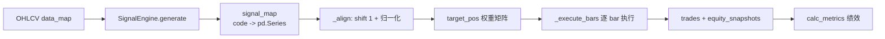
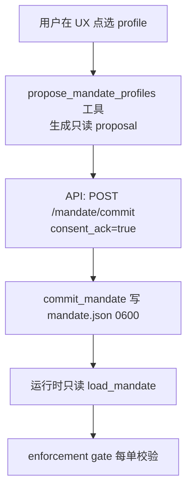
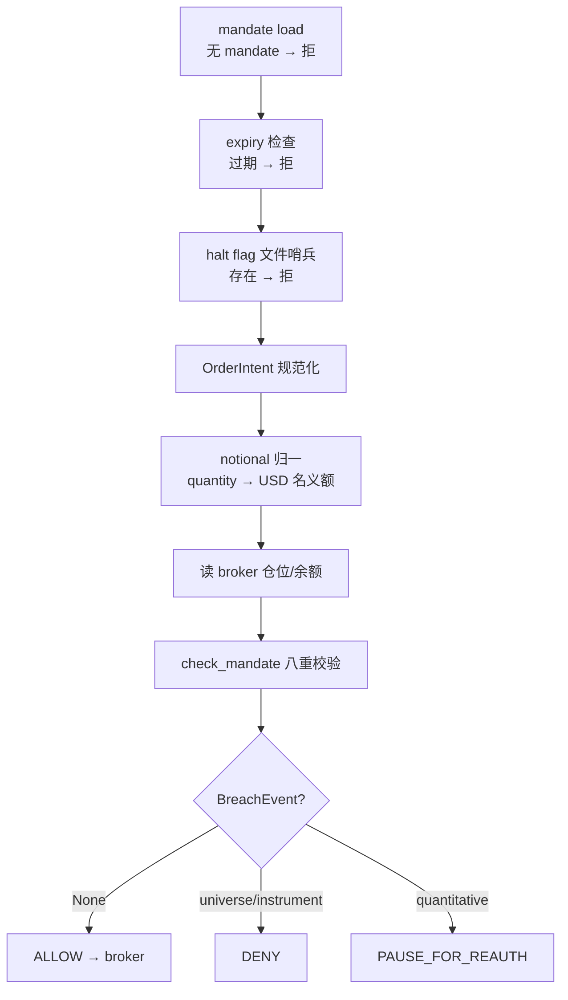
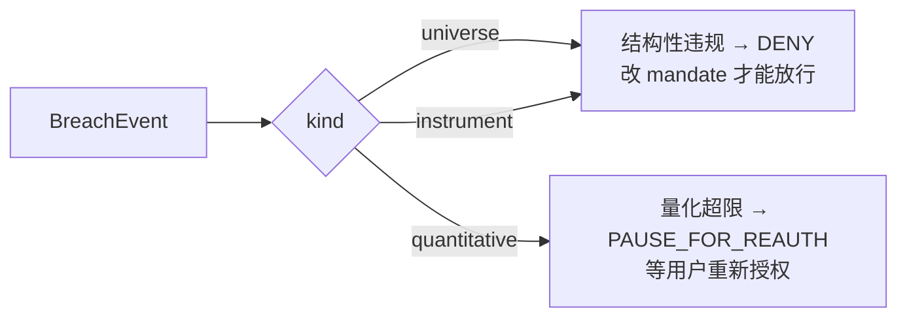

# 回测引擎与实盘风控

> 分片 B。本文覆盖 Vibe-Trading 的"模拟—验证—实盘"三段式金融流水线后半段：bar-by-bar 回测引擎、绩效指标数学、跨市场规则差异、投资组合优化器、信任层与可复现、实盘 Mandate 授权、fail-closed 安全栈、对账异常处理，以及 Shadow Account 影子账户。读者定位：资深金融从业者 + 资深开发。

---

## 1. 回测基本原理

### 1.1 业务定义

回测（backtest）是用历史 OHLCV 数据驱动一套策略，模拟其在过去会如何交易、产生何种权益曲线，从而在不承担真实资金风险的前提下评估策略的统计期望。它是量化研究的"假阴线"——所有 alpha 在上线前都必须先在历史里被证伪或证实。

### 1.2 信号→权重→收益链路

Vibe-Trading 的回测内核是一条明确的因果链：



每个标的产出一个信号 `Series`（连续值，clip 到 $[-1, 1]$），再被聚合成目标权重矩阵，最后在逐 bar 循环里被市场规则（手续费、涨跌停、手数）"挤压"成实际持仓。

### 1.3 bar-by-bar 事件驱动 vs 向量化

工程上存在两种实现：**向量化回测**把整段权益曲线用矩阵运算一次性算出，速度极快但无法表达"T+1 不能卖""涨跌停不能成交"这类条件分支；**事件驱动（bar-by-bar）**逐根 K 线推进，每根 bar 都重新决策、撮合、记账，速度慢一个数量级，但能精确建模市场摩擦。Vibe-Trading 选择后者——金融真实性优先于速度，市场规则是收益曲线的一阶影响因素，不可被向量化"磨平"。

核心循环在 `BaseEngine._execute_bars`（`agent/backtest/engines/base.py:504-559`）：每个 `ts` 先跑 `on_bar` 钩子（资金费/爆仓/swap），再按目标权重 `_rebalance` 每个标的，最后记录 `EquitySnapshot`。末尾强平所有残留仓位（`end_of_backtest` reason）。

### 1.4 signal shift(1)：防前视（look-ahead bias）

这是回测最致命的陷阱：若用 $t$ 时刻收盘价生成的信号，又在 $t$ 时刻收盘价成交，等于"偷看未来"。`_align` 函数（`agent/backtest/engines/base.py:78-137`）在 L126-127 做了关键处理：

```python
raw = signal_map[c].reindex(own_dates).fillna(0.0).clip(-1.0, 1.0)
shifted = raw.shift(1).fillna(0.0)
pos[c] = shifted.reindex(dates).ffill(limit=ffill_limit).fillna(0.0)
```

`shift(1)` 把信号整体后移一根 bar，物理含义是"用 $t$ 日收盘计算的信号，在 $t+1$ 日开盘成交"——next-bar-open 语义。执行时 `_rebalance` 取的是 `bar["open"]`（`base.py:622, 633`），与 shift 语义自洽。`clip(-1, 1)` 防止 LLM 生成越界信号，`ffill(limit)` 防止用前值掩盖长期停牌（单市场 limit=5，跨市场 limit=10 以容纳春节等长假）。

> **实务注意**：shift 必须在**每个标的自己的交易日历**上做，再 reindex 到统一日历。若直接在统一日历上 shift，跨市场（A 股遇美股交易日）会错位一根。

---

## 2. 绩效指标数学

### 2.1 核心指标

所有指标在 `calc_metrics`（`agent/backtest/metrics.py:151-234`）一次算出。设权益序列 $E_t$、收益 $r_t = E_t/E_{t-1} - 1$、$n$ 为 bar 数、$\text{bpy}$ 为年化因子。

| 指标 | 公式 | 代码行 |
|------|------|--------|
| 总收益 | $R_{\text{tot}} = E_n/E_0 - 1$ | `metrics.py:187` |
| 年化收益 | $R_{\text{ann}} = (1+R_{\text{tot}})^{\text{bpy}/n} - 1$ | `metrics.py:188` |
| 最大回撤 | $\text{MDD} = \min_t (E_t - \max_{s\le t} E_s)/\max_{s\le t} E_s$ | `metrics.py:193-195` |
| Sharpe | $\frac{\bar r}{\sigma_r}\sqrt{\text{bpy}}$ | `metrics.py:190` |
| Calmar | $R_{\text{ann}} / |\text{MDD}|$ | `metrics.py:197` |
| Sortino | $\frac{\bar r}{\sigma_{r^-}}\sqrt{\text{bpy}}$，$\sigma_{r^-}$ 为下行收益标准差 | `metrics.py:200-202` |
| 胜率 | $\#\{t:\text{pnl}_t>0\}/\#\text{trades}$ | `metrics.py:71` |
| 盈亏比 | $\overline{\text{win}}/\overline{|\text{loss}|}$ | `metrics.py:74-75` |
| Profit Factor | $\sum\text{win}/\sum|\text{loss}|$ | `metrics.py:77-79` |

### 2.2 Benchmark 超额与 Information Ratio

当传入 `bench_ret`（`metrics.py:206-215`）：超额收益 $\text{excess} = R_{\text{tot}} - R_{\text{bench}}$；主动收益 $a_t = r_t - r_{\text{bench},t}$，则

$$\text{IR} = \frac{\bar a}{\sigma_a}\sqrt{\text{bpy}}$$

IR 衡量的是"每单位跟踪误差的超额"，是相对收益策略的核心 KPI。

### 2.3 年化因子 bars_per_year

$$
\text{Sharpe} = \frac{\bar r}{\sigma_r}\sqrt{\text{bpy}}
$$

年化因子是 Sharpe/Sortino/IR 的"乘子"，算错会让波动率系统性偏估。`calc_bars_per_year`（`metrics.py:34-46`）按 `interval × source` 二维查表：

| 市场 | source | 交易日/年 | 1D bars | 5m bars |
|------|--------|----------|---------|---------|
| A 股 | tushare/akshare/mootdx | 252 | 252 | 12,096 |
| 美股 | yfinance | 252 | 252 | 19,656 |
| 加密 | okx/ccxt | 365 | 365 | 105,120 |
| 港股 | futu | 252 | 252 | 12,096 |

加密 $365\times24$、外汇 $365\times24$（连续市场）。跨市场组合时 `bars_per_year=None`（`runner.py:525-528`），退化为**日历日年化**：$\text{bpy} = n / (\text{days}/365.25)$（`metrics.py:177-181`），避免用单市场因子误估混合曲线。

> **实务注意**：分母 $\sigma$ 用样本标准差（`pandas .std()` 默认 ddof=1），Sharpe 不减无风险利率（`risk_free` 默认 0），与多数研究惯例一致；若对接考核，需显式减 $r_f$。

---

## 3. 市场规则差异表 + 引擎

不同市场的"摩擦结构"完全不同，强行用一套撮合逻辑会高估收益。Vibe-Trading 用 `BaseEngine` 抽象 + 子类覆写四个钩子（`can_execute`/`round_size`/`calc_commission`/`apply_slippage`）+ 可选 `on_bar` 来隔离差异。

### 3.1 市场规则总表

| 维度 | A 股 | 美股 | 港股 | 加密(永续) | 外汇 | 期货 | 期权 |
|------|------|------|------|-----------|------|------|------|
| 交收 | T+1 | T+0 | T+0 | T+0 | T+0 | T+0 | T+0 |
| 涨跌停 | ±10/20/30% | 无 | 无 | 无 | 无 | 涨跌停板 | 无 |
| 做空 | 禁止 | 允许 | 允许 | 允许 | 允许 | 允许 | 允许 |
| 最小手 | 100 股 | 0.01 股 | 100 股 | 6 位小数 | 1000 单位 | 整手 | 整张 |
| 手续费 | 万2.5+印花税 | 0 | 万1.5+印花税 | Maker/Taker | 点差(半价差) | 乘数相关 | 权利金×费率 |
| 杠杆 | 1× | 1× | 1× | 可配 | 100× | 保证金 | — |

### 3.2 各引擎要点

**ChinaAEngine**（`agent/backtest/engines/china_a.py`）：`can_execute`（L40-73）三道闸——禁做空（L52-53）、T+1（L56-62，比较 `bar_date == entry_date`）、涨跌停（L64-71，涨停不能买/跌停不能卖）；`_price_limit`（L137-155）按代码前缀判板：300/688→±20%、北交所 8 开头→±30%、主板→±10%；`round_size`（L75-77）向下取整到 100 股；`calc_commission`（L79-93）= max(万2.5, ¥5) + 过户费万0.1 双边 + 印花税万5 卖方。

**GlobalEquityEngine**（`agent/backtest/engines/global_equity.py`）：US/HK 双模，由 `market` 参数切换。US 零佣金、0.01 股碎股（L53-57）；HK 万1.5 佣金 + 双边印花税 + SFC/FRC 征费 + CCASS 结算费（L65-71）。

**CryptoEngine**（`agent/backtest/engines/crypto.py`）：7×24 不限方向（L43-45），分数仓位到 6 位（L47-49），Maker/Taker 分档（L51-58，开仓 taker/平仓 maker）；`on_bar`（L64-77）跑两件事——资金费（每 8 小时结算）扣 `capital`、维护保证金率触发强平时 `_close_position` reason=`liquidation`。

**ForexEngine**（`agent/backtest/engines/forex.py`）：无显式佣金（点差即成本），`apply_slippage_for_symbol`（L98-122）应用"半价差 + slippage_pips"的不利方向滑点；24 种货币对各有 pip 价差表（L25-36，主要对 1.0-1.5 pip，异国对 USD/TRY 达 15 pip）；`on_bar`（L124-132）每日收盘记 swap（隔夜利息），周三 swap ×3（覆盖周末）。

**FuturesBaseEngine**（`agent/backtest/engines/futures_base.py`）：在 `BaseEngine` 上叠加合约乘数——PnL = $\text{dir}\cdot\text{size}\cdot\text{cm}\cdot(P_{\text{exit}}-P_{\text{entry}})$（L39-44），保证金 = $\text{size}\cdot P\cdot\text{cm}/\text{lev}$（L46-50），下单量 = $\text{notional}/(P\cdot\text{cm})$（L52-56）。子类（China/Global futures）实现 `get_contract_multiplier`。

**OptionsPortfolio**（`agent/backtest/engines/options_portfolio.py`）：用 Black-Scholes 合成理论价（`bs_price` L30-60），欧式 + 美式（早行权启发式 L320-348：intrinsic > continuation×1.02 则行权）；IV 微笑（`iv_smile_adjustment` L135-155）：$\text{IV}(K) = \text{IV}_{\text{atm}} + \text{skew}\cdot\ln(K/S) + \text{curv}\cdot\ln(K/S)^2$；逐日 mark-to-market + Greeks 聚合（delta/gamma/theta/vega）。

**CompositeEngine**（`agent/backtest/engines/composite.py`）：跨市场共享一个资金池，按 `_detect_market` 给每个 symbol 路由到子引擎做"规则书"，所有 state（capital/positions/trades）留在 Composite 自己手里（L60-90）。T+1 因为要查共享持仓表，被拦截在 Composite 层而非子引擎（L94-114）。

---

## 4. 投资组合优化器

信号给的是方向，优化器（`agent/backtest/optimizers/`）决定"配多少"。统一接口 `(ret, pos, dates) -> pos`，在 `_align` 里 `_load_optimizer` 动态加载（`base.py:140-158`）。

所有优化器继承 `BaseOptimizer`（`optimizers/base.py`），共享滚动协方差窗口（lookback 默认 60 bar）、NaN 校验、保留信号符号只改权重的逻辑（L74-76）。权重在 `_calc_weights` 内归一到 $\sum w=1$。

### 4.1 四种优化器

**mean_variance**（`mean_variance.py`，Markowitz）：最大化 Sharpe 比，等价于在 long-only simplex 上求

$$
\max_w \ \frac{w^\top\mu - r_f}{\sqrt{w^\top\Sigma w}}, \quad w\ge 0,\ \sum w = 1
$$

L39-43 定义 `neg_sharpe`，SLSQP 求解（L45-52，bounds $[0,1]$，等式约束 $\sum w=1$）。失败回退等权。

**risk_parity**（`risk_parity.py`，Spinu 2013）：让各资产**边际风险贡献**相等。$w_i \propto 1/\sigma_i$ 作种子（L28-29），然后 5 轮 Newton 风格精炼（L31-39）：$\text{mrc} = \Sigma w / \sigma_p$，$\text{rc}_i = w_i\cdot\text{mrc}_i$，目标 $\text{rc}_i = \sigma_p/n$，迭代 $w_i \leftarrow w_i\cdot(\text{target}/\text{rc}_i)$。

**max_diversification**（`max_diversification.py`，Choueifaty-Coignard）：最大化分散化比

$$
\text{DR} = \frac{w^\top\sigma}{\sqrt{w^\top\Sigma w}}
$$

$\sigma$ 为各资产波动率向量。L31-35 `neg_dr`，SLSQP 求解。

**equal_volatility**（`equal_volatility.py`，逆波动）：最朴素，$w_i \propto 1/\sigma_i$，不做协方差建模（L34-37）。低波资产配高权，让每个资产"贡献等量波动"。

> **实务注意**：Markowitz 对协方差估计极敏感（样本 $\Sigma$ 病态时权重极端），生产多用 risk_parity/逆波动；SLSQP 不收敛时全部回退等权（`_equal_weight`），这是设计上的 fail-safe 而非 bug。

---

## 5. 信任层与可复现

回测结果要能被审计、被复现，必须冻结"配置 + 策略代码 + 产物"的密码学指纹。

### 5.1 Run Card（`agent/backtest/run_card.py`）

`write_run_card`（L25-90）每次回测末尾写 `run_card.json` + `run_card.md`，核心是 `reproducibility` 块：

- `config_hash`：优先对 `config.json` 文件做 `_file_hash`（SHA-256，分块读取，L108-113），否则对 dict 做 `_json_hash`（排序 key + 紧凑序列化后 SHA-256，L97-105）。
- `strategy_hash`：对 `code/signal_engine.py` 同样 `_file_hash`（L55-58）。
- `artifacts`：列出所有产物文件（config、signal_engine、artifacts/）的 path + size + sha256（`_list_artifacts` L142-162）。

复现验证就是重算这些 hash 与存档比对，任一不一致即"回测被篡改过"。

### 5.2 AST 扫描防 LLM 注入（`agent/backtest/runner.py`）

策略代码由 LLM 生成，存在被注入恶意 `import os; os.system(...)` 的风险。`_validate_signal_engine_source`（L243-270）在 `_load_module_from_file`（L145-160，在 `importlib` 执行**前**调用）对源码做 AST 白名单审查：

- 顶层只允许：docstring、`import`/`from import`、函数/类定义、字面量常量赋值（`_is_safe_constant_assignment` L177-183）。
- 拒绝：顶层可执行语句（`raise ValueError(...)` 类调用）、函数装饰器（L203）、非字面量默认参数（L205-207）、不安全注解（L208-216）、类体内可执行语句（`_validate_class_body` L219-240）、自引用循环 import（L253-257）。

注意 import 本身**不**被拦截——真正危险的是 import-time 副作用执行；扫描器保证 `exec_module` 时只有定义被执行，方法体内的恶意代码要到实例化调用 `generate()` 才跑（这是为什么还需 `safe_run_dir` 把 run 目录限定在白名单根下，`runner.py:409-414`）。

---

## 6. 实盘 Mandate 授权

### 6.1 bounded autonomy + immutable consent

实盘交易必须遵循"有界自治"：agent 能在用户预设的边界内自由决策，但**不能自己改边界**。Mandate 就是这份边界契约，用 `@dataclass(frozen=True)` 实现编译期不可变（`agent/src/live/mandate/model.py`）。



### 6.2 Mandate 数据模型

`HardCaps`（`model.py:36-64`，层 a 量化上限）：

| 字段 | 含义 |
|------|------|
| `account_funding_usd` | 圈存账户余额（broker 侧真上限，本地镜像做防御性数学） |
| `max_order_notional_usd` | 单笔订单名义额上限 |
| `max_total_exposure_usd` | 所有持仓总市值上限 |
| `max_leverage` | 总杠杆倍数，1.0 = 纯现金 |
| `allowed_instruments` | 可交易工具类型白名单，空=全拒 |
| `max_trades_per_day` | UTC 日下单计数上限 |

`UniverseConstraint`（`model.py:66-87`，层 b 选股宇宙）：`asset_classes`（资产大类桶，非个股白名单——保留 agent 发现能力）、`min_market_cap_usd`、`min_avg_daily_volume_usd`（流动性地板）、`exclude_symbols`（个股硬黑名单，优先级最高）。

### 6.3 单一写路径 + 默认 30 天

`commit_mandate`（`agent/src/live/mandate/commit.py:312-452`）是**全系统唯一**能激活实盘权限的函数。关键不变量：

- **不是工具、不在 agent 工具注册表里**（commit.py 模块 docstring L1-25）：agent loop 拿不到这个引用，即使模型被劫持也无法 self-authorize。这是"命门不变量"——结构性保证，不是 prompt 层保证。
- 必须传入 `consent_ack=True`（L367-368），而该布尔只能由 surface（API endpoint）在用户真实点击时设置，模型永远产不出。
- commit 时**重新校验** profile 是否仍 fit 用户当初看到的 ceiling 快照（`_profile_fits_ceilings` L275-309，经 `_normalize_limits` 别名归一防 H9 旁路）。
- proposal 一次性（`_invalidate_proposal` L437），防止重放。
- `ConsentMeta.expires_at` = `created_at + lifetime_days`，`DEFAULT_MANDATE_LIFETIME_DAYS = 30`（`commit.py:45`，L381）——活 mandate 不能永生，到期 gate 自动 fail-closed。

`flatten_on_halt`（`model.py:138`，commit.py L387-391）默认 False（cancel-only，安全默认），需用户显式 opt-in 才在 kill switch 触发时平仓。

---

## 7. fail-closed 安全栈（逐层剖析）

实盘订单在到达 broker 前，要穿过一条顺序固定的"洋葱"校验栈。任何一层解析失败都 DENY，绝不 wave-through。

### 7.1 门控顺序



- **mandate load + expiry**：无 mandate 或 `expires_at` 已过 → 拒。
- **halt 文件哨兵**：`halt_flag_set`（`halt.py:135-163`）纯文件系统检查，**不查 LLM 状态、不读进程内 flag**——即使 agent loop 卡死、模型循环、SSE 总线挂了都生效。
- **OrderIntent**（`enforcement.py:100-124`）：broker 无关的归一化订单，symbol 大写、side ∈ {buy,sell}、`notional_usd` + `quantity` + `instrument_type` + `asset_class` 显式携带（多市场连接器用 `asset_class` 区分 US/HK/CN 股票）。
- **notional 规范化（防 H3/H4 旁路）**：`_resolve_order_notional`（`enforcement.py:199-228`）若 `notional_usd` 缺失/非正/NaN → 返回 None → 上游 fail-closed DENY。gate 在 `check_mandate` 前用 live quote 把 quantity 换算成 USD 名义额，盖在 `notional_usd` 上，否则恶意 agent 可只传 quantity 绕过名义额上限。
- **读仓位**：`_positions_market_value`（`enforcement.py:277-301`）严格解析，任一仓位不可解析 → None → DENY。

### 7.2 check_mandate 决策顺序（`enforcement.py:379-538`）

八个 check 固定顺序，首个失败即定 verdict：

1. **exclude_symbols**（L426-432，universe/DENY）：个股黑名单，优先级最高。
2. **allowed_instruments**（L434-441，instrument/DENY）：工具类型白名单，空=全拒。
3. **asset_classes**（L447-454，universe/DENY）：资产大类桶；OPTION 无桶，纯由 instrument 把关。
4. **max_order_notional_usd**（L457-470，quantitative/PAUSE）：单笔名义额。
5. **max_total_exposure_usd**（L474-489，quantitative/PAUSE）：post-trade 总敞口 = current + signed(notional)，sell 用负号减敞口。
6. **max_leverage**（L492-505，quantitative/PAUSE）：$|\text{post\_exposure}|/\text{funding}$；funding ≤ 0 → attempted=inf → DENY。
7. **max_trades_per_day**（L508-515，quantitative/PAUSE）：UTC 日计数 +1 超限。
8. **account_funding_usd**（L519-525，quantitative/PAUSE）：防御性纵深，只对 buy 拦截（sell 不会超资金）。
9. **universe floors**（L530-536，universe/DENY）：market_cap / ADV 地板，缺数据 fail-closed。

### 7.3 BreachEvent 路由（`enforcement.py:126-166`）



结构性违规（黑名单、工具/资产类不允许）只能 DENY——agent 永远不能编辑 mandate，所以无任何旁路。量化超限 PAUSE，等用户在 consent UX 重新授权。

### 7.4 halt kill switch（`halt.py`）

- **全局 vs 单 broker**：`<runtime_root>/live/HALT` 全局，`<runtime_root>/live/<broker>/HALT` 单 broker（L46-69）。全局总赢（L155）。
- **文件即指令**：sentinel 内容是 JSON 归属元数据，**文件存在性**才是 halt 本身；malformed JSON 仍算 tripped（fail-closed，L184-191）。用户/看门狗可直接 `touch` 文件绕过 `trip_halt`。
- **flatten_on_halt**：runner 观察到 trip 后经 `on_halt_action`（L251-280）调注册的 `flatten_and_cancel`——撤 resting order + 按 mandate 平仓。注意 `trip_halt` 是纯哨兵写入、无副作用，action 是 runner 独立驱动的第二阶段（L194-209 设计说明）。

---

## 8. 对账与异常（Reconcile）

交易不幂等：崩溃后"重发"用封堵丢失工作漏洞的方式，开了一个更糟的漏洞（双倍交易真钱）。`reconcile`（`agent/src/live/runtime/reconcile.py:271-362`）的职责是**分类并暴露**歧义，绝不自动重发。

### 8.1 注入式 READ-only

`reconcile` 接收三个注入的 READ callable（`read_positions`/`read_balance`/`read_open_orders`），**永远不持有 broker 写工具**——结构上保证它无法重发订单。它把 broker 真相 diff `<broker>/runtime_state.json` 里的崩溃前持久态。

### 8.2 DeltaKind 分类（`reconcile.py:74-98`）

| DeltaKind | 含义 | 处置 |
|-----------|------|------|
| `matched` | broker 真相 == 记录态 | 无动作 |
| `unknown_fill` | broker 有仓位/成交，我方无记录 | **forces halt**（真钱无审计痕迹移动） |
| `orphan_order` | 我方记录了挂单，broker 无 | 不重发，surface 调查（已撤/拒/成交清出） |
| `mid_order_ambiguous` | 我方"已提交未确认"订单崩溃 | **forces halt**（no-retry 规则） |

`unknown_fill` / `mid_order_ambiguous` 属 `_HALTING_KINDS`（L103），任一存在则 `requires_halt=True`（L176-183），runner 必须 halt + surface，绝不静默重试。歧义从不自动重发——`_call_tool` 故意不重试 mutating 调用、`LiveOrderGuardTool.repeatable=False`。

### 8.3 持久化策略

clean reconcile（无 halting delta）才原子写新 state（temp + `os.replace`，L550-588）；不安全则**保留**原 ambiguity 记录不动（runner 需要原始记录 surface 给人）。冷启动无 prior state 时 broker 真相直接成 baseline、零 delta（未记录过的仓位不算 unknown_fill）。corrupt 文件重命名 aside 而非当冷启动，防半截写入被误读（L531-543）。

---

## 9. Shadow Account（影子账户）

### 9.1 业务定义

Shadow Account 是**从用户真实交易日志里反向提取"可复现策略"**的子系统。它回答：用户（一个主观交易者）实际在用什么规则赚钱？这套规则能不能被结构化、回测、然后归因？

三者关系：

| | broker | mandate | 审计 | 价格源 |
|---|---|---|---|---|
| 实盘 | 有 | 有 | audit.jsonl | live quote |
| 回测 | 无 | 无 | run_card | 历史 OHLCV |
| Shadow | **无** | **无** | **无** | 历史 OHLCV |

Shadow 是纯研究端——无 broker、无 mandate、无审计，只读历史数据做归因。

### 9.2 提取管线（`agent/src/shadow_account/extractor.py`）


- **FIFO 配对**（`extractor.py:93`）：先买先卖配对成 roundtrip。
- **过滤盈利**（L98）：只从赚钱的交易里提炼规则（亏钱的归因到 overtrading/noise）。
- **特征工程**（`_compute_features` L298-327）：journal 衍生特征（holding_days、pnl_pct、entry_hour、entry_weekday、market）永远可算；price 特征（`entry_rsi14`、`prior_5d_return`）按 `buy_dt` as-of 读取历史 OHLCV（`_attach_price_features` L270-295，因果性保证：只读 $\le$ buy_dt 的 bar），价格数据不可得则 NaN 降级。
- **KMeans 聚类**（`_auto_cluster` L416-456）：z-score 标准化后用 silhouette 在 k∈[2,5] 选最优，回退 k=2；NaN 用中位数填补（仅影响分组，不影响规则边界）。
- **规则提取**（`_cluster_to_rule` L459-521）：每簇取 holding_days/entry_hour 的 p10-p90 分位作 entry/exit 条件，dominant market 标签。样本不足（<`min_support`=3）退化为单簇启发式（`_heuristic_single_rule` L524-544）。文档提及的决策树 max_depth=3 是 v2 预留路径，当前用分位数边界（更轻量、小样本可解释）。
- **路径提取**：`entry_condition` dict（市场、时段、RSI/收益区间）→ codegen 模板 → signal_engine.py。

最少 5 个盈利 roundtrip 才能提取（`MIN_PROFITABLE_ROUNDTRIPS=5`，L36），否则 ValueError。

### 9.3 归因分解（`models.py:84-96`，`backtester.py:393-474`）

把"用户实际 PnL"与"shadow 策略 PnL"的差值，分解为五个有业务含义的来源（signed，正=shadow 本可多赚）：

| 分解项 | 公式 | 业务含义 |
|--------|------|---------|
| `noise_trades_pnl` | $-\sum \text{pnl on rule-violating trades}$ | 用户违反自己规则的交易（shadow 会回避） |
| `early_exit_pnl` | $+\sum_{\text{win, hold<lo}} \text{pnl}\cdot\frac{\text{lo}-\text{hold}}{\text{lo}}$ | 盈利单过早平仓的少赚 |
| `late_exit_pnl` | $+\sum_{\text{loss, hold>hi}} |\text{pnl}|\cdot\frac{\text{hold}-\text{hi}}{\text{hi}}$ | 亏损单死扛过头多亏 |
| `overtrading_pnl` | $-\sum \text{pnl on excess trades}$ | 超出预期交易频次（1 单/2×中位持仓天）的额外交易 |
| `missed_signals_pnl` | $\text{shadow} - \text{real} - (\text{noise+early+late+over})$ | 残差，以上都无法解释的部分 |

`overtrading` 按预期预算 $=\text{span}/(2\times\text{median\_hold})$ 算超额笔数，对 cheapest（|pnl| 最小）的超额单惩罚（L486-512）。top-5 |impact| 的反事实交易记入 `counterfactual_trades` 供报告 Section 6 展示。

> **实务注意**：归因是"事后解释"而非"因果证明"。noise/missed 的符号约定（负 pnl 取反为正）容易让人误读为"shadow 一定赚"，实际它度量的是"若遵守规则可避免的损失"，需配合 coverage/support 解释置信度。

---

*本文档基于 Vibe-Trading 源码撰写，所有 file:line 引用均经源码核对。回测引擎聚焦金融真实性（bar-by-bar + 市场规则隔离），实盘风控聚焦 fail-closed 结构性保证（mandate 不可变 + 单一写路径 + 文件哨兵 kill switch + 注入式 READ-only 对账），Shadow Account 聚焦从主观交易中蒸馏可量化策略。三者共同构成"先模拟、再验证、后实盘"的安全闭环。*
