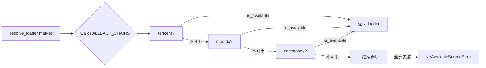
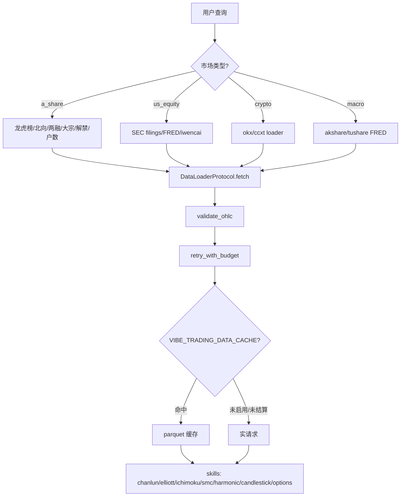

# 数据源体系与技术分析流派

> 分片 C：覆盖 Vibe-Trading 的特有数据源、数据源 fallback chain 工程实现、技术分析流派 skill 全收录，以及跨市场交易规则速查。读者定位为资深金融 + 资深开发，术语保留英文。

---

## 1. A 股特有数据

A 股市场存在大量由交易所/监管强制披露的结构化资金面与筹码面数据。它们既是 A 股 alpha 的重要来源，也是与成熟市场最大的信息结构差异。本项目将每一类封装为只读 Tool，统一经 Eastmoney datacenter 公共 endpoint 取数（无认证、按源 IP 限速），返回 JSON envelope。

### 1.1 龙虎榜 `get_dragon_tiger`

| 维度 | 内容 |
| --- | --- |
| **业务定义** | 沪深交易所每日披露的"异常交易个股"榜单，列明上榜原因（涨跌幅 ±7%、换手率 >20%、日振幅 >15% 等）、买卖前五席位明细、净买入额。 |
| **披露制度/起源** | 交易所信息披露制度，自 2005 年股权分置改革后逐步完善，意在抑制短线操纵、提升市场透明度。每个交易日 18:00 后披露当日数据。 |
| **用法** | ① 识别游资接力（同一席位反复出现在不同标的）；② 机构席位净买入 = 长线信号；③ 知名游资席位（如东方财富拉萨）联动可作情绪指标。 |
| **项目实现** | `DragonTigerTool`，name=`get_dragon_tiger`，读 Eastmoney `RPT_DAILYBILLBOARD_DETAILS`（上榜明细）+ `RPT_BILLBOARD_TRADEDETAIL`（席位明细）。`code` 可选：不传返回全市场上榜列表（上限 200 条），传 code 额外返回该股 top-30 买卖席位。 |

### 1.2 北向资金 `get_northbound_flow`

| 维度 | 内容 |
| --- | --- |
| **业务定义** | 沪深港通（Stock Connect）下，香港及国际资金借道买入内地 A 股的净流入额，分沪股通（沪港通北向）+ 深股通（深港通北向）。单位：万元 CNY。 |
| **披露制度/起源** | 2014 年沪港通、2016 年深港通先后开通。北向被称为"聪明钱（smart money）"，是 A 股日内的全球情绪风向标。 |
| **用法** | ① 北向连续多日大额净流入 → 风险偏好上行；② 个股层面北向持股变动（需用 `get_fund_flow`，本工具为全市场总量）；③ 沪深分化反映大盘 vs 成长风格切换。 |
| **项目实现** | `get_northbound_flow(lookback_days=10)`，返回 realtime（最新实时净流入）+ history（最近 N 个交易日，clamp 到 `[1, _MAX_LOOKBACK_DAYS]`）。**注意**：本工具是全市场总量，非单股流入；单股资金流用 `get_fund_flow`。 |

### 1.3 融资融券 `get_margin_trading`

| 维度 | 内容 |
| --- | --- |
| **业务定义** | 融资（借钱买股，多头杠杆）+ 融券（借股卖出，空头杠杆）余额。核心字段：融资余额、融资买入额、融券余额、两融（RZRQ）合计余额。 |
| **披露制度/起源** | 2010 年 3 月 A 股正式开闸两融。两融标的池由交易所定期调整（目前约 2000 只）。余额逐日披露。 |
| **用法** | ① 融资余额持续上行 = 散户/杠杆多头情绪升温，趋势末段常见；② 融券余额激增 = 看空对冲，常出现在大股东减持前；③ 两融余额/流通市值比 >10% 视为高杠杆警戒线。 |
| **项目实现** | `get_margin_trading(code, days=30)`，每日一行（最新在前），覆盖 SH/SZ 标的。 |

### 1.4 大宗交易 `get_block_trades`

| 维度 | 内容 |
| --- | --- |
| **业务定义** | 单笔成交达到规定最低限额（A 股通常 ≥50 万股或 ≥300 万元）的场外协议大宗成交，记录成交价、量、额、相对收盘价折溢价、买卖双方营业部席位。 |
| **披露制度/起源** | 大宗交易系统独立于集中竞价，T+1 披露。机构大额调仓、股东减持、过桥交易常经此通道。 |
| **用法** | ① 折价成交（如 -8%）常见于股东减持出货，是中期空头信号；② 溢价大宗 = 看多机构抢筹；③ 同一席位对倒（买方=卖方）疑似过桥，无方向意义。 |
| **项目实现** | `get_block_trades(code, days=30)`，返回每笔明细含 premium/discount、买卖营业部。 |

### 1.5 限售解禁 `get_lockup_expiry`

| 维度 | 内容 |
| --- | --- |
| **业务定义** | 首发原股东、定向增发、股权激励等处于锁定期的限售股，锁定期满后转为可流通，产生减持压力。 |
| **披露制度/起源** | 《上市公司股权分置改革》及再融资规则确定的限售期（首发的控股股东通常锁定 36 个月，战略投资者 12 个月等）。解禁日为预定、可提前获知。 |
| **用法** | ① 大额近期解禁（解禁市值 > 流通市值 20%）= 减持冲击风险，常提前 1-2 月压制股价；② 解禁靴子落地后反而可能利空出尽反弹；③ 定增解禁（成本低）比首发解禁（成本极低）减持意愿更强。 |
| **项目实现** | `get_lockup_expiry(code)` 返回个股完整历史解禁计划；省略 code 传 `horizon_days=30` 返回全市场未来 N 日解禁日历（clamp `[1,365]`）。`repeatable=True` 允许批量查询。 |

### 1.6 股东户数 `get_shareholder_count`

| 维度 | 内容 |
| --- | --- |
| **业务定义** | 季报披露的"股东户数"，配合环比变化与户均持股/持股市值，反映筹码集中度。 |
| **披露制度/起源** | 强制在定期报告（季报/半年报/年报）中披露。中国结算（CSDC）持有实时数据，但公开口径仅定期报告快照。 |
| **用法** | ① 户数环比下降（筹码集中）+ 户均市值上升 = 主力吸筹，看多；② 户数激增（筹码分散）= 主力派发，看空；③ 配合十大流通股东变动交叉验证。 |
| **项目实现** | `get_shareholder_count(code, max_periods)`，每行一个报告期，含户数、环比绝对/百分比变化、户均股数/市值。覆盖 SH/SZ/BJ。 |

> **实务注意**：以上 6 个工具全部经 Eastmoney 公共 datacenter 取数，按源 IP 限速。批量回测前务必加节流，否则会触发 IP 封禁。北向与龙虎榜是日内实时数据，其余为 T+1 披露。

---

## 2. 美股 / 全球数据

### 2.1 SEC filings `get_sec_filings`

| 表格 | 含义 | 用法 |
| --- | --- | --- |
| **10-K** | 年报，经审计的完整财务 | 一次性看清全年经营、风险因素（Item 1A）、管理层讨论（MD&A） |
| **10-Q** | 季报，未经审计 | 季度跟踪盈利质量、应收/存货异常 |
| **8-K** | 重大事项即时披露（Material Event） | 并购、CFO 变动、业绩预告修正，最快的事件来源 |
| **13F** | 机构持仓季度披露（≥1 亿美元管理人） | 追踪 Berkshire/桥水等聪明钱持仓变动，45 天滞后 |

- **项目实现**：`get_sec_filings(ticker, form?, metric?, limit?)`。ticker → CIK（经 SEC company-tickers 表），返回 accession number、filing/report date、primary-document URL。`metric` 传入 XBRL `us-gaap` 概念（如 `Revenues`、`NetIncomeLoss`、`Assets`）时，额外返回该概念的报告期时间序列。仅覆盖 US 市场。

### 2.2 FRED 宏观 `get_macro_series`

| series_id | 指标 | 经济含义 |
| --- | --- | --- |
| `FEDFUNDS` | 联邦基金利率 | 美联储政策利率，加息周期压估值 |
| `DGS10` | 10 年期国债收益率 | 无风险利率锚，与成长股估值反向 |
| `CPIAUCSL` | CPI | 通胀，决定 Fed 路径 |
| `GDPC1` | 实际 GDP | 衰退/扩张判定 |
| `UNRATE` | 失业率 | 就业-通胀（菲利普斯曲线）联动 |

- **项目实现**：`get_macro_series(series_id, start_date?, end_date?, limit?)`，需 `FRED_API_KEY`（免费申请）。`check_available()` 在无 key 时返回 False，工具被静默排除出 registry。

### 2.3 iWenCai 语义搜索 `iwencai_search`

| 维度 | 内容 |
| --- | --- |
| **业务定义** | 同花顺 iWenCai（问财）提供的自然语言选股引擎，中文短语即可解析为多条件筛选，返回匹配的 A 股标的 + 解析出的指标列。 |
| **用法** | 例：`"市盈率低于15且净利润增长的银行股"` → 直接得到符合条件标的。远快于手工拼 SQL/因子表达式。 |
| **项目实现** | `iwencai_search(query, limit=20)`，需 `VIBE_TRADING_IWENCAI_KEY`。`repeatable=True`。返回结构化结果列表。中文 query 解析效果最佳。 |

---

## 3. 数据源 fallback chain 工程

### 3.1 18 个 loader 总览

| # | loader | 市场 | 认证 | 风险等级 | 备注 |
|---|--------|------|------|----------|------|
| 1 | tushare | A股/期货/基金/宏观 | token | 中 | 积分制，专业 A 股 |
| 2 | akshare | 全市场 | 无 | 中（IP 限速） | 开源聚合层 |
| 3 | baostock | A股 | 无 | 低 | 免费，gRPC |
| 4 | tencent | A股 | 无 | 中 | 实时行情 |
| 5 | mootdx | A股 | 无 | 中 | 通达信协议 |
| 6 | eastmoney | A股/港股/宏观 | 无 | 中（IP 限速） | 公共 datacenter |
| 7 | sina | A股/美股/港股 | 无 | 中 | 老牌免费源 |
| 8 | yfinance | 美股/全球/加密 | 无 | 低 | Yahoo 官方 |
| 9 | yahoo | 同 yfinance | 无 | 低 | 别名通道 |
| 10 | stooq | 美股/全球 | 无 | 低 | 历史数据强 |
| 11 | futu | 港股 | token | 中 | OpenAPI |
| 12 | ccxt | 加密 | key（可选） | 低 | 100+ 交易所聚合 |
| 13 | okx | 加密 | key（可选） | 低 | 单交易所直连 |
| 14 | finnhub | 美股 | key | 低 | REST API |
| 15 | alphavantage | 美股 | key | 低 | REST，限速严 |
| 16 | tiingo | 美股 | key | 低 | 高质量历史 |
| 17 | fmp | 美股 | key | 低 | Financial Modeling Prep |
| 18 | local | 全市场 | 配置文件 | — | 永不降级网络源 |

### 3.2 按市场排列的 fallback chain

`FALLBACK_CHAINS` 的排序原则：**先 IP-ban 风险（轻量公共 endpoint 优先），后数据质量**。无认证公共源（eastmoney/sina/stooq/yahoo）靠前，key-gated REST（finnhub/alphavantage/tiingo/fmp）靠后，`local` 永远兜底。

| 市场 | fallback chain（左→右） |
|------|------------------------|
| a_share | tencent → mootdx → eastmoney → baostock → akshare → tushare → local |
| us_equity | yahoo → stooq → sina → eastmoney → yfinance → tiingo → fmp → finnhub → alphavantage → akshare → local |
| hk_equity | eastmoney → yahoo → futu → yfinance → akshare → local |
| crypto | okx → ccxt → yfinance → local |
| futures | tushare → akshare → local |
| fund | tushare → akshare → local |
| macro | akshare → tushare → local |
| forex | akshare → yfinance → local |



### 3.3 `local` 永不降级网络源

`_NO_NETWORK_FALLBACK_SOURCES = frozenset({"local"})`：当用户显式请求 `local`（读取 `~/.vibe-trading/data-bridge/config.yaml` 配置的本地文件），若不可用，**绝不允许**静默降级到 Yahoo/Tencent 等网络源。设计意图：`local` 的 `markets` 集合覆盖全市场仅为让 auto-resolver 能"够到"它，而非让一次失败的网络请求伪装成 local 数据。这是一个配置问题，必须抛错让用户看见。

### 3.4 `DataLoaderProtocol` 接口

```python
@runtime_checkable
class DataLoaderProtocol(Protocol):
    name: str              # 源名（如 "tushare"）
    markets: set[str]      # 支持的市场集合
    requires_auth: bool    # 是否需要 token/key

    def is_available(self) -> bool: ...   # token 存在 + 网络可达
    def fetch(self, codes, start_date, end_date, *,
              interval="1D", fields=None) -> dict[str, pd.DataFrame]: ...
```

`@register` 装饰器在模块首次 import 时把类写入全局 `LOADER_REGISTRY`。`_ensure_registered()` 懒加载全部 18 个 loader 模块（缺失依赖如 akshare 未装则静默跳过），保证 `resolve_loader` 调用方永远看到非空 registry，与 import 顺序无关。

### 3.5 三层数据健壮性工程

| 层 | 函数 | 作用 |
|----|------|------|
| **结构校验** | `validate_ohlc(frame, strategy="drop"\|"warn"\|"raise")` | 丢弃/告警/拒绝违反 OHLC 不变量的脏 bar：`high<low`、`high<open`、`open<=0` 等。loader 边界的统一 sanity pass。 |
| **重试预算** | `retry_with_budget(fn, transient, deadline, label, max_retries=3, backoff=(0.5,1.5,4.0))` + `check_budget` | 墙钟 deadline + 退避调度，仅对声明的 transient 异常重试。`sleep(min(backoff[i], remaining))` 防止短预算花完整退避；终态失败包成 `TimeoutError`，原异常作 `__cause__`。 |
| **Parquet 缓存** | `cached_loader_fetch(...)` | opt-in（`VIBE_TRADING_DATA_CACHE=1`）。content-addressed key（source+symbol+timeframe+date+fields 的 sha256），写 `~/.vibe-trading/cache/loaders/<source>/<key>.parquet`（duckdb 写）。**关键**：`loader_cache_range_is_final` 仅缓存 `end_date < today` 的范围，避免把正在形成的当日 bar 钉死在缓存里。 |

> **实务注意**：Tushare 等 loader 在 `__init__` 时即调用 SDK 检查凭证，可能直接抛错。`resolve_loader` 把构造异常等同于 `is_available()=False`，保证 fallback chain 不中断（Issue #50）。

---

## 4. 技术分析流派（项目 skills 全收录）

七大流派全部位于 `agent/src/skills/<name>/`，各自有独立 `SKILL.md`。信号统一约定：`1`=做多，`-1`=做空，`0`=观望。

### 4.1 缠论 chanlun

| 维度 | 内容 |
| --- | --- |
| **起源** | 缠中说禅（2006–2008 博客系列），一套纯基于价格结构的中国本土技术分析体系。 |
| **核心理论** | 市场是完全由价格几何结构决定的自相似系统，无需外部信息。 |
| **关键链路** | 原始K线 → 去包含处理 → 分型（FX）识别 → 笔（BI）检测 → 中枢（ZS）构建 → 买卖点判定 |
| **核心概念** | **分型**：顶分型（中间K最高）/底分型；**笔**：相邻顶底分型间走势，最小单元；**中枢**：≥3 笔的价格重叠区域，趋势核心；**背驰**：力度衰减。 |
| **买卖点** | 一买/一卖（趋势末背驰反转）、二买/二卖（回调不破底/顶确认）、三买/三卖（中枢上/下移后不回前中枢）。 |
| **项目位置** | `skills/chanlun/`，基于 [czsc](https://github.com/waditu/czsc) 库（v0.9.68+），内置 43 个信号函数（`cxt_first_buy_V221126` 等），支持 3/5/7/9/11 笔形态分类。 |

### 4.2 艾略特波浪 elliott-wave

| 维度 | 内容 |
| --- | --- |
| **起源** | R.N. Elliott（1930s），后人 Prechter 推广。 |
| **核心理论** | 市场以分形波浪结构运动：**5 浪推动**（顺趋势 1-2-3-4-5）+ **3 浪调整**（逆趋势 A-B-C）。 |
| **三条铁律** | ① 浪 2 不回破浪 1 起点；② 浪 3 不能是最短推动浪；③ 浪 4 不进浪 1 价格区间。 |
| **斐波那契比例** | 浪 2 回撤浪 1 的 0.5–0.618；浪 3 = 浪 1 × 1.618；浪 4 回撤浪 3 的 0.382；浪 5 ≈ 浪 1。 |
| **信号** | 5 浪推动完成 → 卖（趋势顶）；ABC 调整完成 → 买。浪 3 进行中 → 顺势不反转。 |
| **项目位置** | `skills/elliott-wave/`，**纯自研 pandas 实现**，Zigzag 检测转折点 + 斐波那契比例校验，`swing_window=10`、`fib_tolerance=0.15`。采用"宁缺毋滥单一解释"策略。 |

### 4.3 一目均衡 ichimoku

| 维度 | 内容 |
| --- | --- |
| **起源** | 日本细田悟一（Goichi Hosoda，1930s 开发，1968 公开），"一目"=一眼看穿。 |
| **核心理论** | 五线 + 云层构成的完整趋势评估体系，自带支撑阻力与时间维度。 |
| **五线** | **转换线 Tenkan-sen** (9H+9L)/2；**基准线 Kijun-sen** (26H+26L)/2；**先行带 A** (Tenkan+Kijun)/2 前移 26；**先行带 B** (52H+52L)/2 前移 26（A/B 之间为云层）；**滞后线 Chikou** 收盘后移 26。 |
| **信号** | TK 交叉触发，三重过滤：强买=多头 TK 交叉+价在云上+多头云（A>B）；强卖反之。warm-up 需 78 根（52+26）。 |
| **项目位置** | `skills/ichimoku/`，纯 pandas 实现。 |

### 4.4 SMC（Smart Money Concepts）

| 维度 | 内容 |
| --- | --- |
| **起源** | ICT（Inner Circle Trader，Michael Huddleston），追踪"聪明钱"（机构资金）行为的现代机构交易流派。 |
| **核心理论** | 机构资金在流动性匮乏区制造价格行为，散户止损是机构流动性来源。 |
| **关键概念** | **BOS**（Break of Structure，趋势延续）；**ChoCH**（Change of Character，趋势反转）；**FVG**（Fair Value Gap，价格回补目标）；**Order Blocks**（订单块，机构订单密集区）；**Liquidity**（流动性掠夺/sweep，止损狩猎区）。 |
| **信号** | 方向由 ChoCH 给出，BOS 确认，FVG 过滤：多头 ChoCH/BOS + 多头 FVG → 做多。 |
| **项目位置** | `skills/smc/`，基于 `smartmoneyconcepts` 库，`swing_length=10`、`close_break=True`。 |

### 4.5 谐波 harmonic

| 维度 | 内容 |
| --- | --- |
| **起源** | H.M. Gartley（1935《Profits in the Stock Market》），后人 Carney/ Pesavento 系统化为斐波那契几何学派。 |
| **核心理论** | 用精确的斐波那契比例关系识别 XABCD 五点价格结构，在 PRZ（潜在反转区）捕捉高胜率反转。 |
| **四类形态** | Gartley（B=0.618XA, D=0.786XA）；Bat（B=0.382–0.5XA, D=0.886XA）；Butterfly（B=0.786XA, D=1.27XA）；Crab（B=0.382–0.618XA, D=1.618XA）。 |
| **信号** | 看涨形态（D 在底部）→ 买；看跌形态（D 在顶部）→ 卖。 |
| **项目位置** | `skills/harmonic/`，可选 `vibe-trading-ai[harmonic]`（pyharmonics），未装则 fallback 到内置检测器，`is_stock=False`。 |

### 4.6 蜡烛图 candlestick

| 维度 | 内容 |
| --- | --- |
| **起源** | 日本本间宗久（18 世纪米市），Steve Nison 引入西方。 |
| **核心理论** | 单根/多根 K 线的实体与影线组合反映多空力量瞬时平衡。 |
| **15 种形态** | 单 K（5）：锤子线/倒锤/射击之星/十字星/纺锤顶；双 K（5）：看涨/看跌吞没、看涨/看跌孕线、刺透线/乌云盖顶；三 K（4）：启明星/黄昏星/三白兵/三黑鸦。 |
| **信号** | 看涨形态 +1，看跌 -1，总分 >0 做多，<0 做空。 |
| **项目位置** | `skills/candlestick/`，纯 pandas 向量化实现 15 形态 + 1 趋势确认，`body_pct=0.1`、`shadow_ratio=2.0`。 |

### 4.7 期权策略 options-strategy

| 维度 | 内容 |
| --- | --- |
| **起源** | Black-Scholes（1973）定价模型 + 期权组合工程学。 |
| **核心理论** | 从标的价格出发，BS 模型合成理论期权价，模拟多腿组合 PnL/Greeks/到期行权。 |
| **支持策略** | Covered Call（备兑）、Protective Put（保护性看跌）、Straddle（同价对敲）、Strangle（异价对敲）、Iron Condor（铁鹰）、Butterfly（蝶式）、Calendar Spread（日历价差）。 |
| **Greeks** | **Delta**（标的变化 1 → 期权价变化，对冲比率）；**Gamma**（Delta 变化率，衡量对冲稳定性）；**Theta**（每日时间衰减，卖方收益源）；**Vega**（波动率 1% → 期权价变化，波动率交易核心）；**Rho**（利率敏感度）。 |
| **项目位置** | `skills/options-strategy/`，BS 合成数据模式（`iv_source="historical"` 用 30 日滚动历史波动率替代 IV），多腿组合回测，输出 `equity/metrics/trades/greeks.csv`。配套 `options_pricing` 工具单次定价。 |

> **实务注意**：① BS 假设恒定波动率，但真实市场有波动率微笑/偏斜，深虚值定价偏差大；② Theta 衰减非线性，最后 30 天加速，但 Gamma 风险也激增；③ 本引擎仅支持欧式期权，深实值美式期权有提前行权价值时会低估。

---

## 5. 跨市场交易规则速查表

### 5.1 全市场主表

| 维度 | A 股 | 港股 | 美股 | 加密 | 外汇 | 期货 | 期权 |
|------|------|------|------|------|------|------|------|
| **交易时间** | 9:30–11:30 / 13:00–15:00（T+1） | 9:30–12:00 / 13:00–16:00（T+0） | 9:30–16:00 ET（T+0） | 7×24 | 24/5（悉尼→纽约轮转） | 各交易所分时段，夜盘常见 | 跟随标的，到期日特殊 |
| **最小变动价位** | 0.01 元 | 0.001–0.05（按价位档） | $0.01（> $1）/ $0.0001 | 视交易所 | pip 0.0001（JPY 0.01） | 合约规定 tick | $0.01 / $0.05 |
| **结算** | T+1（资金 T+0） | T+2 | T+1 | 即时 | T+2 | 每日盯市 mark-to-market | T+1（美）/ T+0 |
| **保证金** | 现金账户为主；两融维持担保比 ≥130% | 无强制最低，券商自定 | Reg T 50% 日内/隔夜 | 永续合约 1×–125× | 1%–5%（杠杆 20–100×） | 商品 5%–15% | 买方付权利金，卖方需保证金 |
| **做空规则** | 融券标的池内，禁裸卖空 | 可借券卖空，需报告 | 规则 SHO，禁裸卖空（除做市商） | 永续/合约开空自由 | 做空=卖出报价货币 | 卖开仓，天然双向 | 买入认沽 |
| **涨跌幅** | ±10%（ST ±5%、创业/科创 ±20%） | 无 | 无（仅熔断 circuit breaker） | 无 | 无 | 各品种规定 | 无 |
| **税务要点** | 印花税卖出 0.05%；红利税差别化；个人免资本利得税 | 印花税买卖各 0.13% | 资本利得税（长持 <15%/短持 最高 37%） | 各国差异大 | 免税/低税区居多 | 商品期货平仓盈亏计税 | 美国复杂（Section 1256 60/40） |

### 5.2 结算与税务要点补充

| 市场 | T+N | 关键税务 |
|------|-----|----------|
| A 股 | T+1 | 个人转让免资本利得税；股息红利按持股期限差别化（≤1 月 20%，1 月–1 年 10%，>1 年 0%） |
| 港股 | T+2 | 港股通红利税 20%（个人），印花税 0.13% 双边 |
| 美股 | T+1（2024 年起由 T+2 缩短） | 非居民填 W-8BEN 免/低预扣，资本利得对非居民通常免税 |
| 加密 | 即时 | 多数司法辖区视作财产，每笔交易触发资本利得 |



---

## 附：分片索引

| 分片 | 主题 |
|------|------|
| 02a | 架构与运行时 |
| 02b | 回测引擎与策略框架 |
| **02c（本文）** | **数据源体系 + 技术分析流派 + 跨市场速查** |
| 02d | （后续）风险、组合、归因 |
