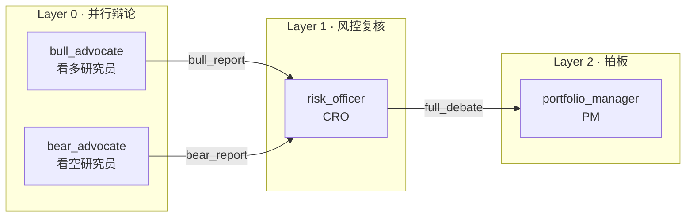
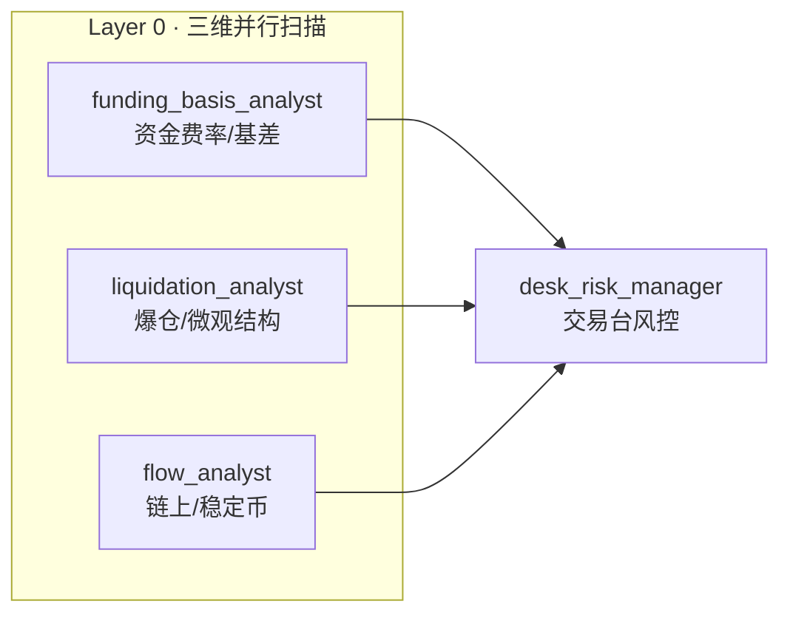
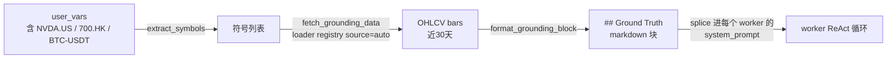

# Swarm 多智能体协作

> 分片 D · Vibe-Trading 学习指南
>
> 范围：多智能体（multi-agent / swarm）为何存在、如何用 DAG 组织一个金融研究/交易团队、调度引擎如何并行执行、以及如何用 grounding 防止 LLM 编造价格。
>
> 配套源码：`agent/src/swarm/`（`runtime.py` / `worker.py` / `grounding.py` / `models.py` / `task_store.py`）+ `presets/*.yaml`（共 29 个预设团队）。

---

## 1. 业务动机：为什么单一 agent 不够

### 1.1 业务定义

**Swarm**：把一个复杂金融研究/决策任务拆成若干**有边界、有工具、有人设**的子 agent，按 DAG 依赖编排，层内并行、层间串行，最终聚合为一个可执行结论的系统。

### 1.2 单 agent 的三大结构性缺陷

金融研究与单边对话天然冲突。一个单体 agent 同时扮演「看多研究员 + 看空研究员 + 风控 + PM」时，会出现：

| 缺陷 | 单 agent 表现 | 多 agent 解法 |
| --- | --- | --- |
| **视角单一（confirmation bias）** | LLM 倾向顺着 prompt 的语气走，看多 prompt 出看多结论，无人挑战 | 设独立 `bear_advocate` 与 `bull_advocate`，prompt 强制反向立场（见 `investment_committee.yaml:9,56`） |
| **风险制衡缺失** | 同一上下文里既当裁判又当运动员，仓位建议无人否决 | 独立 `risk_officer` / `desk_risk_manager`，对上游结论打分（`investment_committee.yaml:106`） |
| **专家分工不深** | 一个 prompt 塞满技术面 + 基本面 + 资金面 + 衍生品，注意力被稀释 | 每个 agent 只配自己领域的 `skills` 白名单（如 `crypto_trading_desk.yaml:42,83,119`） |

### 1.3 多 agent vs 单 agent 取舍

多 agent 不是免费午餐。下表给出真实的工程取舍，**只有当任务满足「多元视角 + 可分解 + 结论需制衡」时才值得上 swarm**：

| 维度 | 单 agent | Swarm（多 agent） |
| --- | --- | --- |
| Token 成本 | 1× | ≈ N×（N 个 worker 各自跑 ReAct 循环，token 累加在 `SwarmRun.total_input_tokens`） |
| 延迟 | 单链路 | 取决于**关键路径深度**，层内并行可摊薄（`runtime.py:256` 拓扑分层） |
| 结论质量 | 易一边倒 | 多空辩论 + 风控否决，结论更稳健 |
| 失败半径 | 全失败 | 单 worker 失败只阻塞其下游（`task_store.py:113` `resolve_dependencies`） |
| 适用场景 | 单点问答、写一段代码 | 投委会、交易台、事件驱动尽调 |

> **实务注意**：一个 4-agent 的投委会跑下来常消耗单 agent 的 4–6 倍 token，且 wall-clock 至少是关键路径深度 × 单 agent 时间。**别对「查一个 ticker 现价」这种任务上 swarm**——那是杀鸡用牛刀。Swarm 的价值在「决策可信度」，不在「速度」。

---

## 2. 投资委员会 DAG 案例（详析）

### 2.1 业务背景

买方基金的**投资委员会（Investment Committee, IC）**是经典的决策结构：看多研究员建多仓逻辑 → 看空研究员挑刺 → CRO 独立风控复核 → PM 拍板。这套流程天然是 DAG，且**多空必须并行**（否则后跑的一方会偷看前一方结论，失去独立性）。

### 2.2 链路

`investment_committee.yaml` 定义了 4 个 agent × 4 个 task 的辩论链路：



| Task ID | Agent | depends_on | input_from | 层级 |
| --- | --- | --- | --- | --- |
| `task-bull` | `bull_advocate` | `[]` | `{}` | L0 |
| `task-bear` | `bear_advocate` | `[]` | `{}` | L0 |
| `task-risk` | `risk_officer` | `[task-bull, task-bear]` | `{bull_report: task-bull, bear_report: task-bear}` | L1 |
| `task-decision` | `portfolio_manager` | `[task-risk]` | `{full_debate: task-risk}` | L2 |

（依赖声明见 `investment_committee.yaml:209-229`。）

### 2.3 角色职责与上游注入

| Agent | 立场 | 核心产出 | 关键 skill |
| --- | --- | --- | --- |
| `bull_advocate`（`L9`） | 强制看多，每个论点要数据支撑 | 多头 thesis、催化剂日历、看多目标价区间 | `technical-basic` / `fundamental-filter` / `sentiment-analysis` |
| `bear_advocate`（`L56`） | 强制独立挑刺，「不要被群众裹挟」 | 看空风险点、估值泡沫、VaR/CVaR、看空目标价 | `technical-basic` / `fundamental-filter` / `risk-analysis` / `volatility` |
| `risk_officer`（`L106`） | **既不偏向多也不偏向空**，只做风控 | 多空论点可靠性打分（1–5）、盲点风险、仓位上限、止损/对冲 | `risk-analysis` / `volatility` / `correlation-analysis` |
| `portfolio_manager`（`L158`） | 拍板，**不做三方投票的平均** | 方向、分批建仓计划、最终目标价/止损、信心度 0–100% | `strategy-generate` / `asset-allocation` |

### 2.4 上游 input 如何注入下游 prompt

这是 swarm 协作的**关键机制**——下游 agent 的 system_prompt 里写一个占位变量 `{upstream_context}`，运行时由 `build_worker_prompt` 替换（`worker.py:199-212`）：

```python
# worker.py:200-207
if upstream_summaries:
    sections = []
    for key, summary in upstream_summaries.items():
        sections.append(f"### {key}\n{summary}")
    upstream_block = "## Upstream Context (from previous agents)\n\n" + "\n\n".join(sections)
# worker.py:211
agent_spec.system_prompt.replace("{upstream_context}", upstream_block)
```

`upstream_summaries` 的来源是 task 的 `input_from` 映射，在 `runtime.py:570-573` 从已完成的上游 `task_summaries` 里按 key 取出：

```python
# runtime.py:570-573
upstream: dict[str, str] = {}
for context_key, source_task_id in task.input_from.items():
    if source_task_id in task_summaries:
        upstream[context_key] = task_summaries[source_task_id]
```

于是 `risk_officer` 的 prompt 里 `{upstream_context}` 被替换成 `### bull_report\n<看多总结>\n\n### bear_report\n<看空总结>`，CRO 就能在同一上下文里对照多空。

> **实务注意**：注入的是上游 agent 的 **summary**（即其 `report.md` 或最后一段正文，见 `worker.py:745` `_best_summary` + `:909` `_resolve_summary`），**不是完整的 tool 调用记录**。这意味着上游若在 tool 调用里捞到关键数据但没写进 summary，下游就看不到——所以 worker prompt 强制要求 Phase 3 必须 `write_file report.md`（`worker.py:276-281`）。

### 2.5 依赖门控（safety-critical）

`risk_officer` 依赖 `[task-bull, task-bear]`。如果某个上游 failed，**绝不能让 CRO 在缺一边的情况下硬跑**——那等于让风控只看多空一面就签字。`runtime.py:518-547` 的依赖门控逻辑专门处理这个：

```python
# runtime.py:518-547（节选）
blocked_upstreams = []
for dep_id in task.depends_on:
    dep_task = task_store.load_task(dep_id)
    if dep_task.status != TaskStatus.completed:
        blocked_upstreams.append((dep_id, dep_task.status.value))
if blocked_upstreams:
    task_store.update_status(tid, TaskStatus.blocked, ...)
    self._emit_event(..., "task_blocked", ...)
    continue   # 不派发，跳过
```

被 block 的 task 不会出现在 `layer_results` 里，run 级别最终标记为 `failed`（`runtime.py:349-351`）——**沉默成功是比失败更危险的金融 bug**。

---

## 3. 交易台组织：crypto_trading_desk

### 3.1 业务背景

研究团队（research）产出「观点」，交易台（trading desk）产出「可执行单子」。区别在于：交易台必须落到**仓位、杠杆、执行时机、风控闸门**，而不是停在「看多/看空」。

### 3.2 crypto_trading_desk 拓扑

`crypto_trading_desk.yaml` 是执行向的 3+1 结构：



（依赖见 `crypto_trading_desk.yaml:173-196`，三个分析师 `depends_on: []`，`desk_risk_manager` 依赖三者。）

### 3.3 分工与权重

| Agent | 关注什么 | 输出什么 |
| --- | --- | --- |
| `funding_basis_analyst`（`L6`） | 永续资金费率（OKX/Binance/Bybit 8h）、季度期货基差、contango/backwardation | 费率 regime 分类、carry 机会年化、OI×费率矩阵信号 |
| `liquidation_analyst`（`L47`） | 多空爆仓簇（带 $ 量级）、级联风险、盘口深度 ±1/2/5% | 爆仓磁铁方向、$1M 单子滑点能否 <0.1%、推荐订单类型 |
| `flow_analyst`（`L88`） | 稳定币增减、交易所净流入、巨鲸钱包、MVRV/SOPR、ETF 流 | 链上累积/派发判断、资本轮动方向 |
| `desk_risk_manager`（`L124`） | **三维信号加权**：链上 40% > 资金费率 35% > 爆仓 25%（`L139`） | 方向、仓位 %、最大杠杆、TP1/2/3、硬止损、5 个风控闸门（费率/爆仓临近/稳定币流出/BTC-NASDAQ 相关/最大回撤） |

### 3.4 研究 desk vs 交易 desk 的本质差异

| 维度 | research team（如 `crypto_research_lab`） | trading desk（如 `crypto_trading_desk`） |
| --- | --- | --- |
| 终态产物 | 投资观点（thesis） | **可执行交易单**（方向+仓位+止损+风控闸门） |
| 风控角色 | 可选的编辑/合成 | **必须有** `risk_manager` 做 gate（`L154-159`） |
| 权重 | 无显式权重 | 显式信号权重（`L139`） |
| 失败代价 | 观点错了亏声誉 | 单子错了亏本金，**必须可被阻断** |

> **实务注意**：交易台预设里的 `desk_risk_manager` 给出的是**建议**，不是真实下单指令。Vibe-Trading 的 swarm 层不下单——下单要走 `backtest/` 或对接实盘 broker 的另一条路径。把 swarm 输出当交易信号直接打单，等于把 LLM 的置信度当成真实风控，极其危险。

---

## 4. 预设团队总览（29 个）

`agent/src/swarm/presets/` 下共 **29 个 yaml**（非 30；以下按 desk 类型分组）。每个文件就是一个开箱即用的 DAG 团队。

### 4.1 研究 / Research

| 预设 | 用途 |
| --- | --- |
| `equity_research_team` | 宏观→行业→个股三层研究，编辑合成完整报告 |
| `fundamental_research_team` | 财务/估值/质量三维并行，合成买方深度报告 |
| `technical_analysis_panel` | 经典 TA + Ichimoku + 谐波 + 艾略特 + SMC 并行，信号聚合打分 |
| `commodity_research_team` | 供需深度并行，周期策略师合成大宗商品 thesis |
| `credit_research_team` | 信用质量+利率环境+行业信用三维，合成债券策略 |
| `crypto_research_lab` | 链上+DeFi+情绪三维，Alpha 合成器收敛建议 |
| `sector_rotation_team` | 经济周期+景气度+资金流并行，构建并回测行业轮动策略 |
| `sentiment_intelligence_team` | 新闻/社交/资金流并行，情绪合成器输出复合分数 |
| `social_alpha_team` | Twitter/Telegram/Reddit 并行，提取可交易社交情绪因子 |

### 4.2 交易 / Trading Desk

| 预设 | 用途 |
| --- | --- |
| `crypto_trading_desk` | 加密执行台（详见 §3） |
| `statistical_arbitrage_desk` | 配对扫描+微观结构并行，套利策略师构建策略+风控复核 |
| `quant_strategy_desk` | 选股+因子并行→策略回测→风险审计 |
| `derivatives_strategy_desk` | 波动率分析→策略设计→Greeks 风险，串行期权台 |
| `pairs_research_lab` | 相关性扫描+协整并行，配对策略师设计+微观结构复核 |
| `ml_quant_lab` | 特征工程+模型设计并行，回测工程师做严格样本外验证 |

### 4.3 风控 / Portfolio Review

| 预设 | 用途 |
| --- | --- |
| `risk_committee` | 回撤/尾部风险/市场 regime 并行，风控主管签字 |
| `portfolio_review_board` | 业绩归因+风险复核+执行质量并行，CIO 合成再平衡决策 |
| `investment_committee` | 多空辩论→风控复核→PM 拍板（详见 §2） |
| `factor_research_committee` | 因子挖掘+验证并行→组合构建→回测复核 |

### 4.4 事件驱动 / 宏观 / 另类

| 预设 | 用途 |
| --- | --- |
| `event_driven_task_force` | 事件扫描→深度影响分析→策略构建，串行尽调链 |
| `earnings_research_desk` | 基本面+盈利修正+期权/事件+盈利策略师，财报季深研 |
| `geopolitical_war_room` | 地缘+能源冲击+供应链并行，首席策略师出应急配置手册 |
| `macro_strategy_forum` | 全球+国内+政策并行，首席策略师出跨资产配置指引 |
| `macro_rates_fx_desk` | 利率+外汇+商品/通胀并行，宏观 PM 出跨资产配置 |
| `global_allocation_committee` | A股+加密+港美股并行，配置师出跨市场加权配置 |
| `global_equities_desk` | A股+港美股+加密分析师+全球策略师，多市场选股 |
| `etf_allocation_desk` | ETF 筛选+宏观配置+风险预算并行，组合优化器构建+回测 |
| `fund_selection_panel` | 多维筛选→Brinson 归因→FOF 权重优化，串行基金评审 |
| `convertible_bond_team` | 债底+股性+嵌入期权价值并行，合成可转债策略 |

---

## 5. DAG 调度机制

### 5.1 拓扑分层：层内并行、层间串行

`task_store.py:203` `topological_layers` 用 Kahn 算法把 DAG 切成层，**同一层的 task 无相互依赖、可并行**：

```python
# task_store.py:216-247（Kahn 算法核心）
in_degree = {t.id: len(t.depends_on) for t in tasks}
queue = deque(tid for tid, deg in in_degree.items() if deg == 0)
while queue:
    layer = list(queue); queue.clear()
    layers.append(layer)
    for tid in layer:
        for downstream in dependents[tid]:
            in_degree[downstream] -= 1
            if in_degree[downstream] == 0:
                queue.append(downstream)
```

`runtime.py:502` 用 `ThreadPoolExecutor(max_workers=4)` 跑同一层——**全局并发上限 4**（`SwarmRuntime.__init__` 默认，`runtime.py:63`）。层与层之间是 `for layer_idx, layer_task_ids in enumerate(layers)` 的串行循环（`runtime.py:261`），上一层全完成（或失败）后才进下一层。

> **实务注意**：max_workers=4 是「同层并发上限」，不是「总 agent 数」。一个 4 层 × 每层 3 agent 的 DAG 仍然只是每层最多 3 路并行。如果你的 layer 有 8 个并行 task，只有 4 个能同时跑，其余排队。加密市场行情 API 多有 rate limit，4 路并行已经接近安全上限，别盲目调大。

### 5.2 取消机制（per-run threading.Event）

每个 run 启动时创建一个独立的 `threading.Event`（`runtime.py:132-134`），存入 `_cancel_events` 字典。`cancel_run(run_id)` 调用 `cancel_event.set()`（`runtime.py:161`）。

取消检查点在**层边界**（`runtime.py:263`），不是逐 token 中断——正在跑的 worker 会自然跑完，但下一层不再派发：

```python
# runtime.py:263-267
if cancel_event.is_set():
    self._cancel_remaining_tasks(task_store, layer_task_ids, run.tasks)
    all_succeeded = False
    break
```

`_cancel_remaining_tasks`（`runtime.py:729`）把所有非 completed/failed 的 task 标记为 `cancelled`。最终 run 状态：取消信号置位 → `RunStatus.cancelled`，否则看 `all_succeeded`（`runtime.py:367-369`）。

### 5.3 SSE 事件流（events.jsonl）

所有事件经 `_emit_event`（`runtime.py:164`）做两件事：(1) `store.append_event` 追加到 `.swarm/runs/{id}/events.jsonl`（append-only，支持 offset 读取，`store.py:242`）；(2) 若注册了 `live_callback` 则实时回调（SSE 推送的基础）。

关键事件类型（`models.py:125` `SwarmEvent`）：

| 事件 | 触发点 | 含义 |
| --- | --- | --- |
| `run_started` | `runtime.py:238` | run 进入 running |
| `layer_started` | `runtime.py:269` | 某层开始，data 带 task 列表 |
| `task_started` | `runtime.py:564` | 单 worker 开跑 |
| `task_completed` | `runtime.py:308` | worker 正常完成 |
| `task_failed` | `runtime.py:331` | worker failed/timeout/incomplete |
| `task_blocked` | `runtime.py:538` | 上游未完成，下游被跳过（**safety-critical**） |
| `task_retry` | `runtime.py:674` | 重试前（最多 `max_retries` 次，默认 2） |
| `task_heartbeat` | `worker.py:676` | tool 调用中持续发心跳，防 stale-run reaper 误杀 |
| `run_heartbeat` | `runtime.py:429` | grounding 预取阶段心跳 |
| `run_completed` | `runtime.py:385` | run 终态（completed/failed/cancelled） |

> **实务注意**：heartbeat 机制不是装饰——`store.py` 的 stale-run reaper 靠 `events.jsonl` 最后一条的时间戳判断 run 是否「卡死」（`store.py:356`）。多 symbol grounding 预取可能 30s+，没有心跳就会被误判为僵尸 run 被 reap 掉。所以 `SWARM_HEARTBEAT_INTERVAL_S`（默认 3s）别调太大。

### 5.4 WorkerStatus：incomplete vs failed

这是 swarm 输出契约里**最容易踩坑**的区分。`models.py:43` 定义了 5 种终态：

| Status | 含义 | 是否重试 | 下游影响 |
| --- | --- | --- | --- |
| `completed` | 正常产出 report | 否 | 下游可消费 summary |
| `failed` | 抛异常/工具错误 | **是**（`runtime.py:672` 按 `max_retries` 重试） | 触发依赖门控，下游 blocked |
| `timeout` | 超 `timeout_seconds` | 否 | 同 failed |
| `token_limit` | 触发 token 上限 | 否 | 同 failed |
| `incomplete` | **没异常，但产出不合格** | 否 | 同 failed（runtime 统一走 else 分支 `runtime.py:321`） |

`incomplete` 是最微妙的：worker 跑完了，没崩，但产出不达标。判定逻辑在 `worker.py:872` `_classify_deliverable`：

```python
# worker.py:886-905（节选）
if not text: return "empty deliverable"
if any(m in low for m in _UNPARSED_TOOL_MARKERS): return "unparsed tool-call markup ..."
if any(m in low for m in _FABRICATION_MARKERS): return "explicitly fabricated / mock data"
if low.startswith(_PLAN_PREFIXES) and len(text) < 600: return "plan-only stub ..."
if is_data_agent and not report_written and data_tool_calls == 0:
    return "data agent produced no tool calls and no report.md"
```

四种典型 incomplete 场景：(1) 只输出计划没执行；(2) 直接把 tool 返回的 JSON 当结论；(3) 明说「这是模拟数据」；(4) **data agent 一个工具都没调**就写了报告（最危险，等于纯靠训练记忆编数）。

> **实务注意**：`incomplete` 绝不能折叠成 `completed`（`models.py:49` 注释明确强调 P01/P03）。一个没调任何数据工具就写满价格的「研报」，比 crash 更具破坏性——它会流到下游 PM 那里被当成真实结论。把它标 failed、阻断下游，是 swarm 的安全底线。

---

## 6. Grounding 防幻觉

### 6.1 业务问题

LLM 的训练数据有 cutoff。问它「NVDA 现价多少」，它会自信地报一个**几个月前的训练数据价格**，且毫无愧疚。在金融场景里，用昨天的价格做今天的多空判断，等于闭眼开车。

`grounding.py:1-9` 的设计哲学一句话：**结构性修复，而非靠 prompt 恳求**——在 worker 开跑前把真实近期 OHLCV 喂进 prompt，并明确告诉它「这些是本次 run 唯一可信的价格」。

### 6.2 三步机制



**Step 1 — 符号提取**（`grounding.py:118` `extract_symbols_from_user_vars`）：扫描 `user_vars` 所有 value，匹配四种后缀形态：

| 模式 | 正则（`grounding.py:75-80`） | 示例 |
| --- | --- | --- |
| 美股 | `\b[A-Z]{1,5}\.US\b` | `NVDA.US` |
| 港股 | `\b\d{3,5}\.HK\b` | `700.HK` |
| A股 | `\b\d{6}\.(?:SZ|SH|BJ)\b` | `600519.SH` |
| 加密 | `\b[A-Z]{2,6}-USDT\b` | `BTC-USDT` |

裸 ticker（如 `NVDA` 无后缀）在护栏下**提升**为 `NVDA.US`（`grounding.py:86,118-141`）：要求 2–5 个大写字母、命中一份金融 stopword 黑名单（`ETF/CEO/GDP/USD/BTC` 等不提升，`grounding.py:91-115`）、且显式后缀符号优先（防止 `BTC-USDT` 被误拆出 `BTC.US`）。

**Step 2 — 预取 OHLCV**（`runtime.py:406` `_prefetch_grounding_data` → `grounding.py:160` `fetch_grounding_data`）：对每个符号调 `backtest.loaders.registry.resolve_loader` + `_detect_market` 路由到对应 loader，拉取近 `DEFAULT_WINDOW_DAYS=30` 天（`grounding.py:64`）的日线。**单符号失败不影响整体**（`grounding.py:207` per-symbol try/except），最多 `DEFAULT_MAX_SYMBOLS=8` 个符号（`grounding.py:65`，可由 `SWARM_GROUNDING_MAX_SYMBOLS` 覆盖）。

**Step 3 — 渲染注入**（`grounding.py:231` `format_grounding_block`）：生成带强约束指令的 markdown 块，在 `worker.py:219-223` 拼接到 system_prompt：

```
## Ground Truth — Recent Market Data
**These are the authoritative current prices for this run.** Do NOT cite
prices ... from your training data — markets have moved.
### NVDA.US  (window 2026-06-03 → 2026-07-03)
| Date | Close | Volume |
| --- | ---: | ---: |
| 2026-06-30 | 123.45 | 12,345,678 |
...
**Latest close:** 125.67  **Window range:** 118.00 – 126.50
```

### 6.3 配套的硬约束

光喂数据不够，worker prompt 还有一条**无条件**的 Data Citation Discipline（`worker.py:243-264`）：任何具体数字必须可追溯到 (a) 本次 tool 调用、(b) Ground Truth 块、(c) 上游已溯源的 summary——否则要么调数据工具，要么删掉数字并标注「未核实」。这条规则对**没有数据工具的合成 agent 同样生效**，防止 PM 编造上游没给的数字。

> **实务注意**：grounding 是 **run 启动时的一次性快照**（`grounding.py:43` 明确承认），不随 run 进行中刷新。一个跑 20 分钟的投委会，worker 看到的仍是开跑时的价格——这对日级决策可接受，对分钟级高频交易**绝对不够**，那种场景 worker 必须自己再调 `get_market_data` 取最新价。

---

## 小结

Swarm 的价值不在「多」，而在「**分工 + 制衡 + 可溯源**」：

1. **分工**：DAG 把复杂决策切成有边界的专家角色，每个 agent 只看自己的 skill 白名单；
2. **制衡**：多空辩论 + 独立风控 + 依赖门控，上游失败宁可阻断下游也不让风控空转；
3. **可溯源**：grounding 喂真实价格 + Data Citation 硬规则 + `incomplete` 状态拦截无证据产出，三道防线压住 LLM 的编造本能。

下一分片将转向**单 worker 内部的 ReAct 循环与 tool 编排**——即 swarm 里每个节点自己在干什么。
