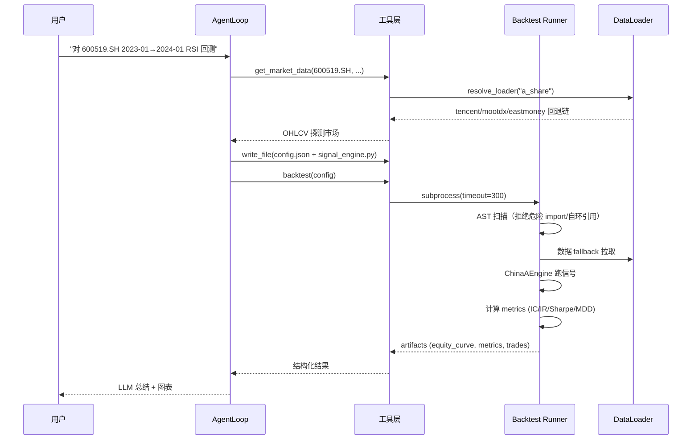
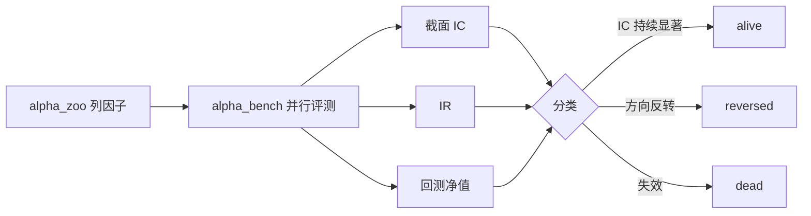
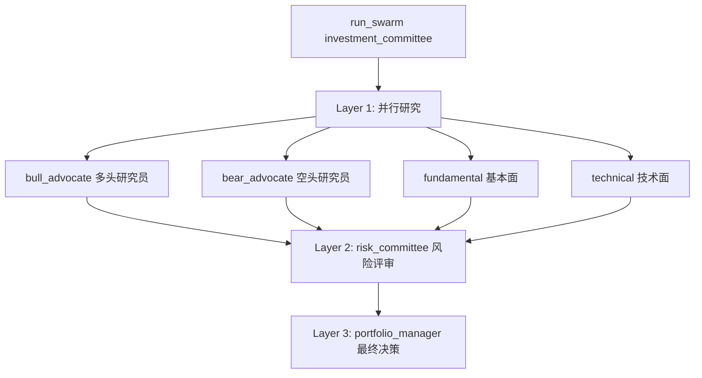
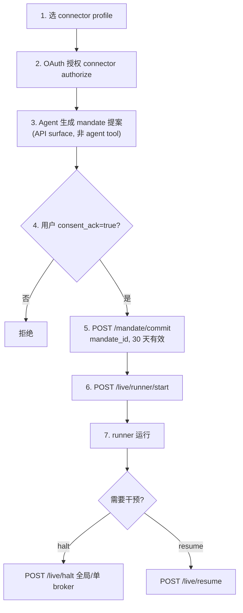
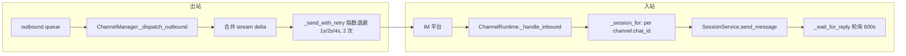

# 第三部分 · 功能使用与配置

> 读者画像：资深金融从业者 + 资深开发工程师。本文把每个功能拆成「用途 → 配置 → 命令 → 典型工作流 → 故障排查」五段式，所有命令块、配置块均可直接复制使用。命令与参数名保留英文原词，说明全部中文。

---

## 目录

1. [安装与环境（dev 模式）](#1-安装与环境dev-模式)
2. [配置体系](#2-配置体系)
3. [CLI 完整命令手册](#3-cli-完整命令手册)
4. [Web UI 使用](#4-web-ui-使用)
5. [典型工作流（端到端示例）](#5-典型工作流端到端示例)
6. [MCP 集成](#6-mcp-集成)
7. [实盘交易操作（安全流程）](#7-实盘交易操作安全流程)
8. [IM 渠道完整接入指南](#8-im-渠道完整接入指南)
9. [故障排查清单](#9-故障排查清单)
10. [开发者扩展](#10-开发者扩展)

---

## 1. 安装与环境（dev 模式）

### 1.1 前置依赖

| 依赖 | 版本要求 | 说明 |
|------|---------|------|
| Python | `>=3.11`（推荐 3.11） | `pyproject.toml` 强制约束 |
| Node.js | `>=20`（docker-compose 用 `node:20` 镜像） | 前端构建 |
| conda / miniconda | 任意现代版本 | 推荐用 conda 隔离环境 |
| Docker Engine | `>=20.10`（host-gateway 支持） | 仅 Docker 部署需要 |

### 1.2 conda 环境创建（Python 3.11）

实际项目环境位于 `/opt/anaconda3/envs/vibe-trading`，对应如下创建步骤：

```bash
# 1. 创建并激活环境
conda create -n vibe-trading python=3.11 -y
conda activate vibe-trading

# 验证
python --version   # 应输出 Python 3.11.x
which python       # /opt/anaconda3/envs/vibe-trading/bin/python
```

### 1.3 安装 Python 依赖（可编辑模式）

```bash
cd /path/to/Vibe-Trading

# 安装核心 + dev 测试依赖
pip install -e ".[dev]"
```

> ⚠️ **关于 `[channels]` extras**：`slackify-markdown>=4.4.0` 在部分环境存在版本兼容问题，**安装核心包时已自动跳过** `[channels]` 全量 extras。如需某个具体 IM 渠道，按需安装对应的单独 extra（见 [第 8 节](#8-im-渠道完整接入指南)），例如 `pip install -e ".[telegram,feishu]"`。

可选 extras 速查（来自 `pyproject.toml [project.optional-dependencies]`）：

| Extra | 用途 |
|-------|------|
| `[ibkr]` | IBKR 本地 TWS 连接器（`ib_async`） |
| `[deepseek]` | DeepSeek 原生 adapter（`langchain-deepseek`） |
| `[ashare]` | A 股 BaoStock TCP 源（绕过 Eastmoney CDN IP 封锁） |
| `[harmonic]` | 谐波形态（`pyharmonics`） |
| `[telegram]` / `[discord]` / `[feishu]` / … | 单个 IM 渠道依赖 |
| `[channels]` | 全部 16 个 IM 渠道（含 `slackify-markdown`，可能踩版本坑） |
| `[dev]` | `pytest` / `pytest-cov` / `pytest-socket` |

### 1.4 前端依赖

```bash
cd frontend
npm install
```

### 1.5 三种启动方式

#### 方式 A：分别启动后端 + 前端（最透明，推荐调试用）

```bash
# 终端 1 —— 后端 API（FastAPI + uvicorn）
vibe-trading serve --host 127.0.0.1 --port 8899

# 终端 2 —— 前端 Vite dev server
cd frontend && npm run dev
```

`vite.config.ts` 中代理规则：前端 `5899` 端口把以下路径转发到 `http://127.0.0.1:8899`（`PROXY_PATHS` 数组 + 正则规则）：

```text
# PROXY_PATHS（前缀匹配，纯代理）
/sessions, /swarm/presets, /swarm/runs, /settings/llm,
/settings/data-sources, /channels, /mandate, /live,
/upload, /shadow-reports

# 正则规则（带 SPA fallback）
^/runs/[^/]+/?$   → SPA fallback 到 index.html（Accept: text/html 时）
/runs             → 纯代理（/runs/{id}/code、/runs/{id}/pine 等 API）
/correlation      → SPA fallback
^/alpha(?:/|$)    → 纯代理（含 /alpha-zoo 及子路径）
```

> SPA 路由 `/runs/{id}`（恰好两段）会 bypass 到 `index.html`；而 `/runs/{id}/code`、`/runs/{id}/pine` 是纯 API，即便 `Accept: text/html` 也继续代理。

#### 方式 B：一键启动后端 + 前端

```bash
vibe-trading dev
# 等价于：
#   vibe-trading dev --port 8899 --frontend-port 5899
#   --frontend-dir 默认 <repo>/frontend
```

`vibe-trading dev` 会在同一进程内拉起后端（8899）和 Vite dev server（5899），stdout 混合输出，适合快速验证。

#### 方式 C：Docker Compose

`docker-compose.yml` 定义了两个服务：

```bash
# 仅后端（生产风格，端口绑死 127.0.0.1）
docker compose up -d vibe-trading

# 同时起前端 dev server（需显式启用 profile）
docker compose --profile frontend up -d
```

关键配置点：

- `vibe-trading` 服务 `ports: 127.0.0.1:8899:8899`，并强制注入 `VIBE_TRADING_TRUST_DOCKER_LOOPBACK=1`（让宿主机浏览器请求仍被视作 loopback dev 模式）。
- `OLLAMA_BASE_URL` 默认 `http://host.docker.internal:11434`（容器内访问宿主机的 Ollama）。
- 持久化 volume：`vibe-runs` / `vibe-sessions` / `vibe-home`（`/home/vibe/.vibe-trading`，承载 memory、FTS5 索引、用户技能、连接器配置、agent.json） / `vibe-swarm-runs` / `vibe-uploads`。
- `frontend` 服务用 `profiles: [frontend]`，默认不启动，需 `--profile frontend`。

### 1.6 端口对照表

| 端口 | 服务 | 说明 |
|------|------|------|
| `8899` | 后端 API（FastAPI） | `vibe-trading serve` 默认（`serve` 子命令默认 8000，`dev` 默认 8899） |
| `5899` | 前端 Vite dev server | `npm run dev` / `vibe-trading dev` |
| `8900` | MCP SSE 传输 | `python mcp_server.py --transport sse --port 8900` |
| `11434` | Ollama 本地模型 | 宿主机 Ollama 默认端口 |

---

## 2. 配置体系

Vibe-Trading 的运行期配置分三层：

1. **`~/.vibe-trading/.env`**：环境变量，承载 LLM provider、数据源 token、服务器与 agent 调优参数。**真相源**。
2. **`~/.vibe-trading/agent.json`（或 `agent.yaml`）**：结构化配置，承载 `mcpServers`（外部 MCP 服务器）和 `channels`（IM 全局开关）。
3. **`~/.vibe-trading/swarm-agent.json`**：Swarm 运行期覆盖配置。

### 2.1 `~/.vibe-trading/.env` 完整配置

`vibe-trading init` 会以向导方式生成此文件。下面给出完整可用的模板（节选自 `agent/.env.example`）。

#### 2.1.1 LLM Provider 配置

**真实示例：DashScope / Qwen3.7-Max + enable_thinking**

```dotenv
# ===== LLM Provider（只启用一个 block）=====
LANGCHAIN_PROVIDER=dashscope
LANGCHAIN_MODEL_NAME=qwen3.7-max
DASHSCOPE_API_KEY=sk-xxxxxxxxxxxxxxxxxxxxxxxx
DASHSCOPE_BASE_URL=https://dashscope.aliyuncs.com/compatible-mode/v1

# 开启 Qwen 混合思考模式（enable_thinking 走 extra_body）
VIBE_TRADING_DASHSCOPE_ENABLE_THINKING=1

# 通用 LLM 参数
LANGCHAIN_TEMPERATURE=0.0
TIMEOUT_SECONDS=120
MAX_RETRIES=2

# 仅 OpenRouter 思考模型需要；Moonshot/DeepSeek 官方 API 默认返回 reasoning
# LANGCHAIN_REASONING_EFFORT=medium   # low / medium / high / max
```

> 🔑 **enable_thinking 不生效排查**：`enable_thinking` 是非标准 OpenAI 参数，必须走 `extra_body`。Vibe-Trading 仅当 `VIBE_TRADING_DASHSCOPE_ENABLE_THINKING` 取值 `1/true/yes` 且 provider 为 `dashscope`/`qwen` 时才注入。同时该 provider 的 capability `capture_reasoning=True`（见 `src/providers/capabilities.py`），会把返回的 `reasoning_content` 落到前端 reasoning 流。两者缺一不可。

#### 2.1.2 Provider 切换速查（14+ provider）

| Provider | `LANGCHAIN_PROVIDER` | 关键环境变量 | 默认模型示例 | 备注 |
|----------|----------------------|-------------|-------------|------|
| OpenRouter（推荐网关） | `openrouter` | `OPENROUTER_API_KEY` / `OPENROUTER_BASE_URL` | `deepseek/deepseek-v4-pro` | 支持 reasoning effort |
| OpenAI | `openai` | `OPENAI_API_KEY` / `OPENAI_BASE_URL` | `gpt-5.5-instant` | — |
| OpenAI Codex（ChatGPT OAuth） | `openai-codex` | `OPENAI_CODEX_BASE_URL` | `openai-codex/gpt-5.3-codex` | 需先 `vibe-trading provider login openai-codex` |
| DeepSeek | `deepseek` | `DEEPSEEK_API_KEY` / `DEEPSEEK_BASE_URL` | `deepseek-v4-pro` | adapter 选择见 [2.4](#24-vibe_trading_deepseek_adapter) |
| Gemini | `gemini` | `GEMINI_API_KEY` / `GEMINI_BASE_URL` | `gemini-3.5-flash` | thought signatures 回环 |
| Groq | `groq` | `GROQ_API_KEY` / `GROQ_BASE_URL` | `meta-llama/llama-4-maverick-17b-128e-instruct` | — |
| DashScope / Qwen | `dashscope` | `DASHSCOPE_API_KEY` / `DASHSCOPE_BASE_URL` | `qwen-plus-latest` / `qwen3.7-max` | `VIBE_TRADING_DASHSCOPE_ENABLE_THINKING=1` 开思考 |
| Zhipu（智谱） | `zhipu` | `ZHIPU_API_KEY` / `ZHIPU_BASE_URL` | `glm-5.1` | 别名 `glm` |
| Moonshot / Kimi | `moonshot` | `MOONSHOT_API_KEY` / `MOONSHOT_BASE_URL` | `kimi-k2.6` | kimi-k2.x 强制 `temperature=1`；别名 `kimi` |
| MiniMax | `minimax` | `MINIMAX_API_KEY` / `MINIMAX_BASE_URL` | `MiniMax-M3` | **要求 temperature>0**，自动 clamp 到 0.01 |
| Xiaomi MIMO | `mimo` | `MIMO_API_KEY` / `MIMO_BASE_URL` | `MiMo-72B-A27B` | — |
| Z.ai | `zai` | `ZAI_API_KEY` / `ZAI_BASE_URL` | `glm-5.1` | Coding Plan |
| Ollama（本地） | `ollama` | `OLLAMA_BASE_URL` | `qwen2.5:32b` | 无需 API key |

未识别的 provider 名会回退到 OpenAI 能力集（`get_provider_capabilities` 默认值）。

#### 2.1.3 数据源 Token

```dotenv
# ===== Data Sources =====
# A 股：Tushare Pro token（https://tushare.pro）
TUSHARE_TOKEN=your-tushare-token

# 港美股：yfinance（免费，免配置）
# 加密货币：OKX 公共 API（免费，免配置）；可改默认回退交易所：
# CCXT_EXCHANGE=binance

# 港 A 股 via Futu OpenAPI（需本地 FutuOpenD）：
# FUTU_HOST=127.0.0.1
# FUTU_PORT=11111

# 以下为可选 API-key 源（仅在 key 设置后启用，否则静默跳过）：
# FINNHUB_API_KEY=xxx          # 美股 OHLCV 回退源
# ALPHAVANTAGE_API_KEY=xxx     # 美股 OHLCV 回退源
# TIINGO_API_KEY=xxx           # 美股 OHLCV 回退源
# FMP_API_KEY=xxx              # 美股 OHLCV 回退源
# FRED_API_KEY=xxx             # 宏观序列（get_macro_series 工具）
# VIBE_TRADING_IWENCAI_KEY=xxx # A 股自然语言研究搜索（iwencai_search 工具）
# VIBE_TRADING_SEC_UA="Your Name your@email.com"  # SEC EDGAR 合规 User-Agent（不设也有内置默认）

# 可选：批量任务每源请求间隔覆盖
# VIBE_TRADING_{EASTMONEY,SINA,STOOQ,YAHOO,SEC,FINNHUB,ALPHAVANTAGE,TIINGO,FMP,FRED,IWENCAI,THS}_MIN_INTERVAL=...
```

免费直连源（Eastmoney / Sina / Stooq / Yahoo）**无需 key**，自动加入回退链。

#### 2.1.4 服务器配置

```dotenv
# ===== API Server =====
# Bearer token；dev 模式 loopback 可空。暴露 8899 到非本机前必须设置。
# API_AUTH_KEY=

# CORS 允许源（逗号分隔）
# CORS_ORIGINS=http://localhost:3000,http://localhost:5173,http://localhost:8000

# 启用 session runtime（默认 true）
# ENABLE_SESSION_RUNTIME=true

# Docker loopback 信任（compose 场景配合 127.0.0.1 端口绑定使用）
# VIBE_TRADING_TRUST_DOCKER_LOOPBACK=0

# 高级：暴露 shell 执行工具给 agent
# VIBE_TRADING_ENABLE_SHELL_TOOLS=0

# read_document / analyze_trade_journal 的可导入根（逗号分隔绝对路径）
# VIBE_TRADING_ALLOWED_FILE_ROOTS=
# write_file / backtest 等生成代码工具的运行根
# VIBE_TRADING_ALLOWED_RUN_ROOTS=
```

#### 2.1.5 Agent 调优参数

```dotenv
# ===== Agent Tuning（默认值都合理，按需调整）=====
# SWARM_WORKER_TIMEOUT=300
# SWARM_WORKER_MAX_ITER=50
# SWARM_MAX_WORKERS=4
# SWARM_TIMEOUT=1800
# SUBAGENT_TIMEOUT=300
# SUBAGENT_MAX_ITER=25
# TOKEN_THRESHOLD=40000

# 只读工具执行硬超时（秒）；写工具仅 warn。默认 1800，设 0 禁用。
# VIBE_TRADING_TOOL_TIMEOUT_SECONDS=1800

# 前端 SSE 空闲超时（秒），超时显示 "Execution timed out"。
# 慢本地模型（CPU Ollama）可调大。
# VIBE_TRADING_SSE_TIMEOUT=90

# 内容过滤告警阈值（默认 0.05 = 5%）：被内容审核拦截的比例超阈值时
# run 卡片会提示切换 provider。
# CONTENT_FILTER_WARNING_THRESHOLD=0.05
```

### 2.2 `agent.json` / `agent.yaml`

位于 `~/.vibe-trading/agent.json`，schema 定义在 `src/config/schema.py`。顶层两个字段：`mcpServers` 和 `channels`。同时支持 snake_case 和 camelCase（`alias_generator=_to_camel`）。

#### 2.2.1 `mcpServers` —— 三种传输 + OAuth + 工具白名单

```json
{
  "mcpServers": {
    "my-local-stdio": {
      "type": "stdio",
      "command": "python",
      "args": ["-m", "my_mcp_server"],
      "env": { "MY_API_KEY": "xxx" },
      "enabled_tools": ["tool_a", "tool_b"]
    },
    "my-sse": {
      "type": "sse",
      "url": "https://example.com/sse",
      "headers": { "Authorization": "Bearer xxx" },
      "tool_timeout": 30.0,
      "enabled_tools": ["*"]
    },
    "my-streamable-http": {
      "type": "streamableHttp",
      "url": "https://example.com/mcp",
      "auth": {
        "type": "oauth",
        "scopes": ["mcp.read"],
        "client_name": "Vibe-Trading",
        "cache_dir": "~/.vibe-trading/live/mybroker/oauth",
        "callback_port": null,
        "client_id": null,
        "client_secret": null,
        "client_metadata_url": null
      },
      "init_timeout": 300.0,
      "enabled_tools": ["get_account", "get_positions"]
    }
  }
}
```

字段含义与校验规则（`MCPServerConfig.validate_transport_config`）：

| 字段 | 适用传输 | 说明 / 约束 |
|------|---------|------------|
| `type` | 全部 | `stdio` / `sse` / `streamableHttp`；不填时由 `command`/`url` 推断 |
| `command` / `args` / `env` | stdio | stdio 必须有 `command`；**不能**同时设 `url`/`headers`/`auth` |
| `url` | sse / streamableHttp | HTTP 必须显式 `type`；不能与 `command`/`args`/`env` 共存 |
| `headers` | HTTP | 静态头；与 `auth` 互斥（OAuth 拥有 Authorization 头） |
| `auth` | HTTP（仅 HTTPS） | OAuth 配置；refresh token 禁止走明文，故必须 `https://` |
| `tool_timeout` | 全部 | 默认 `30.0` 秒 |
| `init_timeout` | 全部 | OAuth/initialize 往返超时，默认 `null` |
| `enabled_tools` | 全部 | 工具白名单，默认 `["*"]` |

> ⚠️ **实盘券商白名单禁用通配**：`AgentConfig.validate_live_broker_servers` 会拒绝实盘券商（Robinhood / IBKR 等，按 key 或 URL host 识别）使用 `enabled_tools: ["*"]`。IBKR 官方 MCP 因 OAuth 后才暴露工具名，被允许用 `["*"]` 作为只读探测（`_allows_readonly_wildcard_probe`）；Robinhood 必须显式列出 `get_account / get_positions / get_quotes / list_orders`。

项目内置的 Robinhood / IBKR 种子配置可直接复制（`ROBINHOOD_MCP_SERVER_SEED` / `IBKR_MCP_SERVER_SEED`）：

```json
{
  "mcpServers": {
    "robinhood": {
      "type": "streamableHttp",
      "url": "https://agent.robinhood.com/mcp/trading",
      "init_timeout": 300.0,
      "auth": {
        "type": "oauth",
        "scopes": ["trading.read"],
        "client_name": "Vibe-Trading",
        "cache_dir": "~/.vibe-trading/live/robinhood/oauth"
      },
      "enabled_tools": ["get_account", "get_positions", "get_quotes", "list_orders"]
    }
  }
}
```

#### 2.2.2 `channels` —— IM 全局配置

```json
{
  "channels": {
    "sendProgress": true,
    "sendToolHints": false,
    "sendMaxRetries": 2,
    "telegram": { "bot_token": "123:abc", "allowlist": ["user_id_1"] }
  }
}
```

`ChannelsConfig` 顶层字段（`send_progress` / `send_tool_hints` / `send_max_retries`）严格校验，其余 per-channel 段（`telegram` / `feishu` / …）由各 adapter 自行解析，故顶层 `extra="allow"`。

### 2.3 `swarm-agent.json`

`~/.vibe-trading/swarm-agent.json` 用于 Swarm 运行期覆盖（runtime config layering）。结构与 `agent.json` 的 override 子集一致（`MCPServerConfigOverride` / `AgentConfigOverride`），允许只填部分字段做合并。典型用途：在 swarm worker 子进程里给某 broker 注入不同的 `tool_timeout` 或临时收窄 `enabled_tools`。

### 2.4 `VIBE_TRADING_DEEPSEEK_ADAPTER`

控制 DeepSeek provider 用哪种 adapter：

| 取值 | 行为 |
|------|------|
| `auto`（默认） | 装了 `langchain-deepseek` 就用原生 adapter；否则走 `ChatOpenAI` 兼容路径 |
| `native` | **强制**原生 adapter；未装 `pip install "vibe-trading-ai[deepseek]"` 直接报错 |
| `openai-compatible` | 强制走 legacy `ChatOpenAI` 路径 |

```dotenv
VIBE_TRADING_DEEPSEEK_ADAPTER=auto
```

### 2.5 数据缓存 `VIBE_TRADING_DATA_CACHE`

```dotenv
# 启用回测 loader 的本地历史 bar 缓存
VIBE_TRADING_DATA_CACHE=1
```

- 启用后，每个数据源把**已结算**的历史 bar 缓存到 `~/.vibe-trading/cache/loaders/`。
- 只有完全过去的交易日才缓存（区间含今天的始终重新拉取）。
- 重复 / 长周期回测可跳过网络。
- 清缓存：`rm -rf ~/.vibe-trading/cache`

---

## 3. CLI 完整命令手册

CLI 有两个 surface：

- **`cli/_legacy.py`**（5309 行，argparse）：所有子命令的真相源。
- **`cli/main.py`**（1384 行）：banner + onboarding + 交互式 REPL，注册 connector slash 命令。

入口：`pyproject.toml [project.scripts]` 定义 `vibe-trading = "cli:main"` 与 `vibe-trading-mcp = "mcp_server:main"`。

### 3.1 核心子命令（`cli/_legacy.py` subparsers）

#### 一次性 / 服务 / 交互

```bash
# 一次性执行 prompt（不进 REPL）
vibe-trading run -p "分析 600519.SH 近一年走势"
vibe-trading run -f prompt.txt              # 从文件读
vibe-trading run -p "..." --json            # 机器可读 JSON 输出
vibe-trading run -p "..." --max-iter 50

# 启动 API 服务
vibe-trading serve --host 127.0.0.1 --port 8899
vibe-trading serve --dev                    # 同时起 Vite

# 一键开发模式（后端 + 前端）
vibe-trading dev --port 8899 --frontend-port 5899

# 交互式 ReAct 聊天
vibe-trading chat --max-iter 50
```

#### 检查 runs

```bash
vibe-trading list --limit 20        # 列出最近 run
vibe-trading show <RUN_ID>          # 详情
vibe-trading code <RUN_ID>          # 查看生成的代码
vibe-trading pine <RUN_ID>          # 导出 TradingView Pine Script
vibe-trading trace <RUN_ID>         # 回放 run trace
```

#### 初始化 / 前端构建

```bash
vibe-trading init                   # 向导生成 ~/.vibe-trading/.env
vibe-trading setup                  # 安装前端依赖并构建生产 bundle
vibe-trading setup --frontend-dir /custom/path
```

#### OAuth Provider

```bash
vibe-trading provider login openai-codex    # 浏览器 OAuth
vibe-trading provider doctor                # 打印脱敏诊断
```

#### IM 渠道

```bash
vibe-trading channels status [--json] [--local]
vibe-trading channels start [--json]
vibe-trading channels stop  [--json]
vibe-trading channels login <channel_name> [--force]   # 如 weixin/feishu/whatsapp
vibe-trading channels pairing list   --channel telegram
vibe-trading channels pairing approve <code> --channel telegram
vibe-trading channels pairing deny    <code>
vibe-trading channels pairing revoke  <sender_id>
```

#### 交易连接器（connector）

```bash
vibe-trading connector list                       # 列出可选 profile
vibe-trading connector use ibkr-paper-local        # 选默认 profile

# 本地连接配置（IBKR TWS）
vibe-trading connector configure ibkr-paper-local \
    --host 127.0.0.1 --port 7497 --client-id 77 --account U1234567 -y

vibe-trading connector check [profile] [--host .. --port .. --client-id .. --account ..]
vibe-trading connector status [profile]

# 远程 MCP 券商 OAuth 授权
vibe-trading connector authorize robinhood-live-mcp

# 只读账户查询
vibe-trading connector account   [profile] [local flags]
vibe-trading connector positions [profile]
vibe-trading connector orders    [profile] [--include-executions]
vibe-trading connector quote   AAPL [profile] [--exchange SMART --currency USD --sec-type STK]
vibe-trading connector history AAPL [profile] \
    [--duration "30 D" --bar-size "1 day" --what-to-show TRADES --no-rth] \
    [--period 1d --limit 90]   # SDK 连接器用 period/limit

# 实盘 runner 生命周期
vibe-trading connector start   [profile]
vibe-trading connector stop    [profile]
vibe-trading connector halt    [profile]    # 触发该 profile kill switch
vibe-trading connector resume  [profile]    # 清除 kill switch
vibe-trading connector revoke  [profile]    # 吊销 OAuth token + mandate
```

#### 持久记忆（memory）

```bash
vibe-trading memory list [--type <type>]
vibe-trading memory show  <name>
vibe-trading memory search "<query>" --limit 5
vibe-trading memory forget <name> [-y]
```

#### Swarm

> ⚠️ Swarm **没有**顶层 `vibe-trading swarm ...` 子命令。Swarm 通过两种方式触发：
> 1. **全局 flag**：`vibe-trading --swarm-run <PRESET> [VARS...]`（legacy 入口）
> 2. **REPL slash 命令**：`vibe-trading chat` 内的 `/swarm`（见 [3.2](#32-交互式-slash-命令)）

```bash
# 全局 flag：运行预设
vibe-trading --swarm-run investment_committee target=NVDA market=us

# 在 REPL 内（/swarm 子命令）
> /swarm                     # 列预设
> /swarm inspect <PRESET>    # 检查 DAG（不运行）
> /swarm <PRESET> [VARS...]  # 运行
> /swarm cancel <RUN_ID>     # 取消运行
```

#### Alpha Zoo（`src/factors/cli_handlers.add_subparser` 注册）

```bash
vibe-trading alpha list
vibe-trading alpha show <alpha_id>
vibe-trading alpha bench <alpha_id> [--universe csi300]
vibe-trading alpha compare <id_a> <id_b>
vibe-trading alpha export-manifest
```

#### 假设注册表（`src/hypotheses/cli_handlers.add_subparser`）

```bash
vibe-trading hypothesis ...   # 注册/查询研究假设
```

#### Session

```bash
vibe-trading --sessions                # 列 session
vibe-trading --session-chat <SESSION_ID>
vibe-trading --upload <FILE_PATH>
```

### 3.2 交互式 slash 命令

在 `vibe-trading chat` REPL 内，输入 `/` 触发 typeahead。共 16 个命令（`cli/commands/slash_router.py` 的 `SLASH_COMMANDS`）：

| 命令 | 别名 | 说明 |
|------|------|------|
| `/help` | `?` | 显示快捷键与命令列表 |
| `/model` | — | 切换 LLM provider 与模型 |
| `/memory` | — | 查看 / 管理持久记忆 |
| `/history` | — | 浏览并恢复历史 session |
| `/goal` | — | 启动 / 查看金融研究 goal |
| `/search` | — | 跨所有 session 全文检索（FTS5） |
| `/swarm` | — | 多 agent 预设（committee / quant / risk） |
| `/skill` | — | 列出 / 加载 / 卸载技能 |
| `/show` | — | 按 id 查看历史 run |
| `/clear` | — | 清空当前对话 |
| `/pine` | — | 导出当前策略为 Pine Script |
| `/journal` | — | 分析交易日志 CSV |
| `/shadow` | — | 训练 / 查看 Shadow Account |
| `/export` | — | 导出当前 session（md / json） |
| `/debug` | — | 切换调试面板（token 用量 / 延迟） |
| `/quit` | `q` / `exit` / `:q` | 退出 |

模糊匹配 `_fuzzy_score`（prefix > substring > subsequence）：

- prefix 匹配 → `100 + length bonus`
- substring 匹配 → `50 + length bonus`
- subsequence（字符按序出现） → `10 + 匹配字符数`

例如 `/sw` 命中 `/swarm`，`/jo` 命中 `/journal`。

---

## 4. Web UI 使用

### 4.1 路由表

| 路由 | 页面 | 用途 |
|------|------|------|
| `/` | Home | 首页 |
| `/agent` | Agent（1673 行） | 主聊天界面 |
| `/runtime` | Runtime | IM 渠道 + 实盘状态总览 |
| `/reports` | Reports | 报告列表 |
| `/settings` | Settings | LLM provider 切换 + 数据源配置 |
| `/runs/:runId` | RunDetail | 单次回测详情（含曲线/指标） |
| `/compare` | Compare | 多 run 对比 |
| `/correlation` | Correlation | 相关性分析 |
| `/alpha-zoo` | AlphaZoo | 因子动物园 |
| `/alpha-zoo/bench` | AlphaZoo | 因子评测 |
| `/alpha-zoo/compare` | AlphaZoo | 因子对比 |
| `/alpha-zoo/:alphaId` | AlphaZoo | 单因子详情 |

所有页面 `lazy` 加载，`Layout` 包裹。技术栈：React 19 + react-router-dom 7 + Vite 6 + Zustand 5 + Tailwind 3 + lucide + sonner + react-markdown + echarts 6 + i18next。

### 4.2 Agent 聊天界面

进入 `/agent`：

- **消息流**：用户/assistant 消息，markdown 渲染（`remark-gfm` + `rehype-highlight` 代码高亮）。
- **工具调用卡片**：每次 `tool_call` / `tool_result` 渲染为可展开卡片。
- **流式输出**：`text_delta`（正文增量）与 `reasoning_delta`（思考增量）实时流式。
- **Swarm 卡片**：`swarm.started` / `swarm.event` 渲染多 agent 协作进度。
- **Mandate 提案卡片**：实盘下单前弹出 `mandate.proposal`，需用户 `consent_ack`。
- **Live 状态 chips**：`live.halted` / `live.resumed` / `live.action` 显示实盘状态徽章。

API 调用走 `lib/api.ts` 的 `request<T>`，鉴权头 `Authorization: Bearer <localStorage.vibe_trading_api_auth_key>`。Session 缓存用 Zustand `useAgentStore`，LRU `_sessionCache max 5`。

### 4.3 Settings 页

- **LLM provider**：下拉切换 provider + 模型，对应 `POST /settings/llm`。
- **数据源**：配置 `TUSHARE_TOKEN` / `FINNHUB_API_KEY` 等，对应 `POST /settings/data-sources`。

改动直接写回 `~/.vibe-trading/.env`（需后端有写权限）。

### 4.4 SSE 实时事件类型清单

前端 `useSSE.ts` 的 `knownTypes`：

```text
# 流式正文 / 思考
text_delta, reasoning_delta, stream_reset, thinking_done

# 工具
tool_call, tool_result, tool_heartbeat, tool_progress, compact, llm_usage

# Swarm
swarm.started, swarm.event

# Goal
goal.created, goal.evidence, goal.updated

# Mandate / Live
mandate.proposal, mandate.committed,
live.halted, live.resumed, live.action

# Session 生命周期
attempt.created, attempt.started, attempt.completed, attempt.failed,
message.received, session.created,
heartbeat, done
```

注意 `useSSE` 的 `knownTypes` 不含 `attempt.json`（该事件由专用 `/attempts/{id}/json` 轮询端点返回，非 SSE 推送）。

`useSSE` 关键健壮性机制：

- **指数退避重连**：1s → 30s。
- **LRU 去重**：容量 500，防止重连后重放重复事件。
- **`Last-Event-ID` resume**：重连带上最后事件 id，服务端续传。
- **心跳**：`heartbeat` 维持连接，超 `VIBE_TRADING_SSE_TIMEOUT`（默认 90s）显示超时。

---

## 5. 典型工作流（端到端示例）

### 5.1 用自然语言跑回测

**Prompt**：「对 600519.SH 从 2023-01 到 2024-01 用 RSI 策略回测」



关键点：

- **市场探测**：先 `get_market_data` 摸数据，自动识别 A 股并选 ChinaAEngine。
- **代码生成**：`write_file` 写 `config.json` + `signal_engine.py` 到 run 目录（`VIBE_TRADING_ALLOWED_RUN_ROOTS`）。
- **subprocess 隔离**：`Runner(timeout=300)` 起子进程，先做 **AST 扫描**（拒绝循环自导入、不安全 import、非常量赋值），再注入数据 fallback 链，最后 ChinaAEngine 执行。
- **失败常见原因**：AST 拒绝（signal_engine 含 `import os` 等）、数据空（token 缺失 + 公共源限流）、市场检测错（A 股代码被当成美股）。

### 5.2 Alpha 因子研究

**Prompt**：「在沪深 300 上评测 momentum 类 alpha」



```bash
# CLI 等价
vibe-trading alpha list                       # 看 zoo
vibe-trading alpha bench alpha101_018 --universe csi300
vibe-trading alpha compare alpha101_018 alpha101_049
```

`alpha_bench` 工具并行计算 IC / IR，并按统计显著性分类为 `alive` / `reversed` / `dead`。zoo 来源：`academic` / `alpha101` / `gtja191` / `qlib158`。

### 5.3 投资委员会 Swarm

**Prompt**：「用投资委员会分析 NVDA」

```bash
# 在 REPL 内先看 DAG（/swarm inspect 子命令）
> /swarm inspect investment_committee

# 或用全局 flag 直接运行
vibe-trading --swarm-run investment_committee target=NVDA market=us
```

执行流程：



Swarm runtime 按 **DAG 拓扑层**调度（`topological_layers`），同层任务并行（受 `SWARM_MAX_WORKERS=4` 限制），跨层依赖等待。每个 worker 受 `SWARM_WORKER_TIMEOUT=300` / `SWARM_WORKER_MAX_ITER=50` 约束。worker 通过 `Context.report_progress` 发 keepalive，防止 MCP 客户端长任务断连。

### 5.4 配置交易连接器

```bash
# 1. 选 profile
vibe-trading connector use ibkr-paper-local

# 2. 配置本地 TWS 连接
vibe-trading connector configure ibkr-paper-local \
    --host 127.0.0.1 --port 7497 --client-id 77 -y

# 3. 就绪检查
vibe-trading connector check

# 4. 只读查询
vibe-trading connector account
vibe-trading connector positions
vibe-trading connector quote AAPL
vibe-trading connector history AAPL --duration "30 D" --bar-size "1 day"
```

实盘下单走 **mandate 提案 → consent_ack → commit** 流程，详见 [第 7 节](#7-实盘交易操作安全流程)。

### 5.5 IM 渠道接入

```bash
# 1. 配 ~/.vibe-trading/.env 的 TELEGRAM_BOT_TOKEN
# 2. 启动 channel
vibe-trading channels start

# 3. 在 Telegram 给 bot 发消息，bot 回复一个 8 位配对码（如 ABCD-EFGH）
# 4. 在 CLI 批准配对
vibe-trading channels pairing approve ABCD-EFGH --channel telegram

# 5. 之后该 Telegram 用户即可与 bot 对话，每 chat 一个独立 session
```

### 5.6 Shadow Account


工具链（`src/tools/shadow_account_tool.py`）：`extract_shadow_strategy` → `extractor.extract_shadow_profile`；`run_shadow_backtest` → `backtester.run_shadow_backtest`；`render_shadow_report` → `reporter.render_shadow_report`。

```bash
# 在 chat 内
> /shadow upload my_trades.csv
> /shadow train
> /shadow report
```

---

## 6. MCP 集成

把 Vibe-Trading 当工具暴露给 Claude Desktop / Cursor 等外部 MCP 客户端。

### 6.1 启动 MCP server

```bash
# 默认 stdio（Claude Desktop 等本地客户端）
vibe-trading-mcp
# 等价：python mcp_server.py

# SSE 传输（Web 客户端）
python mcp_server.py --transport sse --port 8900
```

- **stdio** 模式默认启用 shell 工具。
- **sse** 模式 shell 工具受 `VIBE_TRADING_ENABLE_SHELL_TOOLS` 门控（默认关）。
- registry 启动时预热，防止 FastMCP worker 死锁。

### 6.2 工具规模

`mcp_server.py` 注册 **54 个 `@mcp.tool`**，**全部只读 / 研究**：

| 分类 | 示例工具 |
|------|---------|
| skills / research | 加载技能、研究编排 |
| goals / analysis | `backtest` / `factor_analysis` / `options` / `pattern` |
| web / docs / files | 文档读取 |
| trading reads（8 个） | 账户 / 持仓 / 报价 / 历史 |
| swarm orchestration | `run_swarm`（async，`Context.report_progress` keepalive） |
| run management | run 查询 |
| market data + A 股基本面（13 个） | 行情、财务、Macro |
| trade journal + shadow（5 个） | 日志分析、影子账户 |

### 6.3 客户端配置示例

**Claude Desktop**（`claude_desktop_config.json`）：

```json
{
  "mcpServers": {
    "vibe-trading": {
      "command": "vibe-trading-mcp",
      "env": {
        "LANGCHAIN_PROVIDER": "openrouter",
        "OPENROUTER_API_KEY": "sk-or-...",
        "TUSHARE_TOKEN": "your-token"
      }
    }
  }
}
```

**Cursor**：在 Settings → MCP 添加同样的 stdio 命令。

**SSE 模式**：先 `python mcp_server.py --transport sse --port 8900`，客户端填 `http://localhost:8900/sse`。

---

## 7. 实盘交易操作（安全流程）

实盘是 Vibe-Trading 安全等级最高的部分。核心原则：**任何下单都必须有用户显式提交的 mandate；reconcile ambiguous 一律拒单，从不自动重发**。

### 7.1 端到端安全流程



### 7.2 关键 API

| 端点 | 方法 | 作用 | 鉴权 |
|------|------|------|------|
| `/mandate/commit` | POST | **唯一** mandate 写入点 | `require_auth` |
| `/live/halt` | POST | 触发 kill switch（全局或单 broker） | `require_auth` |
| `/live/resume` | POST | 清除 kill switch | `require_auth` |
| `/live/authorize` | POST | OAuth 授权 | `require_auth` |
| `/live/runner/start` | POST | 启动 runner | `require_auth` |
| `/live/runner/stop` | POST | 停止 runner（不 flatten） | `require_auth` |

> 注意：`/live/runner/stop` 仅停 runner，**不**触发 flatten；flatten 由 `/live/halt` 的 preemptive kill switch 负责。

### 7.3 `commit_mandate` 请求体

```json
{
  "consent_ack": true,
  "lifetime_days": 30,
  "...": "其余 mandate 字段"
}
```

- `consent_ack` **必须** `true`（`HTTPException 400` 否则）。
- `lifetime_days` 默认 30，范围 `[1, 365]`。
- 成功后 emit `mandate.committed` 事件，并写入审计日志。

### 7.4 Kill Switch

`src/live/halt.py`：基于**文件 sentinel**（非数据库），即便 agent loop 卡死也能生效：

- `<runtime_root>/live/HALT` —— 全局 kill switch，halt **所有** broker。
- `<runtime_root>/live/<broker>/HALT` —— 单 broker halt（每个 broker 一个子目录）。
- 每次 live order 工具调用前检查 `halt_flag_set`，全局 sentinel 优先级最高（global wins）。
- sentinel 文件内容是 JSON attribution metadata（文件**存在**即 halt，JSON 仅记录"谁、何时、为何"触发）。

审计事件类型（`src/live/audit.py` 的 `LiveActionKind`）：`order_placed` / `order_cancelled` / `order_rejected` / `mandate_committed` / `breach` / `halt_tripped` / `halt_cleared`，追加写入不可变 `audit.jsonl` 账本。

### 7.5 Enforcement / Reconcile

`src/live/enforcement.py`：订单 intent 归一化后过门控。**任何 ambiguous 字段都拒单**，绝不"放行补全"。典型被拒场景：notional 缺失、symbol 不在 mandate universe、side 与 mandate 方向冲突。

### 7.6 故障排查

- **mandate commit 报 `consent_ack must be true`**：前端 mandate 提案卡片未点确认，或 API 直接调用漏了该字段。
- **OAuth 失败**：Robinhood 可能要求人脸验证；IBKR 需先完成 OAuth 才暴露工具名。`connector authorize <profile>` 看错误。
- **halt 后单子不下**：检查 `~/.vibe-trading/live/HALT` 是否存在，`rm` 后 `POST /live/resume`。

---

## 8. IM 渠道完整接入指南

Vibe-Trading 内置 16 个 IM 渠道适配器（`src/channels/`）。基类 `BaseChannel`（`base.py`）提供 `start` / `stop` / `send` + `send_delta` / `send_reasoning_delta` / `send_reasoning_end` / `send_file_edit_events`。

### 8.1 16 渠道总览

| 渠道 | 模块 | pip extra | 特性 |
|------|------|-----------|------|
| Telegram | `telegram.py` | `[telegram]`（`python-telegram-bot>=21`） | 流式 + reasoning + markdown 拆分 |
| Discord | `discord.py` | `[discord]`（`discord.py>=2.4`） | 可选 |
| Slack | `slack.py` | `[slack]`（`slack-sdk` + `slackify-markdown`） | — |
| Feishu（飞书） | `feishu.py` | `[feishu]`（`lark-oapi` + `qrcode`） | 可选 |
| WeCom（企业微信） | `wecom.py` | `[wecom]`（`wecom-aibot-sdk`） | — |
| Weixin（微信） | `weixin.py` | `[weixin]`（`qrcode`，无额外包） | — |
| DingTalk（钉钉） | `dingtalk.py` | `[dingtalk]`（`dingtalk-stream`） | — |
| QQ | `qq.py` | `[qq]`（`qq-botpy`） | — |
| MSTeams | `msteams.py` | `[msteams]`（`cryptography` + `PyJWT[crypto]`） | — |
| Matrix | `matrix.py` | `[matrix]`（`matrix-nio[e2e]`） | E2E 加密，workspace 受限 |
| WhatsApp | `whatsapp.py` | `[whatsapp]`（`neonize`） | — |
| Signal | `signal.py` | 依赖外部 `signal-cli-rest-api` | — |
| Email | `email.py` | 标准库 | — |
| MoChat | `mochat.py` | `[mochat]`（`msgpack` + `python-socketio`） | — |
| NapCat（QQ bot） | `napcat.py` | `[napcat]`（`aiohttp` + `websockets`） | — |
| WebUI / Websocket | `websocket.py` | 标准库 | 富客户端 |

每个渠道：依赖（pip extra）→ 配置项（写 `~/.vibe-trading/.env` 或 `agent.json` 的 `channels.<name>`）→ 启动（`vibe-trading channels start` 或 `channels login <name>`）。

### 8.2 Telegram 接入示例（最常用）

```dotenv
# ~/.vibe-trading/.env
TELEGRAM_BOT_TOKEN=123456:ABC-DEF...
# 可选：发送者白名单（Telegram user id）
# TELEGRAM_ALLOWLIST=11111111,22222222
```

```bash
pip install -e ".[telegram]"
vibe-trading channels start
```

- 流式：`send_delta` 把 `text_delta` 实时编辑到同一条消息；Telegram 单消息上限 4000 字符，超长自动拆分（`_split_telegram_markdown`）。
- reasoning：`send_reasoning_delta` 用引用块显示思考过程。
- markdown：Telegram 用精选 Markdown 子集，避免 `**`/`_` 不闭合导致渲染失败。

### 8.3 Pairing 配对流程

未在 allowlist 的发送者首次 DM 时，bot 回复一个 **8 字符配对码**（格式 `ABCD-EFGH`，`pairing/store.py`：`_CODE_LENGTH=8`），**TTL 10 分钟**（`_TTL_DEFAULT_S=600`），存于 `~/.vibe-trading/pairing.json`。

```bash
vibe-trading channels pairing list   --channel telegram
vibe-trading channels pairing approve ABCD-EFGH --channel telegram
vibe-trading channels pairing deny    ABCD-EFGH
vibe-trading channels pairing revoke  <sender_id>
```

### 8.4 发送者门控 `is_allowed`

`BaseChannel.is_allowed(sender_id)`（`base.py:165`）优先级：

```text
"*" 通配（允许所有人） > allowlist 白名单 > pairing store 已配对 > deny
```

即默认拒绝；只有显式 `*`、命中 allowlist 或已完成配对才放行。

### 8.5 运行期数据流



- **入站**：`ChannelRuntime._handle_inbound`（`runtime.py:108`）消费 inbound queue，按 `channel:chat_id` 解析 session（`_session_for`，`sessions.json`），调 `SessionService.send_message`，再 `_wait_for_reply` 轮询 600s。
- **出站**：`ChannelManager._dispatch_outbound`（`manager.py:283`）消费 outbound queue，按 metadata flags 路由，合并 stream delta，`_send_with_retry`（`manager.py:421`）指数退避 `1s/2s/4s`，最多 2 次（`send_max_retries`）。

---

## 9. 故障排查清单

### 9.1 preflight 失败

启动时 `src/preflight.py` 检查 LLM 与数据源。**LLM 失败是致命的（阻塞启动）**，数据源失败仅告警。

| 现象 | 诊断 |
|------|------|
| `LLM Provider` 失败 | 检查 `LANGCHAIN_PROVIDER` / API key / base URL；`vibe-trading provider doctor` 看脱敏诊断 |
| `LLM (openrouter)` 401 | `OPENROUTER_API_KEY` 错或欠费 |
| `LLM (dashscope)` 超时 | DashScope 偶发限流，`MAX_RETRIES=2` 已重试 |
| `Tushare` 失败 | `TUSHARE_TOKEN` 错或积分不足；A 股有免费回退链（tencent/mootdx/eastmoney/baostock/akshare） |
| `yfinance` 失败 | 网络问题；港股/美股另有 stooq/sina 回退 |
| `OKX` 失败 | 加密货币公共 API 偶发限流 |

### 9.2 SSE 断连

`useSSE.ts` 已内置：

- 指数退避 `1s → 30s` 重连。
- LRU 去重（容量 500）防重放重复。
- `Last-Event-ID` 续传。

若仍频繁断：

- 检查代理（Nginx 等）是否缓冲 SSE（需关 `proxy_buffering`）。
- 慢本地模型调大 `VIBE_TRADING_SSE_TIMEOUT`（默认 90s）。
- 鉴权：EventSource 不能发自定义 header，故 SSE 用 `?api_key=` query（`require_event_stream_auth`）。

### 9.3 回测 subprocess 失败

`Runner(timeout=300)` 起子进程。常见错误：

| 错误 | 原因 | 处理 |
|------|------|------|
| 超时（300s） | 策略计算过重或数据量过大 | 拆分回测区间；检查 signal_engine 是否有 O(n²) 循环 |
| AST 拒绝 | `signal_engine.py` 含 `import os` / 自环引用 / 非常量赋值 | 只用允许的库（pandas/numpy/scipy），数据由 runner 注入 |
| 数据空 | 全部回退源失败 | 检查 token、网络；`VIBE_TRADING_DATA_CACHE=1` 减少网络依赖 |
| 市场检测错 | A 股代码被当美股 | 显式 `source: tencent` 或带 `.SH/.SZ` 后缀 |

### 9.4 FTS5 索引损坏

跨 session 搜索（`/search`、`memory search`）依赖 SQLite FTS5。损坏症状：搜索报错或漏结果。

```bash
# 重建索引（从 session store 重灌）
# store_dir 需为 Path 对象（传 str 会 AttributeError，因 reindex 内部调 .exists()/.iterdir()）。
# 默认 session 目录是 api_server.py 同级的 sessions/（即 agent/sessions/），
# 用 runtime_root 覆盖时则为 <runtime_root>/sessions/。
python -c "from pathlib import Path; from src.session.search import SessionSearchIndex; \
  idx = SessionSearchIndex(); \
  store = Path('agent/sessions')  # 换成你的实际 session 根目录; \
  print(idx.reindex_from_store(store), 'rows reindexed')"
```

`reindex_from_store`（`src/session/search.py:266`）遍历 `sessions/` 下所有 JSONL 重建 FTS5：先 `DELETE FROM messages/sessions` + `'rebuild'` 清空 FTS5，再逐 session 目录灌入。

### 9.5 内容过滤

`CONTENT_FILTER_WARNING_THRESHOLD`（默认 0.05）控制告警：被 provider 内容审核拦截的比例超阈值时，run 卡片提示切换 provider。

DashScope / Qwen 在 swarm worker 中有**电路断路器**（`src/swarm/worker.py`）：连续 `MAX_CONSECUTIVE_CONTENT_FILTER_SKIPS` 次被拦后触发 `content_filter_circuit_breaker`，跳过该 worker 而非无限重试。

### 9.6 DashScope enable_thinking 不生效

排查清单：

1. `LANGCHAIN_PROVIDER` 必须是 `dashscope` 或 `qwen`（capability `capture_reasoning=True`）。
2. `VIBE_TRADING_DASHSCOPE_ENABLE_THINKING` 取值 `1/true/yes`（小写）。
3. 模型本身支持混合思考（如 `qwen3-max` / `qwen3.7-max`）。
4. 前端能看到 `reasoning_delta` 流（说明 `capture_reasoning` 与 `enable_thinking` 都生效）。

---

## 10. 开发者扩展

### 10.1 新增工具

> 来源：`src/tools/__init__.py` 顶部注释。

```python
# 1. 在 src/tools/ 下新建文件 my_tool.py
from src.agent.tools import BaseTool

class MyTool(BaseTool):
    name = "my_tool"
    description = "做某件事"
    parameters = {  # JSON Schema，描述参数
        "type": "object",
        "properties": {"symbol": {"type": "string"}},
        "required": ["symbol"],
    }
    is_readonly = True     # True=可并行；False=串行（write/有副作用）

    @classmethod
    def check_available(cls) -> bool:
        # 可选：依赖缺失时返回 False，自动从 registry 排除
        return True

    def execute(self, **kwargs) -> str:
        # 必须返回 JSON 字符串（ToolRegistry.execute 会兜底异常）
        return '{"status": "ok", "result": ...}'
```

**无需手动注册**：`build_registry` 通过 `pkgutil.iter_modules` 扫描 `src/tools/`，导入所有非 `_` 开头模块，再用 `BaseTool.__subclasses__()` BFS 收集子类。文件名即模块名，类有非空 `name` 即被收录。

### 10.2 新增技能

技能目录：内置 `src/skills/`，用户级 `~/.vibe-trading/skills/user/`。

```bash
mkdir -p ~/.vibe-trading/skills/user/my-skill
```

```markdown
<!-- ~/.vibe-trading/skills/user/my-skill/SKILL.md -->
---
name: my-skill
description: 一句话描述技能用途。
category: strategy
---

# My Skill

## Purpose
...

## Methodology
...
```

frontmatter 字段：`name`（与目录名一致）/ `description` / `category`。技能可附 `example_signal_engine.py`、`scripts/`、`references/`。Agent 通过 `load_skill("my-skill")` 加载。

### 10.3 新增数据 loader

```python
# backtest/loaders/my_source_loader.py
from backtest.loaders.registry import register, FALLBACK_CHAINS
from backtest.loaders.base import DataLoaderProtocol  # Protocol 定义

@register
class MySourceLoader:
    name = "my_source"

    def is_available(self) -> bool: ...
    def fetch(self, symbol, start, end, **kw) -> dict: ...
```

然后把自己加进 `registry.py` 的 `_loader_modules` 列表与 `FALLBACK_CHAINS`（如 `"a_share": [..., "my_source", "local"]`）。`@register` 装饰器把类挂进 `LOADER_REGISTRY`，`resolve_loader` 按 chain 取第一个 `is_available()=True` 的。

现有回退链：

```python
FALLBACK_CHAINS = {
    "a_share":   ["tencent", "mootdx", "eastmoney", "baostock", "akshare", "tushare", "local"],
    "us_equity": ["yahoo", "stooq", "sina", "eastmoney", "yfinance", "tiingo", "fmp", "finnhub", "alphavantage", "akshare", "local"],
    "hk_equity": ["eastmoney", "yahoo", "futu", "yfinance", "akshare", "local"],
    "crypto":    ["okx", "ccxt", "yfinance", "local"],
    "futures":   ["tushare", "akshare", "local"],
    "fund":      ["tushare", "akshare", "local"],
    "macro":     ["akshare", "tushare", "local"],
    "forex":     ["akshare", "yfinance", "local"],
}
```

### 10.4 新增因子

```python
# src/factors/zoo/<theme>/my_alpha.py
ALPHA_ID = "mytheme_001"

__alpha_meta__ = {
    'id': 'mytheme_001',
    'nickname': '我的因子',
    'theme': ['momentum'],
    'formula_latex': '...',
    'columns_required': ['close', 'volume'],
    'extras_required': [],
    'requires_sector': False,
    'universe': ['equity_cn'],
    'frequency': ['1D'],
    'decay_horizon': 5,
    'min_warmup_bars': 20,
    'notes': '',
}

def compute(panel: dict) -> "pd.DataFrame":
    close = panel["close"]
    volume = panel["volume"]
    ...   # 返回 wide DataFrame
```

- 目录：`zoo/<theme>/<name>.py`，theme 如 `academic` / `alpha101` / `gtja191` / `qlib158` 或自建。
- 必须有 `__alpha_meta__`（元数据）+ `compute(panel)`（计算）。
- 可从 `src.factors.base` 导入算子（`rank` / `ts_corr` / `ts_std` / `decay_linear` 等）。
- zoo 目录 F401（unused-import）豁免，因完整复用论文公式。

### 10.5 新增 Swarm 预设

```yaml
# src/swarm/presets/my_team.yaml
name: my_team
title: "My Research Team"
description: "..."

agents:
  - id: analyst_a
    role: Analyst A
    system_prompt: |
      你是分析师 A，负责 {target} 的 ... 分析。
    tools: [bash, read_file, write_file, load_skill, get_market_data, factor_analysis]
    skills: [technical-basic, fundamental-filter]
    max_iterations: 50
    timeout_seconds: 1800
    max_retries: 1
    depends_on: []   # DAG 依赖

  - id: reviewer
    role: Reviewer
    system_prompt: |
      综合上游结论 ...
    tools: [...]
    depends_on: [analyst_a]
```

在 REPL 内执行 `/swarm inspect my_team` 会校验 DAG（`validate_dag` + `topological_layers`）并打印拓扑层，无需运行即可发现循环依赖。

### 10.6 新增交易连接器

参考 `src/trading/connectors/` 现有结构（`ibkr` / `robinhood` / `alpaca` / `binance` / `dhan` / `futu` / `longbridge` / `okx` / `shoonya`）。每个连接器目录需提供 `profiles.py` 导出 `<NAME>_PROFILES`（`ConnectorProfile` 列表），并在 `src/trading/profiles.py` 聚合。然后 `vibe-trading connector list` 即可见。

---

## 附录：关键路径速查

| 路径 | 内容 |
|------|------|
| `~/.vibe-trading/.env` | LLM / 数据源 / 服务器 / 调优环境变量 |
| `~/.vibe-trading/agent.json` | mcpServers + channels 结构化配置 |
| `~/.vibe-trading/swarm-agent.json` | Swarm 运行期覆盖 |
| `~/.vibe-trading/skills/user/` | 用户级技能 |
| `~/.vibe-trading/pairing.json` | IM 渠道配对码（8 字符，10 分钟 TTL） |
| `~/.vibe-trading/channels/sessions.json` | IM 渠道 → agent session 映射 |
| `~/.vibe-trading/sessions.db` | FTS5 全文索引（WAL 模式）|
| `~/.vibe-trading/cache/loaders/` | 数据缓存（`VIBE_TRADING_DATA_CACHE=1`） |
| `~/.vibe-trading/live/robinhood/oauth/` 等 | OAuth token cache |
| `<runtime_root>/live/HALT` | 全局 kill switch sentinel |
| `agent/runs/` | 回测 run 产物 |
| `agent/sessions/` | session JSONL 消息日志（`SessionStore` base_dir）|

---

> **下一篇**：第四部分将深入架构与源码导读，覆盖 AgentLoop 状态机、Swarm DAG 调度器、enforcement 安全模型等内部实现。
